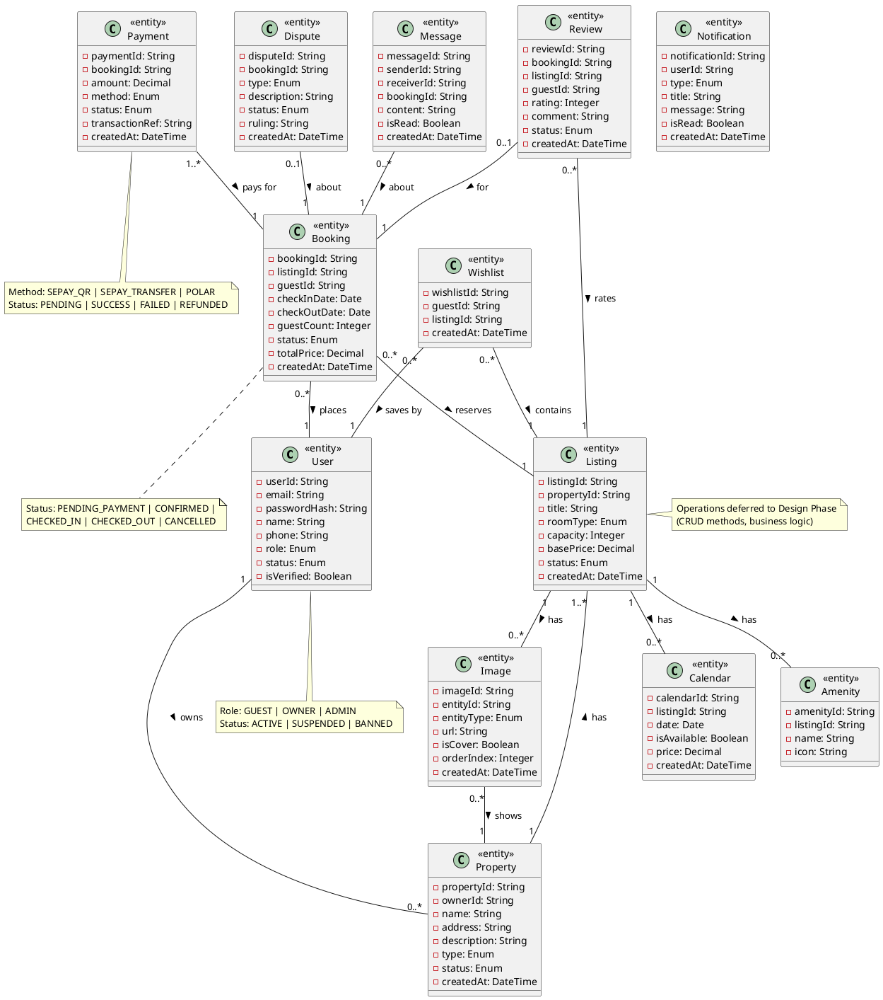

# Phase 1: Static Model

**Project:** Hostel Management System
**Date:** 2026-01-26
**Input:** 17 Use Case Specifications

---

## System Context Diagram

### External Classes

| External Class | Stereotype | Description | Association |
|----------------|------------|-------------|-------------|
| Guest | «external user» | Person searching and booking hostels | Interacts with |
| Owner | «external user» | Property owner managing listings | Interacts with |
| Admin | «external user» | Platform administrator | Interacts with |
| WebBrowser | «external I/O device» | Web browser interface (keyboard, mouse, display) | Inputs to / Outputs to |
| MobileApp | «external I/O device» | Mobile app interface (touch, gestures) | Inputs to / Outputs to |
| SePayGateway | «external system» | Vietnamese payment gateway (VietQR, Bank Transfer) | Communicates with |
| PolarGateway | «external system» | Global payment gateway (SaaS subscriptions) | Communicates with |

### Diagram

```plantuml
@startuml System_Context
!define RECTANGLE class

' System boundary
RECTANGLE "«software system»\nHostel Management System" as HMS

' External users
actor "«external user»\nGuest" as Guest
actor "«external user»\nOwner" as Owner
actor "«external user»\nAdmin" as Admin

' External devices
RECTANGLE "«external I/O device»\nWeb Browser" as WebBrowser
RECTANGLE "«external I/O device»\nMobile App" as MobileApp

' External systems
RECTANGLE "«external system»\nSePay Payment Gateway" as SePayGateway
RECTANGLE "«external system»\nPolar Payment Gateway" as PolarGateway

' Associations
Guest -- WebBrowser : Interacts with >
Guest -- MobileApp : Interacts with >
Owner -- WebBrowser : Interacts with >
Owner -- MobileApp : Interacts with >
Admin -- WebBrowser : Interacts with >

WebBrowser -- HMS : Inputs to >
MobileApp -- HMS : Inputs to >
HMS -- WebBrowser : Outputs to >
HMS -- MobileApp : Outputs to >

HMS -- SePayGateway : Communicates with >
HMS -- PolarGateway : Communicates with >

@enduml
```

---

## Entity Class Diagram

### Entity Classes

| Entity | Description | Key Attributes |
|--------|-------------|----------------|
| User | Platform user account | userId, email, passwordHash, name, phone, role, status, isVerified |
| Property | Hostel property registered by owner | propertyId, ownerId, name, address, description, type, status, createdAt |
| Listing | Room/accommodation listing under property | listingId, propertyId, title, roomType, capacity, basePrice, status, createdAt |
| Booking | Reservation made by guest | bookingId, listingId, guestId, checkInDate, checkOutDate, guestCount, status, totalPrice, createdAt |
| Payment | Payment transaction for booking | paymentId, bookingId, amount, method, status, transactionRef, createdAt |
| Review | Review submitted by guest after stay | reviewId, bookingId, listingId, guestId, rating, comment, status, createdAt |
| Wishlist | Saved listings for guest | wishlistId, guestId, listingId, createdAt |
| Calendar | Availability and pricing calendar | calendarId, listingId, date, isAvailable, price, createdAt |
| Amenity | Property amenity features | amenityId, listingId, name, icon |
| Image | Property/listing photos | imageId, entityId, entityType, url, isCover, orderIndex, createdAt |
| Dispute | Dispute between guest and owner | disputeId, bookingId, type, description, status, ruling, createdAt |
| Notification | System notifications to users | notificationId, userId, type, title, message, isRead, createdAt |
| Message | Communication between guest and owner | messageId, senderId, receiverId, bookingId, content, isRead, createdAt |

### Relationships

| Relationship | Multiplicity | Description |
|--------------|--------------|-------------|
| User → Property | 1 → 0..* | Owner owns multiple properties |
| Property → Listing | 1 → 1..* | Property has multiple listings |
| Listing → Calendar | 1 → 0..* | Listing has calendar entries |
| Listing → Amenity | 1 → 0..* | Listing has multiple amenities |
| Listing → Image | 1 → 0..* | Listing has multiple images |
| Booking → Listing | 0..* → 1 | Multiple bookings for one listing |
| Booking → User | 0..* → 1 | Multiple bookings by one guest |
| Payment → Booking | 1..* → 1 | Multiple payments for one booking (refund scenarios) |
| Review → Booking | 0..1 → 1 | Optional review per booking |
| Review → Listing | 0..* → 1 | Multiple reviews for one listing |
| Wishlist → User | 0..* → 1 | Multiple wishlist items for one guest |
| Wishlist → Listing | 0..* → 1 | Listing saved by multiple guests |
| Dispute → Booking | 0..1 → 1 | Optional dispute per booking |
| Message → Booking | 0..* → 1 | Multiple messages per booking |
| Image → Property | 0..* → 1 | Property has multiple images |

### Diagram



---

## Validation Checklist

| Check | Status |
|-------|--------|
| At least 1 external class | ✅ (7 external classes: 3 users, 2 devices, 2 systems) |
| System Context renders | ✅ |
| At least 1 entity class | ✅ (14 entity classes) |
| Entity diagram renders | ✅ |
| All actors mapped | ✅ (Guest, Owner, Admin → external users) |
| NO operations on entities | ✅ (attributes only) |
| Multiplicity shown | ✅ |
| Stereotypes applied | ✅ («entity», «external user», «external I/O device», «external system») |

---

## Next Steps

```bash
/comet-ba-analysis object-structuring
```

This will generate Phase 2: Object Structuring analysis for each use case.