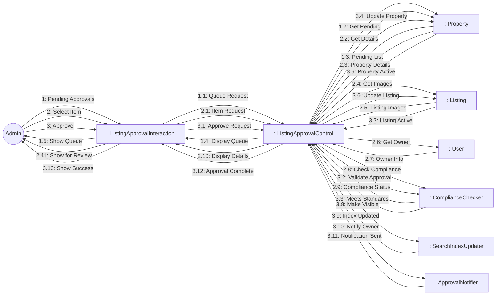
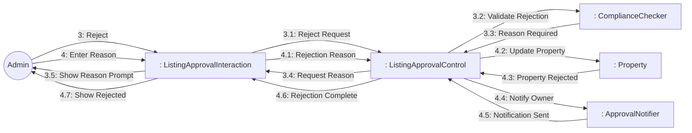

# Dynamic Interaction: Approve Listings

**Use Case Reference**: docs/requirements/use-cases/UC-A01-approve-listings.md
**Objects From**: docs/analysis/phase2-object-structuring/UC-A01-approve-listings.md
**Generated**: 2026-01-26

---

## Participating Objects

From Phase 2 object structuring:
- `: ListingApprovalInteraction` («user interaction»)
- `: ListingApprovalControl` («state-dependent control»)
- `: ComplianceChecker` («business logic»)
- `: ApprovalNotifier` («service»)
- `: SearchIndexUpdater` («service»)
- `: Property` («entity»)
- `: Listing` («entity»)
- `: User` («entity»)

**Total**: 8 objects (1 boundary, 3 entity, 1 control, 3 application logic)

---

## Main Sequence Communication Diagram

**Scenario**: Admin approves property listing

### Message Flow Description

| Seq# | From | To | Message | Description |
|------|------|-----|---------|-------------|
| 1 | Admin | ListingApprovalInteraction | Pending Approvals | Navigate to approvals |
| 1.1 | ListingApprovalInteraction | ListingApprovalControl | Queue Request | Get pending items |
| 1.2 | ListingApprovalControl | Property | Get Pending | Query pending properties |
| 1.3 | Property | ListingApprovalControl | Pending List | Return pending queue |
| 1.4 | ListingApprovalControl | ListingApprovalInteraction | Display Queue | Show pending items |
| 1.5 | ListingApprovalInteraction | Admin | Show Queue | Display queue |
| 2 | Admin | ListingApprovalInteraction | Select Item | Select property to review |
| 2.1 | ListingApprovalInteraction | ListingApprovalControl | Item Request | Request item details |
| 2.2 | ListingApprovalControl | Property | Get Details | Get property details |
| 2.3 | Property | ListingApprovalControl | Property Details | Property information |
| 2.4 | ListingApprovalControl | Listing | Get Images | Get listing images |
| 2.5 | Listing | ListingApprovalControl | Listing Images | Image list |
| 2.6 | ListingApprovalControl | User | Get Owner | Get owner info |
| 2.7 | User | ListingApprovalControl | Owner Info | Owner details |
| 2.8 | ListingApprovalControl | ComplianceChecker | Check Compliance | Validate compliance |
| 2.9 | ComplianceChecker | ListingApprovalControl | Compliance Status | Compliance check result |
| 2.10 | ListingApprovalControl | ListingApprovalInteraction | Display Details | Show for review |
| 2.11 | ListingApprovalInteraction | Admin | Show for Review | Display review page |
| 3 | Admin | ListingApprovalInteraction | Approve | Approve property |
| 3.1 | ListingApprovalInteraction | ListingApprovalControl | Approve Request | Approval request |
| 3.2 | ListingApprovalControl | ComplianceChecker | Validate Approval | Final compliance check |
| 3.3 | ComplianceChecker | ListingApprovalControl | Meets Standards | Passes quality standards |
| 3.4 | ListingApprovalControl | Property | Update Property | Set status to active |
| 3.5 | Property | ListingApprovalControl | Property Active | Property activated |
| 3.6 | ListingApprovalControl | Listing | Update Listing | Set listing to active |
| 3.7 | Listing | ListingApprovalControl | Listing Active | Listing activated |
| 3.8 | ListingApprovalControl | SearchIndexUpdater | Make Visible | Add to search index |
| 3.9 | SearchIndexUpdater | ListingApprovalControl | Index Updated | Search updated |
| 3.10 | ListingApprovalControl | ApprovalNotifier | Notify Owner | Notify owner of approval |
| 3.11 | ApprovalNotifier | ListingApprovalControl | Notification Sent | Notification sent |
| 3.12 | ListingApprovalControl | ListingApprovalInteraction | Approval Complete | Approval done |
| 3.13 | ListingApprovalInteraction | Admin | Show Success | Display confirmation |

---

## Alternative Sequence: Reject Listing

**Scenario**: Admin rejects property with feedback

---

## Validation

- [x] All objects from Phase 2 represented
- [x] Messages use hierarchical numbering
- [x] Main sequence covered
- [x] Alternative sequences covered

---

## Phase 4 Integration Notes

**Messages TO ListingApprovalControl (Events)**:
- 1.1: Queue Request
- 1.3: Pending List
- 2.1: Item Request
- 2.3: Property Details, 2.5: Listing Images, 2.7: Owner Info
- 2.9: Compliance Status
- 3.1: Approve Request
- 3.3: Meets Standards / 3.3A: Fails Standards
- 3.5: Property Active
- 3.7: Listing Active
- 3.9: Index Updated
- 3.11: Notification Sent
- 4.1: Rejection Reason
- 4.3: Property Rejected
- 4.5: Notification Sent

**Messages FROM ListingApprovalControl (Actions)**:
- 1.2: Get Pending
- 1.4: Display Queue
- 2.2: Get Details
- 2.4: Get Images
- 2.6: Get Owner
- 2.8: Check Compliance
- 2.10: Display Details
- 3.2: Validate Approval
- 3.4: Update Property (approve)
- 3.6: Update Listing (approve)
- 3.8: Make Visible
- 3.10: Notify Owner (approve)
- 3.12: Approval Complete
- 3.4: Request Reason
- 4.2: Update Property (reject)
- 4.4: Notify Owner (reject)
- 4.6: Rejection Complete

---

## Notes

- BR-009: Quality standards must be met
- BR-010: Rejected properties receive feedback
- SLA: Review within 48 hours
- Bulk action support
- Decision audit trail
- Rejection reason templates
