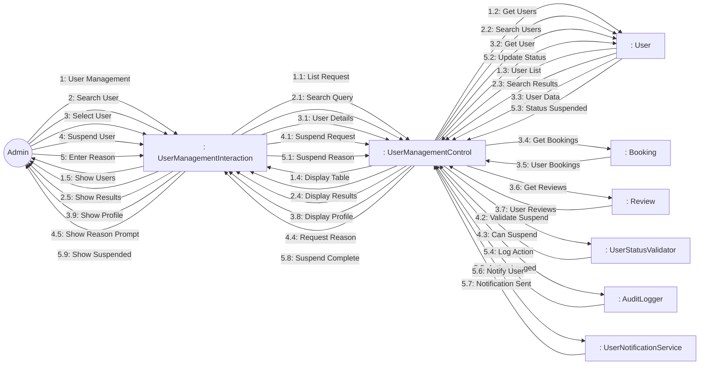
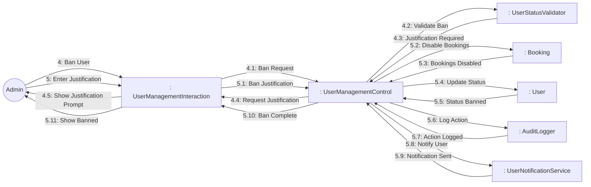
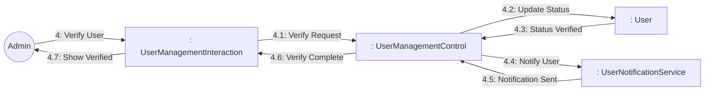

# Dynamic Interaction: Manage Users

**Use Case Reference**: docs/requirements/use-cases/UC-A02-manage-users.md
**Objects From**: docs/analysis/phase2-object-structuring/UC-A02-manage-users.md
**Generated**: 2026-01-26

---

## Participating Objects

From Phase 2 object structuring:
- `: UserManagementInteraction` («user interaction»)
- `: UserManagementControl` («state-dependent control»)
- `: UserStatusValidator` («business logic»)
- `: UserNotificationService` («service»)
- `: AuditLogger` («service»)
- `: User` («entity»)
- `: Booking` («entity»)
- `: Review` («entity»)

**Total**: 8 objects (1 boundary, 3 entity, 1 control, 3 application logic)

---

## Main Sequence Communication Diagram

**Scenario**: Admin views user and suspends account

### Message Flow Description

| Seq# | From | To | Message | Description |
|------|------|-----|---------|-------------|
| 1 | Admin | UserManagementInteraction | User Management | Navigate to user management |
| 1.1 | UserManagementInteraction | UserManagementControl | List Request | Get all users |
| 1.2 | UserManagementControl | User | Get Users | Query user list |
| 1.3 | User | UserManagementControl | User List | Return users |
| 1.4 | UserManagementControl | UserManagementInteraction | Display Table | Show user table |
| 1.5 | UserManagementInteraction | Admin | Show Users | Display users |
| 2 | Admin | UserManagementInteraction | Search User | Search by email/name |
| 2.1 | UserManagementInteraction | UserManagementControl | Search Query | Search criteria |
| 2.2 | UserManagementControl | User | Search Users | Search users |
| 2.3 | User | UserManagementControl | Search Results | Matching users |
| 2.4 | UserManagementControl | UserManagementInteraction | Display Results | Show results |
| 2.5 | UserManagementInteraction | Admin | Show Results | Display search results |
| 3 | Admin | UserManagementInteraction | Select User | Click on user |
| 3.1 | UserManagementInteraction | UserManagementControl | User Details | Request user details |
| 3.2 | UserManagementControl | User | Get User | Get user data |
| 3.3 | User | UserManagementControl | User Data | User details |
| 3.4 | UserManagementControl | Booking | Get Bookings | Get user's bookings |
| 3.5 | Booking | UserManagementControl | User Bookings | Booking list |
| 3.6 | UserManagementControl | Review | Get Reviews | Get user's reviews |
| 3.7 | Review | UserManagementControl | User Reviews | Review list |
| 3.8 | UserManagementControl | UserManagementInteraction | Display Profile | Show full profile |
| 3.9 | UserManagementInteraction | Admin | Show Profile | Display profile |
| 4 | Admin | UserManagementInteraction | Suspend User | Click suspend |
| 4.1 | UserManagementInteraction | UserManagementControl | Suspend Request | Suspend request |
| 4.2 | UserManagementControl | UserStatusValidator | Validate Suspend | Validate suspension |
| 4.3 | UserStatusValidator | UserManagementControl | Can Suspend | Can suspend user |
| 4.4 | UserManagementControl | UserManagementInteraction | Request Reason | Ask for reason |
| 4.5 | UserManagementInteraction | Admin | Show Reason Prompt | Display reason input |
| 5 | Admin | UserManagementInteraction | Enter Reason | Enter suspension reason |
| 5.1 | UserManagementInteraction | UserManagementControl | Suspend Reason | Reason + duration |
| 5.2 | UserManagementControl | User | Update Status | Set status to suspended |
| 5.3 | User | UserManagementControl | Status Suspended | Status updated |
| 5.4 | UserManagementControl | AuditLogger | Log Action | Log status change |
| 5.5 | AuditLogger | UserManagementControl | Action Logged | Action logged |
| 5.6 | UserManagementControl | UserNotificationService | Notify User | Email user |
| 5.7 | UserNotificationService | UserManagementControl | Notification Sent | Email sent |
| 5.8 | UserManagementControl | UserManagementInteraction | Suspend Complete | Suspension done |
| 5.9 | UserManagementInteraction | Admin | Show Suspended | Display confirmation |

---

## Alternative Sequence: Ban User

**Scenario**: Admin bans user permanently

---

## Alternative Sequence: Verify User

**Scenario**: Admin verifies user account

---

## Validation

- [x] All objects from Phase 2 represented
- [x] Messages use hierarchical numbering
- [x] Main sequence covered
- [x] Alternative sequences covered (2)

---

## Phase 4 Integration Notes

**Messages TO UserManagementControl (Events)**:
- 1.1: List Request
- 1.3: User List
- 2.1: Search Query
- 2.3: Search Results
- 3.1: User Details
- 3.3: User Data, 3.5: User Bookings, 3.7: User Reviews
- 4.1: Suspend Request / 4.1: Ban Request / 4.1: Verify Request
- 4.3: Can Suspend / 4.3: Justification Required / 4.3: Can Verify
- 5.1: Suspend Reason / 5.1: Ban Justification
- 5.3: Status Suspended / 5.3: Bookings Disabled / 5.3: Status Verified
- 5.5: Action Logged / 5.7: Action Logged
- 5.7: Notification Sent

**Messages FROM UserManagementControl (Actions)**:
- 1.2: Get Users
- 1.4: Display Table
- 2.2: Search Users
- 2.4: Display Results
- 3.2: Get User
- 3.4: Get Bookings
- 3.6: Get Reviews
- 3.8: Display Profile
- 4.2: Validate Suspend / 4.2: Validate Ban / 4.2: Validate Verify
- 4.4: Request Reason / 4.4: Request Justification
- 5.2: Update Status (suspend) / 5.2: Disable Bookings / 5.2: Update Status (verify)
- 5.4: Log Action
- 5.6: Notify User
- 5.8: Suspend Complete / 5.8: Ban Complete / 5.8: Verify Complete

---

## Notes

- BR-027: Suspended users cannot create new bookings
- BR-028: Banned users lose access to platform
- Paginated list (50 per page)
- Quick search < 1s
- Action confirmation dialogs
- Email notifications to users
