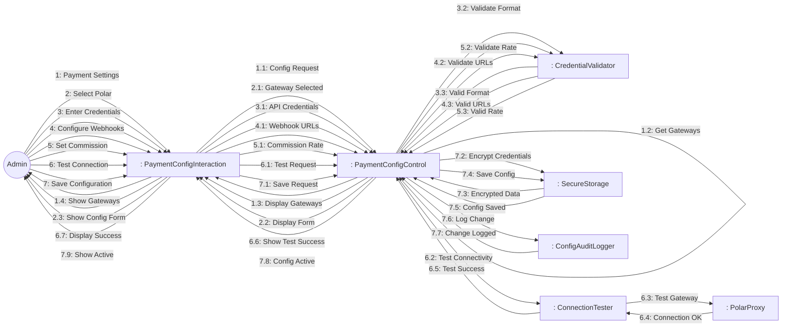
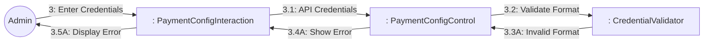

# Dynamic Interaction: Configure Payments

**Use Case Reference**: docs/requirements/use-cases/UC-A03-configure-payments.md
**Objects From**: docs/analysis/phase2-object-structuring/UC-A03-configure-payments.md
**Generated**: 2026-01-26

---

## Participating Objects

From Phase 2 object structuring:
- `: PaymentConfigInteraction` («user interaction»)
- `: PolarProxy` («proxy»)
- `: PaymentConfigControl` («state-dependent control»)
- `: CredentialValidator` («business logic»)
- `: ConnectionTester` («service»)
- `: SecureStorage` («service»)
- `: ConfigAuditLogger` («service»)

**Total**: 7 objects (2 boundary, 0 entity, 1 control, 4 application logic)

---

## Main Sequence Communication Diagram

**Scenario**: Admin configures Polar payment gateway

### Message Flow Description

| Seq# | From | To | Message | Description |
|------|------|-----|---------|-------------|
| 1 | Admin | PaymentConfigInteraction | Payment Settings | Navigate to payment settings |
| 1.1 | PaymentConfigInteraction | PaymentConfigControl | Config Request | Get configured gateways |
| 1.2 | PaymentConfigControl | PaymentConfigControl | Get Gateways | Get gateway list |
| 1.3 | PaymentConfigControl | PaymentConfigInteraction | Display Gateways | Show gateways |
| 1.4 | PaymentConfigInteraction | Admin | Show Gateways | Display gateways |
| 2 | Admin | PaymentConfigInteraction | Select Polar | Select Polar gateway |
| 2.1 | PaymentConfigInteraction | PaymentConfigControl | Gateway Selected | Polar selected |
| 2.2 | PaymentConfigControl | PaymentConfigInteraction | Display Form | Show config form |
| 2.3 | PaymentConfigInteraction | Admin | Show Config Form | Display form |
| 3 | Admin | PaymentConfigInteraction | Enter Credentials | Enter API key/secret |
| 3.1 | PaymentConfigInteraction | PaymentConfigControl | API Credentials | API credentials |
| 3.2 | PaymentConfigControl | CredentialValidator | Validate Format | Validate format |
| 3.3 | CredentialValidator | PaymentConfigControl | Valid Format | Format valid |
| 4 | Admin | PaymentConfigInteraction | Configure Webhooks | Set callback URLs |
| 4.1 | PaymentConfigInteraction | PaymentConfigControl | Webhook URLs | Webhook URLs |
| 4.2 | PaymentConfigControl | CredentialValidator | Validate URLs | Validate URLs |
| 4.3 | CredentialValidator | PaymentConfigControl | Valid URLs | URLs valid |
| 5 | Admin | PaymentConfigInteraction | Set Commission | Set platform commission |
| 5.1 | PaymentConfigInteraction | PaymentConfigControl | Commission Rate | Commission % |
| 5.2 | PaymentConfigControl | CredentialValidator | Validate Rate | Validate rate |
| 5.3 | CredentialValidator | PaymentConfigControl | Valid Rate | Rate valid |
| 6 | Admin | PaymentConfigInteraction | Test Connection | Test gateway connection |
| 6.1 | PaymentConfigInteraction | PaymentConfigControl | Test Request | Request connection test |
| 6.2 | PaymentConfigControl | ConnectionTester | Test Connectivity | Test connection |
| 6.3 | ConnectionTester | PolarProxy | Test Gateway | Test gateway |
| 6.4 | PolarProxy | ConnectionTester | Connection OK | Connection successful |
| 6.5 | ConnectionTester | PaymentConfigControl | Test Success | Test passed |
| 6.6 | PaymentConfigControl | PaymentConfigInteraction | Show Test Success | Display success |
| 6.7 | PaymentConfigInteraction | Admin | Display Success | Show test result |
| 7 | Admin | PaymentConfigInteraction | Save Configuration | Save configuration |
| 7.1 | PaymentConfigInteraction | PaymentConfigControl | Save Request | Save config |
| 7.2 | PaymentConfigControl | SecureStorage | Encrypt Credentials | Encrypt API keys |
| 7.3 | SecureStorage | PaymentConfigControl | Encrypted Data | Encrypted data |
| 7.4 | PaymentConfigControl | SecureStorage | Save Config | Save config |
| 7.5 | SecureStorage | PaymentConfigControl | Config Saved | Config saved |
| 7.6 | PaymentConfigControl | ConfigAuditLogger | Log Change | Log configuration change |
| 7.7 | ConfigAuditLogger | PaymentConfigControl | Change Logged | Change logged |
| 7.8 | PaymentConfigControl | PaymentConfigInteraction | Config Active | Configuration active |
| 7.9 | PaymentConfigInteraction | Admin | Show Active | Display confirmation |

---

## Alternative Sequence: Invalid Credentials

**Scenario**: API credentials format invalid

---

## Alternative Sequence: Connection Test Failed

**Scenario**: Cannot connect to gateway

```mermaid
graph LR
    Admin((Admin))
    ConfigInt[": PaymentConfigInteraction"]
    Control[": PaymentConfigControl"]
    Tester[": ConnectionTester"]
    Polar[": PolarProxy"]

    Admin -->|6: Test Connection| ConfigInt
    ConfigInt -->|6.1: Test Request| Control
    Control -->|6.2: Test Connectivity| Tester
    Tester -->|6.3: Test Gateway| Polar
    Polar -->|6.4A: Connection Failed| Tester
    Tester -->|6.5A: Test Failed| Control
    Control -->|6.6A: Show Error| ConfigInt
    ConfigInt -->|6.7A: Display Error| Admin
```

---

## Validation

- [x] All objects from Phase 2 represented
- [x] Messages use hierarchical numbering
- [x] Main sequence covered
- [x] Alternative sequences covered (2)

---

## Phase 4 Integration Notes

**Messages TO PaymentConfigControl (Events)**:
- 1.1: Config Request
- 2.1: Gateway Selected
- 3.1: API Credentials
- 3.3: Valid Format / 3.3A: Invalid Format
- 4.1: Webhook URLs
- 4.3: Valid URLs / 4.3A: Invalid URLs
- 5.1: Commission Rate
- 5.3: Valid Rate / 5.3A: Invalid Rate
- 6.1: Test Request
- 6.5: Test Success / 6.5A: Test Failed
- 7.1: Save Request
- 7.3: Encrypted Data
- 7.5: Config Saved
- 7.7: Change Logged

**Messages FROM PaymentConfigControl (Actions)**:
- 1.2: Get Gateways
- 1.3: Display Gateways
- 2.2: Display Form
- 3.2: Validate Format
- 4.2: Validate URLs
- 5.2: Validate Rate
- 6.2: Test Connectivity
- 6.6: Show Test Success / 6.6A: Show Error
- 7.2: Encrypt Credentials
- 7.4: Save Config
- 7.6: Log Change
- 7.8: Config Active

---

## Notes

- BR-029: Credentials must be encrypted
- BR-030: Configuration changes require audit log
- Connection test before save
- Test mode support
- Credential rotation support
- Platform commission rate (%)
