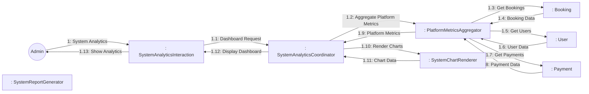
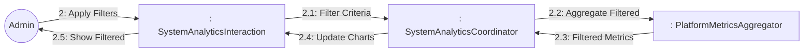
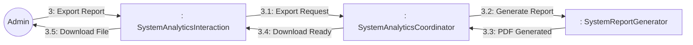
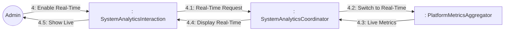

# Dynamic Interaction: View System Analytics

**Use Case Reference**: docs/requirements/use-cases/UC-A04-view-system-analytics.md
**Objects From**: docs/analysis/phase2-object-structuring/UC-A04-view-system-analytics.md
**Generated**: 2026-01-26

---

## Participating Objects

From Phase 2 object structuring:
- `: SystemAnalyticsInteraction` («user interaction»)
- `: SystemAnalyticsCoordinator` («coordinator»)
- `: PlatformMetricsAggregator` («algorithm»)
- `: SystemChartRenderer` («service»)
- `: SystemReportGenerator` («service»)
- `: Booking` («entity»)
- `: User` («entity»)
- `: Payment` («entity»)

**Total**: 8 objects (1 boundary, 3 entity, 1 coordinator, 2 application logic)

---

## Main Sequence Communication Diagram

**Scenario**: Admin views platform-wide analytics

### Message Flow Description

| Seq# | From | To | Message | Description |
|------|------|-----|---------|-------------|
| 1 | Admin | SystemAnalyticsInteraction | System Analytics | Navigate to system analytics |
| 1.1 | SystemAnalyticsInteraction | SystemAnalyticsCoordinator | Dashboard Request | Request dashboard data |
| 1.2 | SystemAnalyticsCoordinator | PlatformMetricsAggregator | Aggregate Platform Metrics | Calculate platform metrics |
| 1.3 | PlatformMetricsAggregator | Booking | Get Bookings | Fetch booking data |
| 1.4 | Booking | PlatformMetricsAggregator | Booking Data | Return bookings |
| 1.5 | PlatformMetricsAggregator | User | Get Users | Fetch user data |
| 1.6 | User | PlatformMetricsAggregator | User Data | Return users |
| 1.7 | PlatformMetricsAggregator | Payment | Get Payments | Fetch payment data |
| 1.8 | Payment | PlatformMetricsAggregator | Payment Data | Return payments |
| 1.9 | PlatformMetricsAggregator | SystemAnalyticsCoordinator | Platform Metrics | All platform metrics |
| 1.10 | SystemAnalyticsCoordinator | SystemChartRenderer | Render Charts | Generate chart data |
| 1.11 | SystemChartRenderer | SystemAnalyticsCoordinator | Chart Data | Chart rendering data |
| 1.12 | SystemAnalyticsCoordinator | SystemAnalyticsInteraction | Display Dashboard | Dashboard ready |
| 1.13 | SystemAnalyticsInteraction | Admin | Show Analytics | Display dashboard |

---

## Alternative Sequence: Filter by Region

**Scenario**: Admin filters by region and date range

---

## Alternative Sequence: Export Comprehensive Report

**Scenario**: Admin exports full platform report as PDF

---

## Alternative Sequence: Switch to Real-Time Mode

**Scenario**: Admin switches from hourly to real-time metrics

---

## Validation

- [x] All objects from Phase 2 represented
- [x] Messages use hierarchical numbering
- [x] Main sequence covered
- [x] Alternative sequences covered (3)

---

## Phase 4 Integration Notes

**No statechart required** - Coordinator pattern (read-only platform dashboard)

---

## Notes

- BR-031: System analytics updated hourly
- BR-032: Export limited to platform data
- Business metrics, User metrics, Technical metrics
- Filter by date range, region
- Drill-down capability
- Real-time mode available
