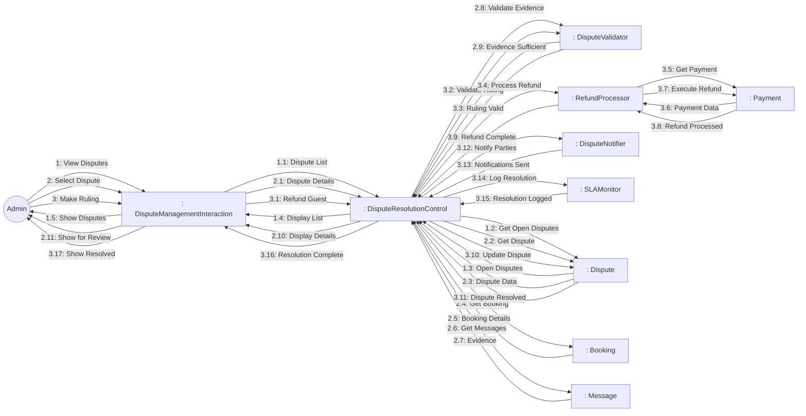
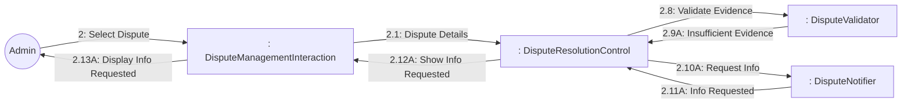
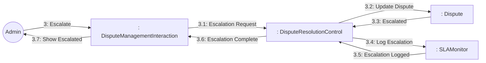

# Dynamic Interaction: Handle Disputes

**Use Case Reference**: docs/requirements/use-cases/UC-A05-handle-disputes.md
**Objects From**: docs/analysis/phase2-object-structuring/UC-A05-handle-disputes.md
**Generated**: 2026-01-26

---

## Participating Objects

From Phase 2 object structuring:
- `: DisputeManagementInteraction` («user interaction»)
- `: DisputeResolutionControl` («state-dependent control»)
- `: DisputeValidator` («business logic»)
- `: RefundProcessor` («service»)
- `: DisputeNotifier` («service»)
- `: SLAMonitor` («service»)
- `: Dispute` («entity»)
- `: Booking` («entity»)
- `: Message` («entity»)
- `: Payment` («entity»)

**Total**: 10 objects (1 boundary, 4 entity, 1 control, 4 application logic)

---

## Main Sequence Communication Diagram

**Scenario**: Admin reviews dispute and rules in favor of guest

### Message Flow Description

| Seq# | From | To | Message | Description |
|------|------|-----|---------|-------------|
| 1 | Admin | DisputeManagementInteraction | View Disputes | Navigate to disputes |
| 1.1 | DisputeManagementInteraction | DisputeResolutionControl | Dispute List | Get dispute list |
| 1.2 | DisputeResolutionControl | Dispute | Get Open Disputes | Query open disputes |
| 1.3 | Dispute | DisputeResolutionControl | Open Disputes | Return disputes |
| 1.4 | DisputeResolutionControl | DisputeManagementInteraction | Display List | Show with priority |
| 1.5 | DisputeManagementInteraction | Admin | Show Disputes | Display disputes |
| 2 | Admin | DisputeManagementInteraction | Select Dispute | Click on dispute |
| 2.1 | DisputeManagementInteraction | DisputeResolutionControl | Dispute Details | Request dispute details |
| 2.2 | DisputeResolutionControl | Dispute | Get Dispute | Get dispute data |
| 2.3 | Dispute | DisputeResolutionControl | Dispute Data | Dispute information |
| 2.4 | DisputeResolutionControl | Booking | Get Booking | Get booking details |
| 2.5 | Booking | DisputeResolutionControl | Booking Details | Booking information |
| 2.6 | DisputeResolutionControl | Message | Get Messages | Get evidence messages |
| 2.7 | Message | DisputeResolutionControl | Evidence | Evidence messages |
| 2.8 | DisputeResolutionControl | DisputeValidator | Validate Evidence | Check evidence sufficiency |
| 2.9 | DisputeValidator | DisputeResolutionControl | Evidence Sufficient | Evidence is sufficient |
| 2.10 | DisputeResolutionControl | DisputeManagementInteraction | Display Details | Show for review |
| 2.11 | DisputeManagementInteraction | Admin | Show for Review | Display review page |
| 3 | Admin | DisputeManagementInteraction | Make Ruling | Rule in favor of guest |
| 3.1 | DisputeManagementInteraction | DisputeResolutionControl | Refund Guest | Full refund to guest |
| 3.2 | DisputeResolutionControl | DisputeValidator | Validate Ruling | Validate ruling decision |
| 3.3 | DisputeValidator | DisputeResolutionControl | Ruling Valid | Ruling is valid |
| 3.4 | DisputeResolutionControl | RefundProcessor | Process Refund | Execute refund |
| 3.5 | RefundProcessor | Payment | Get Payment | Get payment details |
| 3.6 | Payment | RefundProcessor | Payment Data | Payment information |
| 3.7 | RefundProcessor | Payment | Execute Refund | Process refund |
| 3.8 | Payment | RefundProcessor | Refund Processed | Refund executed |
| 3.9 | RefundProcessor | DisputeResolutionControl | Refund Complete | Refund successful |
| 3.10 | DisputeResolutionControl | Dispute | Update Dispute | Set status to resolved |
| 3.11 | Dispute | DisputeResolutionControl | Dispute Resolved | Dispute resolved |
| 3.12 | DisputeResolutionControl | DisputeNotifier | Notify Parties | Notify both parties |
| 3.13 | DisputeNotifier | DisputeResolutionControl | Notifications Sent | Notifications sent |
| 3.14 | DisputeResolutionControl | SLAMonitor | Log Resolution | Log resolution time |
| 3.15 | SLAMonitor | DisputeResolutionControl | Resolution Logged | Resolution logged |
| 3.16 | DisputeResolutionControl | DisputeManagementInteraction | Resolution Complete | Resolution done |
| 3.17 | DisputeManagementInteraction | Admin | Show Resolved | Display confirmation |

---

## Alternative Sequence: Request More Information

**Scenario**: Evidence insufficient, request more info

---

## Alternative Sequence: Escalate to Legal

**Scenario**: Dispute requires legal review

---

## Validation

- [x] All objects from Phase 2 represented
- [x] Messages use hierarchical numbering
- [x] Main sequence covered
- [x] Alternative sequences covered (2)

---

## Phase 4 Integration Notes

**Messages TO DisputeResolutionControl (Events)**:
- 1.1: Dispute List
- 1.3: Open Disputes
- 2.1: Dispute Details
- 2.3: Dispute Data, 2.5: Booking Details, 2.7: Evidence
- 2.9: Evidence Sufficient / 2.9A: Insufficient Evidence
- 3.1: Refund Guest / 3.1: Refund Owner / 3.1: Split Refund / 3.1: Escalate
- 3.3: Ruling Valid
- 3.8: Refund Processed
- 3.11: Dispute Resolved / 3.3: Escalated
- 3.13: Notifications Sent
- 3.15: Resolution Logged / 3.5: Escalation Logged

**Messages FROM DisputeResolutionControl (Actions)**:
- 1.2: Get Open Disputes
- 1.4: Display List
- 2.2: Get Dispute
- 2.4: Get Booking
- 2.6: Get Messages
- 2.8: Validate Evidence
- 2.10: Display Details / 2.10A: Request Info
- 3.2: Validate Ruling
- 3.4: Process Refund
- 3.10: Update Dispute
- 3.12: Notify Parties
- 3.14: Log Resolution / 3.4: Log Escalation
- 3.16: Resolution Complete / 3.6: Escalation Complete

---

## Notes

- BR-033: Response within 24 hours
- BR-034: Resolution within 72 hours
- BR-035: All decisions auditable
- Ruling options: refund guest, refund owner, split
- Escalation to legal team
- Evidence file upload support
- Secure messaging
