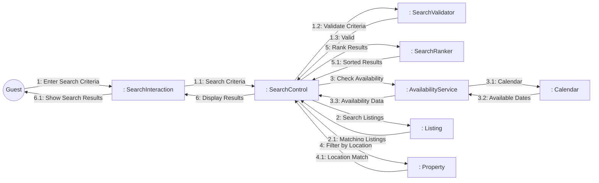
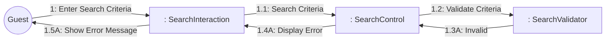
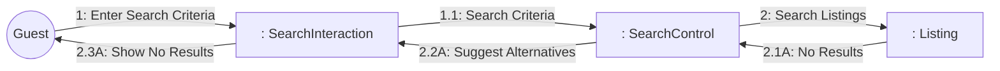

# Dynamic Interaction: Search Hostels

**Use Case Reference**: docs/requirements/use-cases/UC-G01-search-hostels.md
**Objects From**: docs/analysis/phase2-object-structuring/UC-G01-search-hostels.md
**Generated**: 2026-01-26

---

## Participating Objects

From Phase 2 object structuring:
- `: SearchInteraction` («user interaction»)
- `: SearchControl` («state-dependent control»)
- `: SearchValidator` («business logic»)
- `: SearchRanker` («algorithm»)
- `: AvailabilityService` («service»)
- `: Listing` («entity»)
- `: Calendar` («entity»)
- `: Property` («entity»)

**Total**: 8 objects (1 boundary, 3 entity, 1 control, 3 application logic)

---

## Main Sequence Communication Diagram

**Scenario**: Guest successfully searches for available hostels

### Message Flow Description

| Seq# | From | To | Message | Description | Condition |
|------|------|-----|---------|-------------|-----------|
| 1 | Guest | SearchInteraction | Enter Search Criteria | Guest enters location, dates, guest count | - |
| 1.1 | SearchInteraction | SearchControl | Search Criteria | Interface forwards search criteria | - |
| 1.2 | SearchControl | SearchValidator | Validate Criteria | Validate date range, location format | - |
| 1.3 | SearchValidator | SearchControl | Valid | Criteria validation passed | [Valid] |
| 2 | SearchControl | Listing | Search Listings | Query listings by search criteria | - |
| 2.1 | Listing | SearchControl | Matching Listings | Return matching accommodation listings | - |
| 3 | SearchControl | AvailabilityService | Check Availability | Verify availability for date range | - |
| 3.1 | AvailabilityService | Calendar | Query Dates | Check calendar for available dates | - |
| 3.2 | Calendar | AvailabilityService | Available Dates | Return availability status | - |
| 3.3 | AvailabilityService | SearchControl | Availability Data | Filtered availability results | - |
| 4 | SearchControl | Property | Filter by Location | Apply Vietnam location filter | - |
| 4.1 | Property | SearchControl | Location Match | Properties in specified location | - |
| 5 | SearchControl | SearchRanker | Rank Results | Sort by relevance and availability | - |
| 5.1 | SearchRanker | SearchControl | Sorted Results | Ranked listing results | - |
| 6 | SearchControl | SearchInteraction | Display Results | Send paginated results to display | - |
| 6.1 | SearchInteraction | Guest | Show Search Results | Display search results with filters | - |

---

## Alternative Sequence: Invalid Date Range

**Scenario**: Guest enters check-out date before check-in

### Alternative Message Flow

| Seq# | From | To | Message | Condition |
|------|------|-----|---------|-----------|
| 1.3A | SearchValidator | SearchControl | Invalid | [Check-out before check-in] |
| 1.4A | SearchControl | SearchInteraction | Display Error | Error message |
| 1.5A | SearchInteraction | Guest | Show Error Message | "Check-out date must be after check-in" |

---

## Alternative Sequence: No Results Found

**Scenario**: No accommodations match search criteria

### Alternative Message Flow

| Seq# | From | To | Message | Condition |
|------|------|-----|---------|-----------|
| 2.1A | Listing | SearchControl | No Results | [No matching listings] |
| 2.2A | SearchControl | SearchInteraction | Suggest Alternatives | Nearby locations or date adjustments |
| 2.3A | SearchInteraction | Guest | Show No Results | "No hostels found" with suggestions |

---

## Validation

- [x] All objects from Phase 2 represented
- [x] Messages use hierarchical numbering (1, 1.1, 1.2)
- [x] Object names format: `: ClassName` (NOT underlined)
- [x] Message names descriptive (NOT technical method names)
- [x] Simple arrows only (no sync/async distinction)
- [x] All use case steps mapped to messages
- [x] Main sequence covered
- [x] Alternative sequences covered (2 documented)

---

## Phase 4 Integration Notes

⚠️ **For Phase 4 Statechart (SearchControl)**:

**Messages TO SearchControl (Events)**:
- 1.1: Search Criteria
- 1.3: Valid / 1.3A: Invalid
- 2.1: Matching Listings / 2.1A: No Results
- 3.3: Availability Data
- 4.1: Location Match
- 5.1: Sorted Results

**Messages FROM SearchControl (Actions)**:
- 1.2: Validate Criteria
- 2: Search Listings
- 3: Check Availability
- 4: Filter by Location
- 5: Rank Results
- 6: Display Results / 1.4A: Display Error / 2.2A: Suggest Alternatives

---

## Notes

- Main sequence covers happy path (successful search with results)
- 2 alternative sequences documented (invalid date range, no results)
- Performance requirement: < 500ms p95 for results display
- Search analytics logged (Postconditions)
