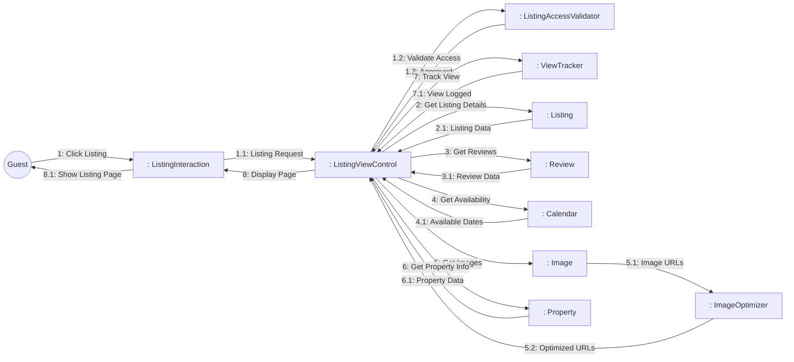
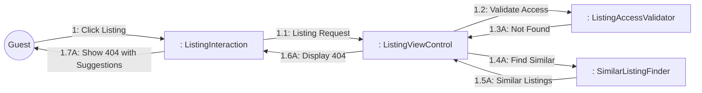
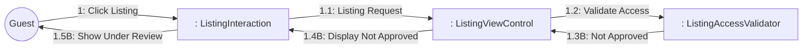
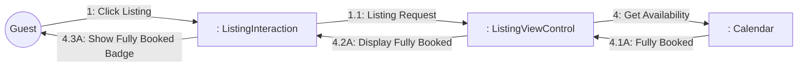

# Dynamic Interaction: View Listing Details

**Use Case Reference**: docs/requirements/use-cases/UC-G02-view-listing-details.md
**Objects From**: docs/analysis/phase2-object-structuring/UC-G02-view-listing-details.md
**Generated**: 2026-01-26

---

## Participating Objects

From Phase 2 object structuring:
- `: ListingInteraction` («user interaction»)
- `: ListingViewControl` («state-dependent control»)
- `: ListingAccessValidator` («business logic»)
- `: ViewTracker` («service»)
- `: ImageOptimizer` («service»)
- `: SimilarListingFinder` («algorithm»)
- `: Listing` («entity»)
- `: Review` («entity»)
- `: Calendar` («entity»)
- `: Image` («entity»)
- `: Property` («entity»)

**Total**: 11 objects (1 boundary, 5 entity, 1 control, 4 application logic)

---

## Main Sequence Communication Diagram

**Scenario**: Guest successfully views listing details

### Message Flow Description

| Seq# | From | To | Message | Description | Condition |
|------|------|-----|---------|-------------|-----------|
| 1 | Guest | ListingInteraction | Click Listing | Guest clicks listing from search results | - |
| 1.1 | ListingInteraction | ListingViewControl | Listing Request | Request listing details page | - |
| 1.2 | ListingViewControl | ListingAccessValidator | Validate Access | Check if listing exists and approved | - |
| 1.3 | ListingAccessValidator | ListingViewControl | Approved | Listing accessible | [Approved] |
| 2 | ListingViewControl | Listing | Get Listing Details | Retrieve listing information | - |
| 2.1 | Listing | ListingViewControl | Listing Data | Title, description, room type, capacity | - |
| 3 | ListingViewControl | Review | Get Reviews | Fetch reviews and ratings | - |
| 3.1 | Review | ListingViewControl | Review Data | Review list with ratings | - |
| 4 | ListingViewControl | Calendar | Get Availability | Check available dates | - |
| 4.1 | Calendar | ListingViewControl | Available Dates | Calendar availability status | - |
| 5 | ListingViewControl | Image | Get Images | Fetch listing photos | - |
| 5.1 | Image | ImageOptimizer | Image URLs | Raw image URLs | - |
| 5.2 | ImageOptimizer | ListingViewControl | Optimized URLs | CDN-optimized URLs (WebP) | - |
| 6 | ListingViewControl | Property | Get Property Info | Get property details | - |
| 6.1 | Property | ListingViewControl | Property Data | Property name, location | - |
| 7 | ListingViewControl | ViewTracker | Track View | Increment view count | - |
| 7.1 | ViewTracker | ListingViewControl | View Logged | View count incremented | - |
| 8 | ListingViewControl | ListingInteraction | Display Page | Send all listing data | - |
| 8.1 | ListingInteraction | Guest | Show Listing Page | Display complete listing page | - |

---

## Alternative Sequence: Listing Not Found

**Scenario**: Guest clicks on non-existent listing

### Alternative Message Flow

| Seq# | From | To | Message | Condition |
|------|------|-----|---------|-----------|
| 1.3A | ListingAccessValidator | ListingViewControl | Not Found | [Listing does not exist] |
| 1.4A | ListingViewControl | SimilarListingFinder | Find Similar | Get similar listing suggestions |
| 1.5A | SimilarListingFinder | ListingViewControl | Similar Listings | Suggested alternatives |
| 1.6A | ListingViewControl | ListingInteraction | Display 404 | 404 page with suggestions |
| 1.7A | ListingInteraction | Guest | Show 404 with Suggestions | Error message with similar listings |

---

## Alternative Sequence: Listing Not Approved

**Scenario**: Guest accesses pending/rejected listing

### Alternative Message Flow

| Seq# | From | To | Message | Condition |
|------|------|-----|---------|-----------|
| 1.3B | ListingAccessValidator | ListingViewControl | Not Approved | [Listing pending/rejected] |
| 1.4B | ListingViewControl | ListingInteraction | Display Not Approved | Under review message |
| 1.5B | ListingInteraction | Guest | Show Under Review | "This listing is under review" |

---

## Alternative Sequence: No Availability

**Scenario**: Selected dates fully booked

### Alternative Message Flow

| Seq# | From | To | Message | Condition |
|------|------|-----|---------|-----------|
| 4.1A | Calendar | ListingViewControl | Fully Booked | [No availability for dates] |
| 4.2A | ListingViewControl | ListingInteraction | Display Fully Booked | Show badge with nearest dates |
| 4.3A | ListingInteraction | Guest | Show Fully Booked Badge | "Fully Booked" with alternatives |

---

## Validation

- [x] All objects from Phase 2 represented
- [x] Messages use hierarchical numbering (1, 1.1, 1.2)
- [x] Object names format: `: ClassName` (NOT underlined)
- [x] Message names descriptive (NOT technical method names)
- [x] Simple arrows only (no sync/async distinction)
- [x] All use case steps mapped to messages
- [x] Main sequence covered
- [x] Alternative sequences covered (3 documented)

---

## Phase 4 Integration Notes

⚠️ **For Phase 4 Statechart (ListingViewControl)**:

**Messages TO ListingViewControl (Events)**:
- 1.1: Listing Request
- 1.3: Approved / 1.3A: Not Found / 1.3B: Not Approved
- 2.1: Listing Data
- 3.1: Review Data
- 4.1: Available Dates / 4.1A: Fully Booked
- 5.2: Optimized URLs
- 6.1: Property Data
- 7.1: View Logged

**Messages FROM ListingViewControl (Actions)**:
- 1.2: Validate Access
- 2: Get Listing Details
- 3: Get Reviews
- 4: Get Availability
- 5: Get Images
- 6: Get Property Info
- 7: Track View
- 8: Display Page / 1.4A: Display 404 / 1.4B: Display Not Approved / 4.2A: Display Fully Booked

---

## Notes

- Main sequence covers happy path (approved listing with availability)
- 3 alternative sequences documented (not found, not approved, no availability)
- Page load < 2s requirement
- View count tracking per BR-012
