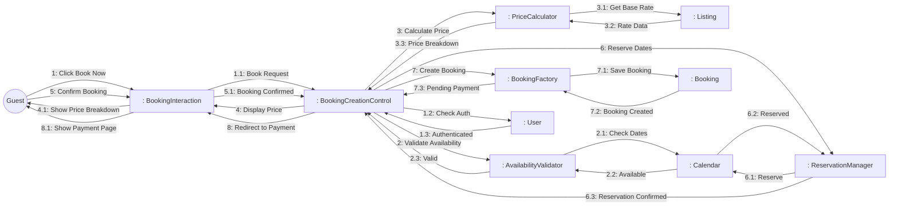
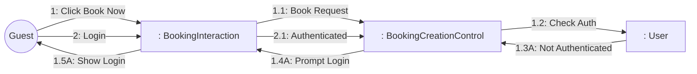
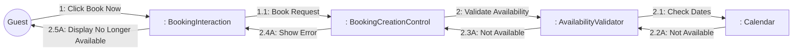

# Dynamic Interaction: Create Booking

**Use Case Reference**: docs/requirements/use-cases/UC-G03-create-booking.md
**Objects From**: docs/analysis/phase2-object-structuring/UC-G03-create-booking.md
**Generated**: 2026-01-26

---

## Participating Objects

From Phase 2 object structuring:
- `: BookingInteraction` («user interaction»)
- `: BookingCreationControl` («state-dependent control»)
- `: AvailabilityValidator` («business logic»)
- `: PriceCalculator` («algorithm»)
- `: ReservationManager` («service»)
- `: BookingFactory` («service»)
- `: Booking` («entity»)
- `: Calendar` («entity»)
- `: Listing` («entity»)
- `: User` («entity»)

**Total**: 10 objects (1 boundary, 4 entity, 1 control, 4 application logic)

---

## Main Sequence Communication Diagram

**Scenario**: Guest successfully creates booking

### Message Flow Description

| Seq# | From | To | Message | Description | Condition |
|------|------|-----|---------|-------------|-----------|
| 1 | Guest | BookingInteraction | Click Book Now | Guest clicks "Book Now" from listing | - |
| 1.1 | BookingInteraction | BookingCreationControl | Book Request | Initiate booking flow | - |
| 1.2 | BookingCreationControl | User | Check Auth | Verify guest authentication | - |
| 1.3 | User | BookingCreationControl | Authenticated | Guest logged in | [Authenticated] |
| 2 | BookingCreationControl | AvailabilityValidator | Validate Availability | Check dates and capacity | - |
| 2.1 | AvailabilityValidator | Calendar | Check Dates | Query availability for date range | - |
| 2.2 | Calendar | AvailabilityValidator | Available | Dates available | [Available] |
| 2.3 | AvailabilityValidator | BookingCreationControl | Valid | Availability validated | - |
| 3 | BookingCreationControl | PriceCalculator | Calculate Price | Compute total with fees/taxes | - |
| 3.1 | PriceCalculator | Listing | Get Base Rate | Fetch nightly rate | - |
| 3.2 | Listing | PriceCalculator | Rate Data | Base price per night | - |
| 3.3 | PriceCalculator | BookingCreationControl | Price Breakdown | Base + fees + taxes | - |
| 4 | BookingCreationControl | BookingInteraction | Display Price | Show price breakdown | - |
| 4.1 | BookingInteraction | Guest | Show Price Breakdown | Display price to guest | - |
| 5 | Guest | BookingInteraction | Confirm Booking | Guest confirms booking details | - |
| 5.1 | BookingInteraction | BookingCreationControl | Booking Confirmed | Guest confirmed | - |
| 6 | BookingCreationControl | ReservationManager | Reserve Dates | Reserve availability | - |
| 6.1 | ReservationManager | Calendar | Reserve | Lock dates for booking | - |
| 6.2 | Calendar | ReservationManager | Reserved | Dates reserved | - |
| 6.3 | ReservationManager | BookingCreationControl | Reservation Confirmed | 15-minute reservation active | - |
| 7 | BookingCreationControl | BookingFactory | Create Booking | Create booking record | - |
| 7.1 | BookingFactory | Booking | Save Booking | Persist booking data | - |
| 7.2 | Booking | BookingFactory | Booking Created | Booking saved with pending_payment | - |
| 7.3 | BookingFactory | BookingCreationControl | Pending Payment | Booking created successfully | - |
| 8 | BookingCreationControl | BookingInteraction | Redirect to Payment | Forward to payment flow | - |
| 8.1 | BookingInteraction | Guest | Show Payment Page | Display payment options | - |

---

## Alternative Sequence: Not Authenticated

**Scenario**: Guest not logged in

### Alternative Message Flow

| Seq# | From | To | Message | Condition |
|------|------|-----|---------|-----------|
| 1.3A | User | BookingCreationControl | Not Authenticated | [Guest not logged in] |
| 1.4A | BookingCreationControl | BookingInteraction | Prompt Login | Request authentication |
| 1.5A | BookingInteraction | Guest | Show Login | Display login/register form |
| 2 | Guest | BookingInteraction | Login | Guest authenticates |
| 2.1 | BookingInteraction | BookingCreationControl | Authenticated | Login successful |

---

## Alternative Sequence: Dates No Longer Available

**Scenario**: Another guest booked while viewing

### Alternative Message Flow

| Seq# | From | To | Message | Condition |
|------|------|-----|---------|-----------|
| 2.2A | Calendar | AvailabilityValidator | Not Available | [Dates just booked] |
| 2.3A | AvailabilityValidator | BookingCreationControl | Not Available | Availability check failed |
| 2.4A | BookingCreationControl | BookingInteraction | Show Error | Error message |
| 2.5A | BookingInteraction | Guest | Display No Longer Available | "Selected dates no longer available" |

---

## Validation

- [x] All objects from Phase 2 represented
- [x] Messages use hierarchical numbering (1, 1.1, 1.2)
- [x] Object names format: `: ClassName` (NOT underlined)
- [x] Message names descriptive (NOT technical method names)
- [x] Simple arrows only (no sync/async distinction)
- [x] All use case steps mapped to messages
- [x] Main sequence covered
- [x] Alternative sequences covered (2 documented)

---

## Phase 4 Integration Notes

⚠️ **For Phase 4 Statechart (BookingCreationControl)**:

**Messages TO BookingCreationControl (Events)**:
- 1.1: Book Request
- 1.3: Authenticated / 1.3A: Not Authenticated
- 2.3: Valid / 2.3A: Not Available
- 3.3: Price Breakdown
- 5.1: Booking Confirmed
- 6.3: Reservation Confirmed / 6.3A: Reservation Failed
- 7.3: Pending Payment / 7.3A: Creation Failed

**Messages FROM BookingCreationControl (Actions)**:
- 1.2: Check Auth
- 2: Validate Availability
- 3: Calculate Price
- 4: Display Price / 2.4A: Show Error
- 6: Reserve Dates
- 7: Create Booking
- 8: Redirect to Payment

---

## Notes

- 15-minute reservation timeout (BR-004)
- Atomic booking creation (zero double-bookings)
- Booking status: pending_payment
- Temporary data preservation during auth flow
