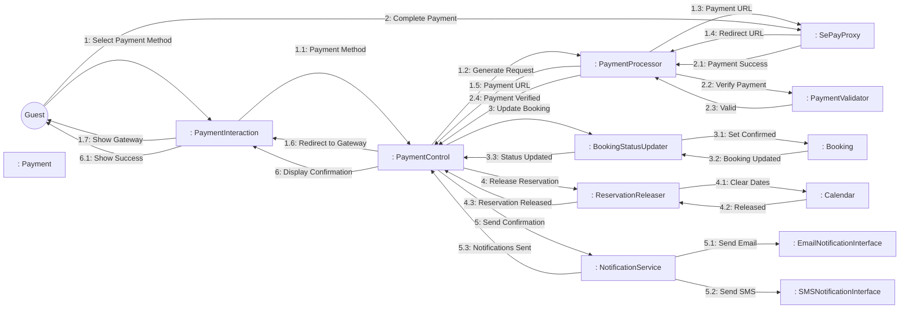
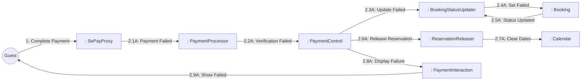
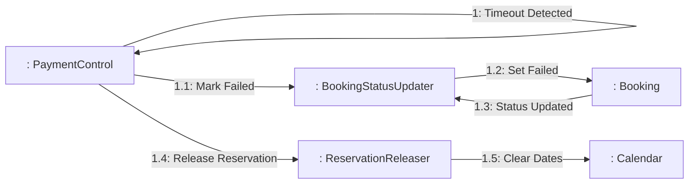

# Dynamic Interaction: Process Payment

**Use Case Reference**: docs/requirements/use-cases/UC-G04-process-payment.md
**Objects From**: docs/analysis/phase2-object-structuring/UC-G04-process-payment.md
**Generated**: 2026-01-26

---

## Participating Objects

From Phase 2 object structuring:
- `: PaymentInteraction` («user interaction»)
- `: SePayProxy` («proxy»)
- `: EmailNotificationInterface` («output»)
- `: SMSNotificationInterface` («output»)
- `: PaymentControl` («state-dependent control»)
- `: PaymentValidator` («business logic»)
- `: PaymentProcessor` («service»)
- `: BookingStatusUpdater` («service»)
- `: ReservationReleaser` («service»)
- `: NotificationService` («service»)
- `: Payment` («entity»)
- `: Booking` («entity»)
- `: Calendar` («entity»)

**Total**: 13 objects (4 boundary, 3 entity, 1 control, 5 application logic)

---

## Main Sequence Communication Diagram

**Scenario**: Guest successfully completes payment

### Message Flow Description

| Seq# | From | To | Message | Description | Condition |
|------|------|-----|---------|-------------|-----------|
| 1 | Guest | PaymentInteraction | Select Payment Method | Guest selects VietQR/Bank Transfer | - |
| 1.1 | PaymentInteraction | PaymentControl | Payment Method | Selected payment method | - |
| 1.2 | PaymentControl | PaymentProcessor | Generate Request | Create payment request with callbacks | - |
| 1.3 | PaymentProcessor | SePayProxy | Payment URL | Request payment URL | - |
| 1.4 | SePayProxy | PaymentProcessor | Redirect URL | Gateway redirect URL | - |
| 1.5 | PaymentProcessor | PaymentControl | Payment URL | Gateway URL for redirect | - |
| 1.6 | PaymentControl | PaymentInteraction | Redirect to Gateway | Forward to payment gateway | - |
| 1.7 | PaymentInteraction | Guest | Show Gateway | Redirect guest to SePay | - |
| 2 | Guest | SePayProxy | Complete Payment | Guest completes payment on gateway | - |
| 2.1 | SePayProxy | PaymentProcessor | Payment Success | Payment success notification | [Success] |
| 2.2 | PaymentProcessor | PaymentValidator | Verify Payment | Validate signature and amount | - |
| 2.3 | PaymentValidator | PaymentProcessor | Valid | Payment verified | - |
| 2.4 | PaymentProcessor | PaymentControl | Payment Verified | Idempotent processing complete | - |
| 3 | PaymentControl | BookingStatusUpdater | Update Booking | Update booking to confirmed | - |
| 3.1 | BookingStatusUpdater | Booking | Set Confirmed | Change status to confirmed | - |
| 3.2 | Booking | BookingStatusUpdater | Booking Updated | Status updated successfully | - |
| 3.3 | BookingStatusUpdater | PaymentControl | Status Updated | Booking now confirmed | - |
| 4 | PaymentControl | ReservationReleaser | Release Reservation | Release date reservation | - |
| 4.1 | ReservationReleaser | Calendar | Clear Dates | Remove reservation lock | - |
| 4.2 | Calendar | ReservationReleaser | Released | Dates released | - |
| 4.3 | ReservationReleaser | PaymentControl | Reservation Released | Availability restored | - |
| 5 | PaymentControl | NotificationService | Send Confirmation | Send booking confirmation | - |
| 5.1 | NotificationService | EmailNotificationInterface | Send Email | Email confirmation | - |
| 5.2 | NotificationService | SMSNotificationInterface | Send SMS | SMS confirmation | - |
| 5.3 | NotificationService | PaymentControl | Notifications Sent | Confirmations sent | - |
| 6 | PaymentControl | PaymentInteraction | Display Confirmation | Show booking success | - |
| 6.1 | PaymentInteraction | Guest | Show Success | Display booking confirmation | - |

---

## Alternative Sequence: Payment Failed

**Scenario**: Payment declined or failed

### Alternative Message Flow

| Seq# | From | To | Message | Condition |
|------|------|-----|---------|-----------|
| 2.1A | SePayProxy | PaymentProcessor | Payment Failed | [Payment declined] |
| 2.2A | PaymentProcessor | PaymentControl | Verification Failed | Payment not successful |
| 2.3A | PaymentControl | BookingStatusUpdater | Update Failed | Mark booking as failed |
| 2.4A | BookingStatusUpdater | Booking | Set Failed | Change status to payment_failed |
| 2.5A | Booking | BookingStatusUpdater | Status Updated | Failed status set |
| 2.6A | PaymentControl | ReservationReleaser | Release Reservation | Release reserved dates |
| 2.7A | ReservationReleaser | Calendar | Clear Dates | Remove reservation |
| 2.8A | PaymentControl | PaymentInteraction | Display Failure | Show error with retry option |
| 2.9A | PaymentInteraction | Guest | Show Failed | "Payment failed, please try again" |

---

## Alternative Sequence: Payment Timeout

**Scenario**: Guest abandons payment (15-minute timeout)

### Alternative Message Flow

| Seq# | From | To | Message | Condition |
|------|------|-----|---------|-----------|
| 1 | PaymentControl | PaymentControl | Timeout Detected | [15 minutes elapsed] |
| 1.1 | PaymentControl | BookingStatusUpdater | Mark Failed | Timeout expired |
| 1.2 | BookingStatusUpdater | Booking | Set Failed | payment_failed status |
| 1.3 | Booking | BookingStatusUpdater | Status Updated | Failed status set |
| 1.4 | PaymentControl | ReservationReleaser | Release Reservation | Release dates |
| 1.5 | ReservationReleaser | Calendar | Clear Dates | Remove reservation |

---

## Validation

- [x] All objects from Phase 2 represented
- [x] Messages use hierarchical numbering (1, 1.1, 1.2)
- [x] Object names format: `: ClassName` (NOT underlined)
| [x] Message names descriptive (NOT technical method names)
- [x] Simple arrows only (no sync/async distinction)
- [x] All use case steps mapped to messages
- [x] Main sequence covered
- [x] Alternative sequences covered (2 documented)

---

## Phase 4 Integration Notes

⚠️ **For Phase 4 Statechart (PaymentControl)**:

**Messages TO PaymentControl (Events)**:
- 1.1: Payment Method
- 1.5: Payment URL
- 2.1: Payment Success / 2.1A: Payment Failed
- 2.4: Payment Verified / 2.2A: Verification Failed
- 3.3: Status Updated
- 4.3: Reservation Released
- 5.3: Notifications Sent
- Timeout Detected (internal event)

**Messages FROM PaymentControl (Actions)**:
- 1.2: Generate Request
- 1.6: Redirect to Gateway
- 3: Update Booking
- 4: Release Reservation
- 5: Send Confirmation
- 6: Display Confirmation / 2.8A: Display Failure

---

## Notes

- Payment processing timeout < 30 seconds
- Idempotent notification processing
- PCI DSS compliance (no card data stored)
- 15-minute payment timeout (BR-005)
- Confirmation within 1 minute (BR-006)
