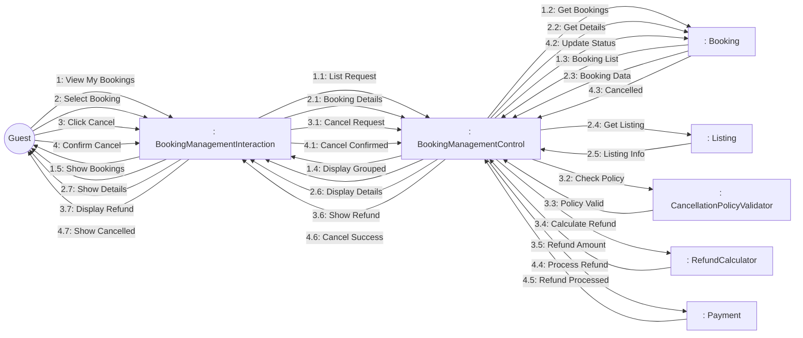
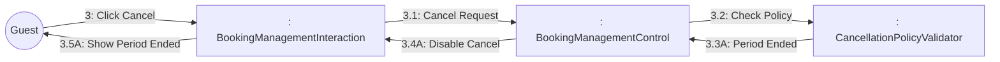

# Dynamic Interaction: Manage Bookings

**Use Case Reference**: docs/requirements/use-cases/UC-G05-manage-bookings.md
**Objects From**: docs/analysis/phase2-object-structuring/UC-G05-manage-bookings.md
**Generated**: 2026-01-26

---

## Participating Objects

From Phase 2 object structuring:
- `: BookingManagementInteraction` («user interaction»)
- `: BookingManagementControl` («state-dependent control»)
- `: CancellationPolicyValidator` («business logic»)
- `: RefundCalculator` («algorithm»)
- `: Booking` («entity»)
- `: Payment` («entity»)
- `: Listing` («entity»)

**Total**: 7 objects (1 boundary, 3 entity, 1 control, 2 application logic)

---

## Main Sequence Communication Diagram

**Scenario**: Guest views and cancels booking

### Message Flow Description

| Seq# | From | To | Message | Description |
|------|------|-----|---------|-------------|
| 1 | Guest | BookingManagementInteraction | View My Bookings | Navigate to bookings page |
| 1.1 | BookingManagementInteraction | BookingManagementControl | List Request | Get all guest bookings |
| 1.2 | BookingManagementControl | Booking | Get Bookings | Query bookings by guest ID |
| 1.3 | Booking | BookingManagementControl | Booking List | Return booking list |
| 1.4 | BookingManagementControl | BookingManagementInteraction | Display Grouped | Show grouped by status |
| 1.5 | BookingManagementInteraction | Guest | Show Bookings | Display bookings (upcoming, completed, cancelled) |
| 2 | Guest | BookingManagementInteraction | Select Booking | Click on specific booking |
| 2.1 | BookingManagementInteraction | BookingManagementControl | Booking Details | Request booking details |
| 2.2 | BookingManagementControl | Booking | Get Details | Fetch full booking data |
| 2.3 | Booking | BookingManagementControl | Booking Data | Return booking details |
| 2.4 | BookingManagementControl | Listing | Get Listing | Get listing info |
| 2.5 | Listing | BookingManagementControl | Listing Info | Listing details |
| 2.6 | BookingManagementControl | BookingManagementInteraction | Display Details | Show booking with actions |
| 2.7 | BookingManagementInteraction | Guest | Show Details | Display booking details |
| 3 | Guest | BookingManagementInteraction | Click Cancel | Request cancellation |
| 3.1 | BookingManagementInteraction | BookingManagementControl | Cancel Request | Initiate cancellation |
| 3.2 | BookingManagementControl | CancellationPolicyValidator | Check Policy | Validate cancellation period |
| 3.3 | CancellationPolicyValidator | BookingManagementControl | Policy Valid | Within cancellation period |
| 3.4 | BookingManagementControl | RefundCalculator | Calculate Refund | Compute refund amount |
| 3.5 | RefundCalculator | BookingManagementControl | Refund Amount | Calculated refund |
| 3.6 | BookingManagementControl | BookingManagementInteraction | Show Refund | Display refund before confirmation |
| 3.7 | BookingManagementInteraction | Guest | Display Refund | Show refund amount |
| 4 | Guest | BookingManagementInteraction | Confirm Cancel | Confirm cancellation |
| 4.1 | BookingManagementInteraction | BookingManagementControl | Cancel Confirmed | Guest confirmed |
| 4.2 | BookingManagementControl | Booking | Update Status | Change to cancelled |
| 4.3 | Booking | BookingManagementControl | Cancelled | Status updated |
| 4.4 | BookingManagementControl | Payment | Process Refund | Initiate refund |
| 4.5 | Payment | BookingManagementControl | Refund Processed | Refund initiated |
| 4.6 | BookingManagementControl | BookingManagementInteraction | Cancel Success | Cancellation complete |
| 4.7 | BookingManagementInteraction | Guest | Show Cancelled | Display confirmation |

---

## Alternative Sequence: Outside Cancellation Period

**Scenario**: Guest tries to cancel too late

### Alternative Message Flow

| Seq# | From | To | Message | Condition |
|------|------|-----|---------|-----------|
| 3.3A | CancellationPolicyValidator | BookingManagementControl | Period Ended | [< 48h before check-in] |
| 3.4A | BookingManagementControl | BookingManagementInteraction | Disable Cancel | Cannot cancel |
| 3.5A | BookingManagementInteraction | Guest | Show Period Ended | "Cancellation period ended" |

---

## Validation

- [x] All objects from Phase 2 represented
- [x] Messages use hierarchical numbering
- [x] Object names format correct
- [x] Message names descriptive
- [x] Main sequence covered
- [x] Alternative sequences covered

---

## Phase 4 Integration Notes

**Messages TO BookingManagementControl (Events)**:
- 1.1: List Request
- 1.3: Booking List
- 2.1: Booking Details
- 2.3: Booking Data, 2.5: Listing Info
- 3.1: Cancel Request
- 3.3: Policy Valid / 3.3A: Period Ended
- 3.5: Refund Amount
- 4.1: Cancel Confirmed
- 4.3: Cancelled, 4.5: Refund Processed

**Messages FROM BookingManagementControl (Actions)**:
- 1.2: Get Bookings
- 1.4: Display Grouped
- 2.2: Get Details
- 2.4: Get Listing
- 2.6: Display Details
- 3.2: Check Policy
- 3.4: Calculate Refund
- 3.6: Show Refund / 3.4A: Disable Cancel
- 4.2: Update Status
- 4.4: Process Refund
- 4.6: Cancel Success

---

## Notes

- BR-013: Full refund if cancelled 24h before check-in
- BR-014: 50% refund if cancelled 48h before check-in
- BR-015: No refund if cancelled less than 48h before check-in
- Paginated display (20 per page)
