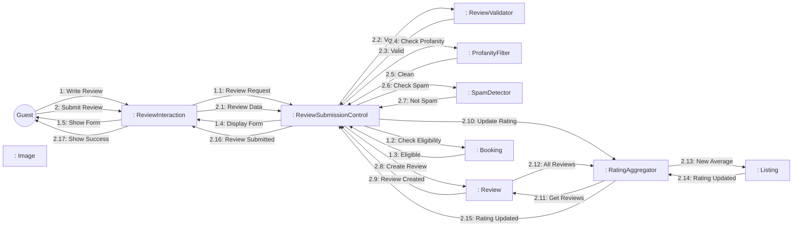
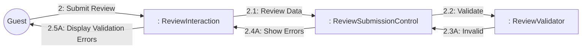

# Dynamic Interaction: Submit Review

**Use Case Reference**: docs/requirements/use-cases/UC-G06-submit-review.md
**Objects From**: docs/analysis/phase2-object-structuring/UC-G06-submit-review.md
**Generated**: 2026-01-26

---

## Participating Objects

From Phase 2 object structuring:
- `: ReviewInteraction` («user interaction»)
- `: ReviewSubmissionControl` («state-dependent control»)
- `: ReviewValidator` («business logic»)
- `: ProfanityFilter` («service»)
- `: SpamDetector` («service»)
- `: RatingAggregator` («algorithm»)
- `: Review` («entity»)
- `: Booking` («entity»)
- `: Listing` («entity»)
- `: Image` («entity»)

**Total**: 10 objects (1 boundary, 4 entity, 1 control, 4 application logic)

---

## Main Sequence Communication Diagram

**Scenario**: Guest successfully submits review

### Message Flow Description

| Seq# | From | To | Message | Description |
|------|------|-----|---------|-------------|
| 1 | Guest | ReviewInteraction | Write Review | Click "Write a Review" |
| 1.1 | ReviewInteraction | ReviewSubmissionControl | Review Request | Request review form |
| 1.2 | ReviewSubmissionControl | Booking | Check Eligibility | Verify booking completed |
| 1.3 | Booking | ReviewSubmissionControl | Eligible | Booking is completed |
| 1.4 | ReviewSubmissionControl | ReviewInteraction | Display Form | Show review form |
| 1.5 | ReviewInteraction | Guest | Show Form | Display rating + comment form |
| 2 | Guest | ReviewInteraction | Submit Review | Submit review with rating |
| 2.1 | ReviewInteraction | ReviewSubmissionControl | Review Data | Rating, comment, photos |
| 2.2 | ReviewSubmissionControl | ReviewValidator | Validate | Check min length, rating |
| 2.3 | ReviewValidator | ReviewSubmissionControl | Valid | Validation passed |
| 2.4 | ReviewSubmissionControl | ProfanityFilter | Check Profanity | Scan for profanity |
| 2.5 | ProfanityFilter | ReviewSubmissionControl | Clean | No profanity found |
| 2.6 | ReviewSubmissionControl | SpamDetector | Check Spam | Spam detection |
| 2.7 | SpamDetector | ReviewSubmissionControl | Not Spam | Legitimate review |
| 2.8 | ReviewSubmissionControl | Review | Create Review | Save review (pending_moderation) |
| 2.9 | Review | ReviewSubmissionControl | Review Created | Review saved |
| 2.10 | ReviewSubmissionControl | RatingAggregator | Update Rating | Recalculate listing rating |
| 2.11 | RatingAggregator | Review | Get Reviews | Fetch all listing reviews |
| 2.12 | Review | RatingAggregator | All Reviews | Return review list |
| 2.13 | RatingAggregator | Listing | New Average | Update average rating |
| 2.14 | Listing | RatingAggregator | Rating Updated | Rating saved |
| 2.15 | RatingAggregator | ReviewSubmissionControl | Rating Updated | Aggregation complete |
| 2.16 | ReviewSubmissionControl | ReviewInteraction | Review Submitted | Review submitted successfully |
| 2.17 | ReviewInteraction | Guest | Show Success | Display confirmation |

---

## Alternative Sequence: Validation Failed

**Scenario**: Review too short or missing rating

### Alternative Message Flow

| Seq# | From | To | Message | Condition |
|------|------|-----|---------|-----------|
| 2.3A | ReviewValidator | ReviewSubmissionControl | Invalid | [Min 50 chars or rating missing] |
| 2.4A | ReviewSubmissionControl | ReviewInteraction | Show Errors | Inline validation errors |
| 2.5A | ReviewInteraction | Guest | Display Validation Errors | Show error messages |

---

## Validation

- [x] All objects from Phase 2 represented
- [x] Messages use hierarchical numbering
- [x] Object names format correct
- [x] Main sequence covered
- [x] Alternative sequences covered

---

## Phase 4 Integration Notes

**Messages TO ReviewSubmissionControl (Events)**:
- 1.1: Review Request
- 1.3: Eligible / 1.3A: Ineligible
- 2.1: Review Data
- 2.3: Valid / 2.3A: Invalid
- 2.5: Clean / 2.5A: Flagged
- 2.7: Not Spam / 2.7A: Spam Detected
- 2.9: Review Created
- 2.15: Rating Updated

**Messages FROM ReviewSubmissionControl (Actions)**:
- 1.2: Check Eligibility
- 1.4: Display Form
- 2.2: Validate
- 2.4: Check Profanity
- 2.6: Check Spam
- 2.8: Create Review
- 2.10: Update Rating
- 2.16: Review Submitted / 2.4A: Show Errors

---

## Notes

- BR-016: Only completed stay guests can review
- BR-017: One review per booking
- Max 5 photos, 5MB each
- Profanity filter + spam detection
- Auto-publish vs moderation flow
