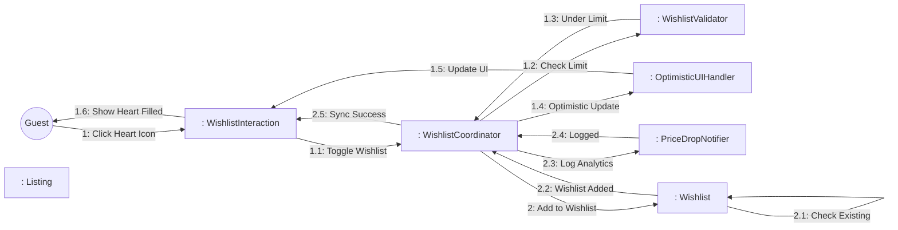
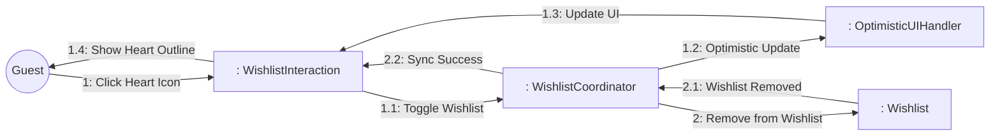
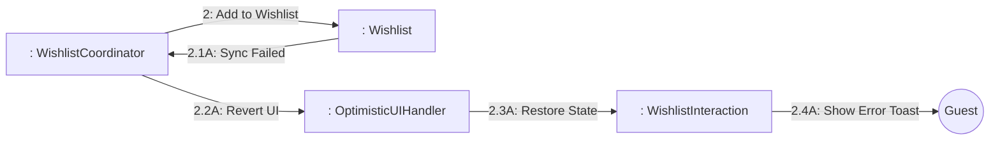

# Dynamic Interaction: Manage Wishlist

**Use Case Reference**: docs/requirements/use-cases/UC-G07-manage-wishlist.md
**Objects From**: docs/analysis/phase2-object-structuring/UC-G07-manage-wishlist.md
**Generated**: 2026-01-26

---

## Participating Objects

From Phase 2 object structuring:
- `: WishlistInteraction` («user interaction»)
- `: WishlistCoordinator` («coordinator»)
- `: WishlistValidator` («business logic»)
- `: OptimisticUIHandler` («service»)
- `: PriceDropNotifier` («service»)
- `: Wishlist` («entity»)
- `: Listing` («entity»)

**Total**: 7 objects (1 boundary, 2 entity, 1 coordinator, 3 application logic)

---

## Main Sequence Communication Diagram

**Scenario**: Guest adds listing to wishlist

### Message Flow Description

| Seq# | From | To | Message | Description |
|------|------|-----|---------|-------------|
| 1 | Guest | WishlistInteraction | Click Heart Icon | Toggle wishlist |
| 1.1 | WishlistInteraction | WishlistCoordinator | Toggle Wishlist | Add/remove listing |
| 1.2 | WishlistCoordinator | WishlistValidator | Check Limit | Validate 100 item limit |
| 1.3 | WishlistValidator | WishlistCoordinator | Under Limit | Limit not exceeded |
| 1.4 | WishlistCoordinator | OptimisticUIHandler | Optimistic Update | Update UI immediately |
| 1.5 | OptimisticUIHandler | WishlistInteraction | Update UI | Show heart filled |
| 1.6 | WishlistInteraction | Guest | Show Heart Filled | Visual feedback |
| 2 | WishlistCoordinator | Wishlist | Add to Wishlist | Sync with backend |
| 2.1 | Wishlist | Wishlist | Check Existing | Verify not duplicate |
| 2.2 | Wishlist | WishlistCoordinator | Wishlist Added | Save successful |
| 2.3 | WishlistCoordinator | PriceDropNotifier | Log Analytics | Log wishlist action |
| 2.4 | PriceDropNotifier | WishlistCoordinator | Logged | Analytics logged |
| 2.5 | WishlistCoordinator | WishlistInteraction | Sync Success | Backend sync complete |

---

## Alternative Sequence: Remove from Wishlist

**Scenario**: Guest removes listing from wishlist

---

## Alternative Sequence: Sync Failed

**Scenario**: Backend sync fails, revert UI

---

## Validation

- [x] All objects from Phase 2 represented
- [x] Messages use hierarchical numbering
- [x] Object names format correct
- [x] Main sequence covered
- [x] Alternative sequences covered (2)

---

## Phase 4 Integration Notes

**No statechart required** - Coordinator pattern (simple CRUD)

---

## Notes

- BR-018: 100 item limit
- Optimistic UI with rollback on failure
- Local storage for non-logged-in guests
- Price drop notifications (opt-in)
