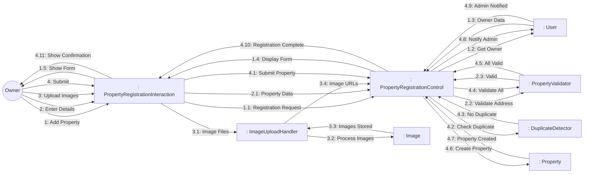
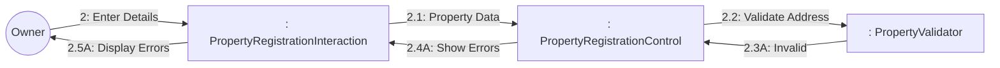

# Dynamic Interaction: Register Property

**Use Case Reference**: docs/requirements/use-cases/UC-O01-register-property.md
**Objects From**: docs/analysis/phase2-object-structuring/UC-O01-register-property.md
**Generated**: 2026-01-26

---

## Participating Objects

From Phase 2 object structuring:
- `: PropertyRegistrationInteraction` («user interaction»)
- `: PropertyRegistrationControl` («state-dependent control»)
- `: PropertyValidator` («business logic»)
- `: ImageUploadHandler` («service»)
- `: DuplicateDetector` («algorithm»)
- `: Property` («entity»)
- `: Image` («entity»)
- `: User` («entity»)

**Total**: 8 objects (1 boundary, 3 entity, 1 control, 3 application logic)

---

## Main Sequence Communication Diagram

**Scenario**: Owner successfully registers property

### Message Flow Description

| Seq# | From | To | Message | Description |
|------|------|-----|---------|-------------|
| 1 | Owner | PropertyRegistrationInteraction | Add Property | Navigate to add property |
| 1.1 | PropertyRegistrationInteraction | PropertyRegistrationControl | Registration Request | Request registration form |
| 1.2 | PropertyRegistrationControl | User | Get Owner | Get owner info |
| 1.3 | User | PropertyRegistrationControl | Owner Data | Return owner details |
| 1.4 | PropertyRegistrationControl | PropertyRegistrationInteraction | Display Form | Show registration form |
| 1.5 | PropertyRegistrationInteraction | Owner | Show Form | Display form fields |
| 2 | Owner | PropertyRegistrationInteraction | Enter Details | Enter property info |
| 2.1 | PropertyRegistrationInteraction | PropertyRegistrationControl | Property Data | Name, address, type, description |
| 2.2 | PropertyRegistrationControl | PropertyValidator | Validate Address | Validate Vietnam address |
| 2.3 | PropertyValidator | PropertyRegistrationControl | Valid | Address valid |
| 3 | Owner | PropertyRegistrationInteraction | Upload Images | Upload photos |
| 3.1 | PropertyRegistrationInteraction | ImageUploadHandler | Image Files | Upload image files |
| 3.2 | ImageUploadHandler | Image | Process Images | Resize, optimize |
| 3.3 | Image | ImageUploadHandler | Images Stored | Images saved |
| 3.4 | ImageUploadHandler | PropertyRegistrationControl | Image URLs | Return image URLs |
| 4 | Owner | PropertyRegistrationInteraction | Submit | Submit for review |
| 4.1 | PropertyRegistrationInteraction | PropertyRegistrationControl | Submit Property | Submit registration |
| 4.2 | PropertyRegistrationControl | DuplicateDetector | Check Duplicate | Check for similar properties |
| 4.3 | DuplicateDetector | PropertyRegistrationControl | No Duplicate | No duplicates found |
| 4.4 | PropertyRegistrationControl | PropertyValidator | Validate All | Validate all fields |
| 4.5 | PropertyValidator | PropertyRegistrationControl | All Valid | All validations passed |
| 4.6 | PropertyRegistrationControl | Property | Create Property | Create property record |
| 4.7 | Property | PropertyRegistrationControl | Property Created | Property saved (pending_approval) |
| 4.8 | PropertyRegistrationControl | User | Notify Admin | Queue admin notification |
| 4.9 | User | PropertyRegistrationControl | Admin Notified | Notification queued |
| 4.10 | PropertyRegistrationControl | PropertyRegistrationInteraction | Registration Complete | Registration submitted |
| 4.11 | PropertyRegistrationInteraction | Owner | Show Confirmation | Display success message |

---

## Alternative Sequence: Validation Failed

**Scenario**: Address format invalid

---

## Validation

- [x] All objects from Phase 2 represented
- [x] Messages use hierarchical numbering
- [x] Main sequence covered
- [x] Alternative sequences covered

---

## Phase 4 Integration Notes

**Messages TO PropertyRegistrationControl (Events)**:
- 1.1: Registration Request
- 1.3: Owner Data
- 2.1: Property Data
- 2.3: Valid / 2.3A: Invalid
- 3.4: Image URLs
- 4.1: Submit Property
- 4.3: No Duplicate / 4.3A: Duplicate Found
- 4.5: All Valid / 4.5A: Validation Failed
- 4.7: Property Created
- 4.9: Admin Notified

**Messages FROM PropertyRegistrationControl (Actions)**:
- 1.2: Get Owner
- 1.4: Display Form
- 2.2: Validate Address
- 4.2: Check Duplicate
- 4.4: Validate All
- 4.6: Create Property
- 4.8: Notify Admin
- 4.10: Registration Complete / 2.4A: Show Errors

---

## Notes

- BR-007: Property in Vietnam
- BR-008: Valid address + contact
- Max 10 images, 5MB each
- Status: pending_approval → active
