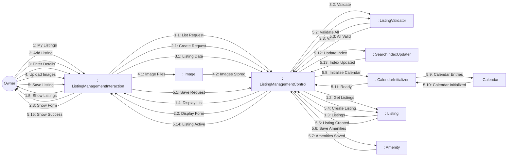

# Dynamic Interaction: Manage Listings

**Use Case Reference**: docs/requirements/use-cases/UC-O02-manage-listings.md
**Objects From**: docs/analysis/phase2-object-structuring/UC-O02-manage-listings.md
**Generated**: 2026-01-26

---

## Participating Objects

From Phase 2 object structuring:
- `: ListingManagementInteraction` («user interaction»)
- `: ListingManagementControl` («state-dependent control»)
- `: ListingValidator` («business logic»)
- `: SearchIndexUpdater` («service»)
- `: CalendarInitializer` («service»)
- `: Listing` («entity»)
- `: Amenity` («entity»)
- `: Image` («entity»)
- `: Calendar` («entity»)

**Total**: 9 objects (1 boundary, 4 entity, 1 control, 3 application logic)

---

## Main Sequence Communication Diagram

**Scenario**: Owner creates new listing

### Message Flow Description

| Seq# | From | To | Message | Description |
|------|------|-----|---------|-------------|
| 1 | Owner | ListingManagementInteraction | My Listings | Navigate to listings |
| 1.1 | ListingManagementInteraction | ListingManagementControl | List Request | Get all listings |
| 1.2 | ListingManagementControl | Listing | Get Listings | Query listings by owner |
| 1.3 | Listing | ListingManagementControl | Listings | Return listing list |
| 1.4 | ListingManagementControl | ListingManagementInteraction | Display List | Show with status |
| 1.5 | ListingManagementInteraction | Owner | Show Listings | Display listings |
| 2 | Owner | ListingManagementInteraction | Add Listing | Click "Add Listing" |
| 2.1 | ListingManagementInteraction | ListingManagementControl | Create Request | Request creation form |
| 2.2 | ListingManagementControl | ListingManagementInteraction | Display Form | Show listing form |
| 2.3 | ListingManagementInteraction | Owner | Show Form | Display form fields |
| 3 | Owner | ListingManagementInteraction | Enter Details | Room type, capacity, price |
| 3.1 | ListingManagementInteraction | ListingManagementControl | Listing Data | Listing details |
| 3.2 | ListingManagementControl | ListingValidator | Validate | Validate listing data |
| 3.3 | ListingValidator | ListingManagementControl | Valid | Validation passed |
| 4 | Owner | ListingManagementInteraction | Upload Images | Upload listing photos |
| 4.1 | ListingManagementInteraction | Image | Image Files | Upload images |
| 4.2 | Image | ListingManagementControl | Images Stored | Images saved |
| 5 | Owner | ListingManagementInteraction | Save Listing | Submit listing |
| 5.1 | ListingManagementInteraction | ListingManagementControl | Save Request | Save listing |
| 5.2 | ListingManagementControl | ListingValidator | Validate All | Final validation |
| 5.3 | ListingValidator | ListingManagementControl | All Valid | All validations passed |
| 5.4 | ListingManagementControl | Listing | Create Listing | Create listing record |
| 5.5 | Listing | ListingManagementControl | Listing Created | Listing saved |
| 5.6 | ListingManagementControl | Amenity | Save Amenities | Save amenities |
| 5.7 | Amenity | ListingManagementControl | Amenities Saved | Amenities saved |
| 5.8 | ListingManagementControl | CalendarInitializer | Initialize Calendar | Create calendar |
| 5.9 | CalendarInitializer | Calendar | Calendar Entries | Initialize calendar dates |
| 5.10 | Calendar | CalendarInitializer | Calendar Initialized | Calendar created |
| 5.11 | CalendarInitializer | ListingManagementControl | Ready | Initialization complete |
| 5.12 | ListingManagementControl | SearchIndexUpdater | Update Index | Update search index |
| 5.13 | SearchIndexUpdater | ListingManagementControl | Index Updated | Search index updated |
| 5.14 | ListingManagementControl | ListingManagementInteraction | Listing Active | Listing is active |
| 5.15 | ListingManagementInteraction | Owner | Show Success | Display confirmation |

---

## Validation

- [x] All objects from Phase 2 represented
- [x] Messages use hierarchical numbering
- [x] Main sequence covered

---

## Phase 4 Integration Notes

**Messages TO ListingManagementControl (Events)**:
- 1.1: List Request
- 1.3: Listings
- 2.1: Create Request
- 3.1: Listing Data
- 3.3: Valid / 3.3A: Invalid
- 4.2: Images Stored
- 5.1: Save Request
- 5.3: All Valid / 5.3A: Validation Failed
- 5.5: Listing Created
- 5.7: Amenities Saved
- 5.11: Ready
- 5.13: Index Updated / 5.13A: Index Failed

**Messages FROM ListingManagementControl (Actions)**:
- 1.2: Get Listings
- 1.4: Display List
- 2.2: Display Form
- 3.2: Validate
- 5.2: Validate All
- 5.4: Create Listing
- 5.6: Save Amenities
- 5.8: Initialize Calendar
- 5.12: Update Index
- 5.14: Listing Active

---

## Notes

- BR-019: Room type matches property type
- BR-020: Pricing within platform limits
- Max 20 images per listing
- Search index update with retry
