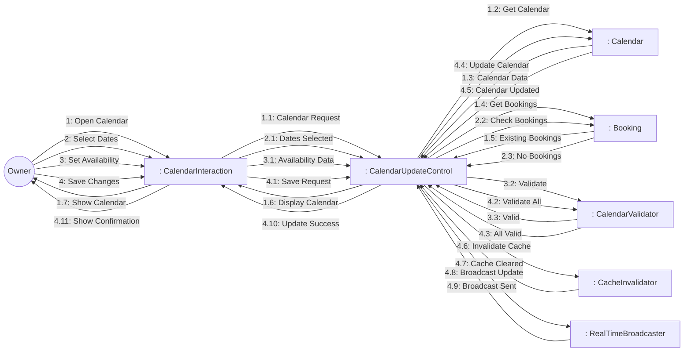
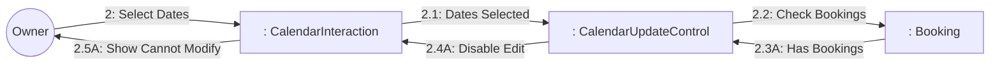
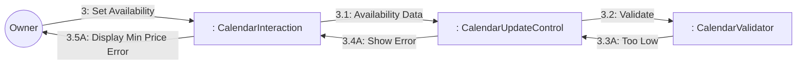

# Dynamic Interaction: Update Calendar

**Use Case Reference**: docs/requirements/use-cases/UC-O03-update-calendar.md
**Objects From**: docs/analysis/phase2-object-structuring/UC-O03-update-calendar.md
**Generated**: 2026-01-26

---

## Participating Objects

From Phase 2 object structuring:
- `: CalendarInteraction` («user interaction»)
- `: CalendarUpdateControl` («state-dependent control»)
- `: CalendarValidator` («business logic»)
- `: CacheInvalidator` («service»)
- `: RealTimeBroadcaster` («service»)
- `: Calendar` («entity»)
- `: Booking` («entity»)

**Total**: 7 objects (1 boundary, 2 entity, 1 control, 3 application logic)

---

## Main Sequence Communication Diagram

**Scenario**: Owner updates calendar availability and pricing

### Message Flow Description

| Seq# | From | To | Message | Description |
|------|------|-----|---------|-------------|
| 1 | Owner | CalendarInteraction | Open Calendar | Open calendar for listing |
| 1.1 | CalendarInteraction | CalendarUpdateControl | Calendar Request | Request calendar data |
| 1.2 | CalendarUpdateControl | Calendar | Get Calendar | Fetch calendar entries |
| 1.3 | Calendar | CalendarUpdateControl | Calendar Data | Return calendar |
| 1.4 | CalendarUpdateControl | Booking | Get Bookings | Get existing bookings |
| 1.5 | Booking | CalendarUpdateControl | Existing Bookings | Return bookings |
| 1.6 | CalendarUpdateControl | CalendarInteraction | Display Calendar | Show with bookings |
| 1.7 | CalendarInteraction | Owner | Show Calendar | Display calendar |
| 2 | Owner | CalendarInteraction | Select Dates | Select date range |
| 2.1 | CalendarInteraction | CalendarUpdateControl | Dates Selected | Selected date range |
| 2.2 | CalendarUpdateControl | Booking | Check Bookings | Check for bookings |
| 2.3 | Booking | CalendarUpdateControl | No Bookings | No confirmed bookings |
| 3 | Owner | CalendarInteraction | Set Availability | Set available/unavailable + price |
| 3.1 | CalendarInteraction | CalendarUpdateControl | Availability Data | Availability and pricing |
| 3.2 | CalendarUpdateControl | CalendarValidator | Validate | Validate changes |
| 3.3 | CalendarValidator | CalendarUpdateControl | Valid | Changes valid |
| 4 | Owner | CalendarInteraction | Save Changes | Save calendar updates |
| 4.1 | CalendarInteraction | CalendarUpdateControl | Save Request | Save changes |
| 4.2 | CalendarUpdateControl | CalendarValidator | Validate All | Final validation |
| 4.3 | CalendarValidator | CalendarUpdateControl | All Valid | Validated |
| 4.4 | CalendarUpdateControl | Calendar | Update Calendar | Update calendar entries |
| 4.5 | Calendar | CalendarUpdateControl | Calendar Updated | Calendar saved |
| 4.6 | CalendarUpdateControl | CacheInvalidator | Invalidate Cache | Clear cached data |
| 4.7 | CacheInvalidator | CalendarUpdateControl | Cache Cleared | Cache invalidated |
| 4.8 | CalendarUpdateControl | RealTimeBroadcaster | Broadcast Update | Notify guests |
| 4.9 | RealTimeBroadcaster | CalendarUpdateControl | Broadcast Sent | Update broadcasted |
| 4.10 | CalendarUpdateControl | CalendarInteraction | Update Success | Changes saved |
| 4.11 | CalendarInteraction | Owner | Show Confirmation | Display confirmation |

---

## Alternative Sequence: Dates Have Bookings

**Scenario**: Owner tries to modify booked dates

---

## Alternative Sequence: Price Below Minimum

**Scenario**: Owner sets price too low

---

## Validation

- [x] All objects from Phase 2 represented
- [x] Messages use hierarchical numbering
- [x] Main sequence covered
- [x] Alternative sequences covered (2)

---

## Phase 4 Integration Notes

**Messages TO CalendarUpdateControl (Events)**:
- 1.1: Calendar Request
- 1.3: Calendar Data, 1.5: Existing Bookings
- 2.1: Dates Selected
- 2.3: No Bookings / 2.3A: Has Bookings
- 3.1: Availability Data
- 3.3: Valid / 3.3A: Too Low
- 4.1: Save Request
- 4.3: All Valid / 4.3A: Invalid
- 4.5: Calendar Updated
- 4.7: Cache Cleared
- 4.9: Broadcast Sent

**Messages FROM CalendarUpdateControl (Actions)**:
- 1.2: Get Calendar
- 1.4: Get Bookings
- 1.6: Display Calendar
- 2.2: Check Bookings
- 3.2: Validate
- 4.2: Validate All
- 4.4: Update Calendar
- 4.6: Invalidate Cache
- 4.8: Broadcast Update
- 4.10: Update Success / 2.4A: Disable Edit / 3.4A: Show Error

---

## Notes

- BR-021: Dates with bookings cannot be modified
- BR-022: Minimum price enforced
- Real-time updates to connected guests
- Bulk update API
- Audit trail for changes
