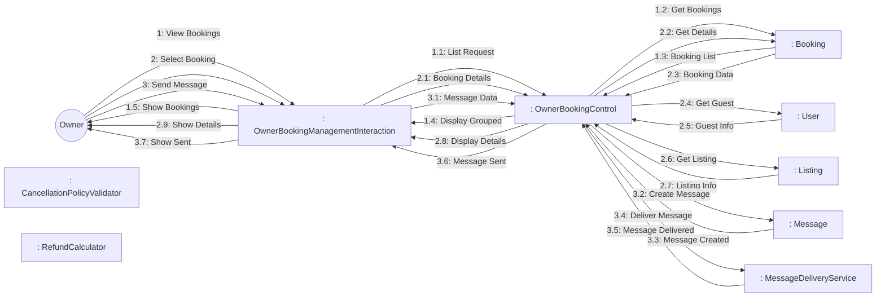
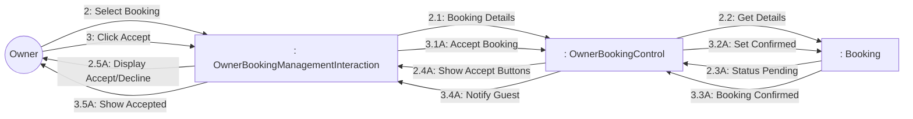
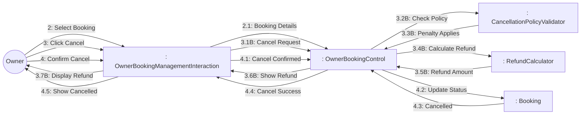

# Dynamic Interaction: Manage Bookings (Owner View)

**Use Case Reference**: docs/requirements/use-cases/UC-O04-manage-bookings-owner.md
**Objects From**: docs/analysis/phase2-object-structuring/UC-O04-manage-bookings-owner.md
**Generated**: 2026-01-26

---

## Participating Objects

From Phase 2 object structuring:
- `: OwnerBookingManagementInteraction` («user interaction»)
- `: OwnerBookingControl` («state-dependent control»)
- `: CancellationPolicyValidator` («business logic»)
- `: MessageDeliveryService` («service»)
- `: RefundCalculator` («algorithm»)
- `: Booking` («entity»)
- `: User` («entity»)
- `: Message` («entity»)
- `: Listing` («entity»)

**Total**: 9 objects (1 boundary, 4 entity, 1 control, 3 application logic)

---

## Main Sequence Communication Diagram

**Scenario**: Owner views booking and sends message to guest

### Message Flow Description

| Seq# | From | To | Message | Description |
|------|------|-----|---------|-------------|
| 1 | Owner | OwnerBookingManagementInteraction | View Bookings | Navigate to bookings dashboard |
| 1.1 | OwnerBookingManagementInteraction | OwnerBookingControl | List Request | Get owner's bookings |
| 1.2 | OwnerBookingControl | Booking | Get Bookings | Query bookings by owner |
| 1.3 | Booking | OwnerBookingControl | Booking List | Return booking list |
| 1.4 | OwnerBookingControl | OwnerBookingManagementInteraction | Display Grouped | Show grouped by status |
| 1.5 | OwnerBookingManagementInteraction | Owner | Show Bookings | Display bookings |
| 2 | Owner | OwnerBookingManagementInteraction | Select Booking | Click on booking |
| 2.1 | OwnerBookingManagementInteraction | OwnerBookingControl | Booking Details | Request booking details |
| 2.2 | OwnerBookingControl | Booking | Get Details | Fetch booking data |
| 2.3 | Booking | OwnerBookingControl | Booking Data | Return booking details |
| 2.4 | OwnerBookingControl | User | Get Guest | Get guest information |
| 2.5 | User | OwnerBookingControl | Guest Info | Guest details |
| 2.6 | OwnerBookingControl | Listing | Get Listing | Get listing info |
| 2.7 | Listing | OwnerBookingControl | Listing Info | Listing details |
| 2.8 | OwnerBookingControl | OwnerBookingManagementInteraction | Display Details | Show with actions |
| 2.9 | OwnerBookingManagementInteraction | Owner | Show Details | Display booking details |
| 3 | Owner | OwnerBookingManagementInteraction | Send Message | Send message to guest |
| 3.1 | OwnerBookingManagementInteraction | OwnerBookingControl | Message Data | Message content |
| 3.2 | OwnerBookingControl | Message | Create Message | Create message record |
| 3.3 | Message | OwnerBookingControl | Message Created | Message saved |
| 3.4 | OwnerBookingControl | MessageDeliveryService | Deliver Message | Deliver to guest |
| 3.5 | MessageDeliveryService | OwnerBookingControl | Message Delivered | Delivered within 1 minute |
| 3.6 | OwnerBookingControl | OwnerBookingManagementInteraction | Message Sent | Message sent successfully |
| 3.7 | OwnerBookingManagementInteraction | Owner | Show Sent | Display confirmation |

---

## Alternative Sequence: Accept Request Booking

**Scenario**: Owner approves booking request

---

## Alternative Sequence: Cancel Booking

**Scenario**: Owner cancels booking with penalty

---

## Validation

- [x] All objects from Phase 2 represented
- [x] Messages use hierarchical numbering
- [x] Main sequence covered
- [x] Alternative sequences covered (2)

---

## Phase 4 Integration Notes

**Messages TO OwnerBookingControl (Events)**:
- 1.1: List Request
- 1.3: Booking List
- 2.1: Booking Details
- 2.3: Booking Data, 2.5: Guest Info, 2.7: Listing Info
- 2.3A: Status Pending (request booking)
- 3.1: Message Data
- 3.1A: Accept Booking
- 3.3A: Booking Confirmed
- 3.1B: Cancel Request
- 3.3B: Penalty Applies
- 3.5B: Refund Amount
- 4.1: Cancel Confirmed
- 4.3: Cancelled

**Messages FROM OwnerBookingControl (Actions)**:
- 1.2: Get Bookings
- 1.4: Display Grouped
- 2.2: Get Details
- 2.4: Get Guest
- 2.6: Get Listing
- 2.8: Display Details / 2.4A: Show Accept Buttons
- 3.2: Create Message
- 3.4: Deliver Message
- 3.6: Message Sent
- 3.2A: Set Confirmed
- 3.4A: Notify Guest
- 3.2B: Check Policy
- 3.4B: Calculate Refund
- 3.6B: Show Refund
- 4.2: Update Status
- 4.4: Cancel Success

---

## Notes

- BR-023: Owner cancellations require reason + penalty explanation
- BR-024: Guest messages delivered within 1 minute
- Request booking: Accept/Decline buttons
- Instant booking: Confirmed status
- Real-time booking notifications
