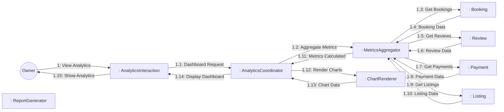
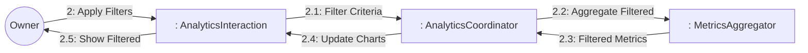
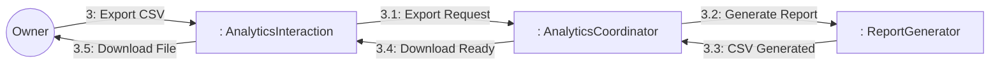

# Dynamic Interaction: View Analytics

**Use Case Reference**: docs/requirements/use-cases/UC-O05-view-analytics.md
**Objects From**: docs/analysis/phase2-object-structuring/UC-O05-view-analytics.md
**Generated**: 2026-01-26

---

## Participating Objects

From Phase 2 object structuring:
- `: AnalyticsInteraction` («user interaction»)
- `: AnalyticsCoordinator` («coordinator»)
- `: MetricsAggregator` («algorithm»)
- `: ChartRenderer` («service»)
- `: ReportGenerator` («service»)
- `: Booking` («entity»)
- `: Review` («entity»)
- `: Payment` («entity»)
- `: Listing` («entity»)

**Total**: 8 objects (1 boundary, 4 entity, 1 coordinator, 2 application logic)

---

## Main Sequence Communication Diagram

**Scenario**: Owner views analytics dashboard

### Message Flow Description

| Seq# | From | To | Message | Description |
|------|------|-----|---------|-------------|
| 1 | Owner | AnalyticsInteraction | View Analytics | Navigate to analytics |
| 1.1 | AnalyticsInteraction | AnalyticsCoordinator | Dashboard Request | Request dashboard data |
| 1.2 | AnalyticsCoordinator | MetricsAggregator | Aggregate Metrics | Calculate all metrics |
| 1.3 | MetricsAggregator | Booking | Get Bookings | Fetch booking data |
| 1.4 | Booking | MetricsAggregator | Booking Data | Return bookings |
| 1.5 | MetricsAggregator | Review | Get Reviews | Fetch review data |
| 1.6 | Review | MetricsAggregator | Review Data | Return reviews |
| 1.7 | MetricsAggregator | Payment | Get Payments | Fetch payment data |
| 1.8 | Payment | MetricsAggregator | Payment Data | Return payments |
| 1.9 | MetricsAggregator | Listing | Get Listings | Fetch listing data |
| 1.10 | Listing | MetricsAggregator | Listing Data | Return listings |
| 1.11 | MetricsAggregator | AnalyticsCoordinator | Metrics Calculated | All metrics computed |
| 1.12 | AnalyticsCoordinator | ChartRenderer | Render Charts | Generate chart data |
| 1.13 | ChartRenderer | AnalyticsCoordinator | Chart Data | Chart rendering data |
| 1.14 | AnalyticsCoordinator | AnalyticsInteraction | Display Dashboard | Dashboard ready |
| 1.15 | AnalyticsInteraction | Owner | Show Analytics | Display dashboard |

---

## Alternative Sequence: Filter by Date Range

**Scenario**: Owner applies filters

---

## Alternative Sequence: Export Report

**Scenario**: Owner exports analytics as CSV

---

## Validation

- [x] All objects from Phase 2 represented
- [x] Messages use hierarchical numbering
- [x] Main sequence covered
- [x] Alternative sequences covered (2)

---

## Phase 4 Integration Notes

**No statechart required** - Coordinator pattern (read-only dashboard)

---

## Notes

- BR-025: Analytics updated daily
- BR-026: Export limited to owner's data
- Chart rendering < 2s
- Revenue, occupancy, trends, ratings
- Mobile-responsive dashboard
