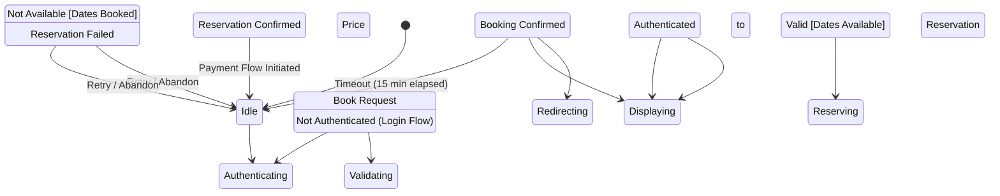

# State Machine: BookingCreationControl

**Control Object**: BookingCreationControl («state-dependent control»)
**Associated Use Cases**: UC-G03 (Create Booking)
**Generated**: 2026-01-26

---

## State Identification

| State Name | Description | Entry Action | Exit Action |
|------------|-------------|--------------|-------------|
| Idle | System waiting for booking initiation | - | - |
| Authenticating Guest | Verifying guest login status | entry / Prompt Login | - |
| Validating Availability | Checking dates and capacity | - | - |
| Displaying Price Breakdown | Showing cost calculation to guest | entry / Display Price | - |
| Reserving Dates | Locking availability (15-min timer) | entry / Start Timer | exit / Cancel Timer |
| Redirecting to Payment | Forwarding to payment flow | entry / Redirect | - |
| Displaying Availability Error | Dates no longer available | entry / Display Error | - |
| Displaying Reservation Error | Failed to create booking | entry / Display Error | - |

**Total States**: 8

---

## Event/Action Mapping

### Events (Messages TO Control)

| Event | Source (Phase 3) | From Object | Use Case | Seq# |
|-------|------------------|-------------|----------|------|
| Book Request | Book Request | BookingInteraction | UC-G03 | 1.1 |
| Authenticated | Authenticated | User | UC-G03 | 1.3 |
| Not Authenticated | Not Authenticated | User | UC-G03 | 1.3A |
| Valid | Valid | AvailabilityValidator | UC-G03 | 2.3 |
| Not Available | Not Available | AvailabilityValidator | UC-G03 | 2.3A |
| Price Breakdown | Price Breakdown | PriceCalculator | UC-G03 | 3.3 |
| Booking Confirmed | Booking Confirmed | BookingInteraction | UC-G03 | 5.1 |
| Reservation Confirmed | Reservation Confirmed | ReservationManager | UC-G03 | 6.3 |
| Reservation Failed | Reservation Failed | ReservationManager | UC-G03 | 6.3A |
| Pending Payment | Pending Payment | BookingFactory | UC-G03 | 7.3 |
| Creation Failed | Creation Failed | BookingFactory | UC-G03 | 7.3A |
| Timeout | Timeout (Internal) | Timer | UC-G03 | - |

**Total Events**: 12

### Actions (Messages FROM Control)

| Action | Target (Phase 3) | To Object | Use Case | Seq# |
|--------|------------------|-----------|----------|------|
| Check Auth | Check Auth | User | UC-G03 | 1.2 |
| Validate Availability | Validate Availability | AvailabilityValidator | UC-G03 | 2 |
| Calculate Price | Calculate Price | PriceCalculator | UC-G03 | 3 |
| Display Price | Display Price | BookingInteraction | UC-G03 | 4 |
| Reserve Dates | Reserve Dates | ReservationManager | UC-G03 | 6 |
| Create Booking | Create Booking | BookingFactory | UC-G03 | 7 |
| Redirect to Payment | Redirect to Payment | BookingInteraction | UC-G03 | 8 |
| Display Error | Display Error | BookingInteraction | UC-G03 | 2.4A |

**Total Actions**: 8

---

## Statechart Diagram

---

## Transition Table

| From State | Event | Condition | To State | Action | Use Case Ref |
|------------|-------|-----------|----------|--------|--------------|
| Idle | Book Request | - | Authenticating Guest | Check Auth | UC-G03 |
| Authenticating Guest | Authenticated | - | Validating Availability | Validate Availability | UC-G03 |
| Validating Availability | Valid | [Dates Available] | Displaying Price Breakdown | Calculate Price, Display Price | UC-G03 |
| Validating Availability | Not Available | [Dates Booked] | Displaying Availability Error | Display Error | UC-G03 |
| Displaying Price Breakdown | Booking Confirmed | - | Reserving Dates | Reserve Dates | UC-G03 |
| Reserving Dates | Reservation Confirmed | - | Redirecting to Payment | Create Booking, Redirect to Payment | UC-G03 |
| Reserving Dates | Reservation Failed | - | Displaying Reservation Error | Display Error | UC-G03 |
| Reserving Dates | Timeout | [15 min elapsed] | Idle | Release Reservation | UC-G03 |
| Redirecting to Payment | Payment Flow Initiated | - | Idle | - | UC-G03 |
| Displaying Availability Error | Retry / Abandon | - | Idle | - | UC-G03 |
| Displaying Reservation Error | Retry / Abandon | - | Idle | - | UC-G03 |

**Total Transitions**: 11

---

## Validation Checklist

- [x] All states named with adjectives/gerunds (NOT events/actions)
- [x] Each state has unique name
- [x] Initial state defined ([*] → Idle)
- [x] All states have exit paths
- [x] Transition syntax: `Event [Condition] / Action`
- [x] All events match messages TO control
- [x] All actions match messages FROM control
- [x] Flat structure (no composite states)
- [x] Diagram renders correctly

---

## Phase 5 Integration Notes

This statechart will be validated in Phase 5.

---

## Notes

- 15-minute reservation timeout (BR-004)
- Zero double-bookings guarantee
- Atomic booking creation
- Temporary data preservation during auth
- Authentication bypass if already logged in
