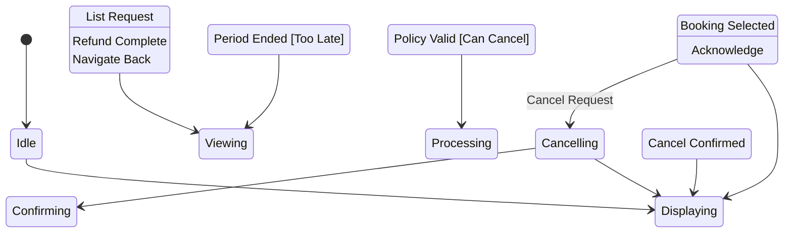

# State Machine: BookingManagementControl

**Control Object**: BookingManagementControl («state-dependent control»)
**Associated Use Cases**: UC-G05 (Manage Bookings)
**Generated**: 2026-01-26

---

## State Identification

| State Name | Description | Entry Action | Exit Action |
|------------|-------------|--------------|-------------|
| Idle | System waiting for booking management request | - | - |
| Displaying Bookings | Showing guest's booking list | entry / Display Grouped Bookings | - |
| Viewing Details | Showing specific booking information | entry / Display Booking Details | - |
| Cancelling | Processing booking cancellation | - | - |
| Confirming Cancellation | Showing refund amount before confirm | entry / Display Refund | - |
| Displaying Cancellation Error | Cannot cancel (period ended) | entry / Disable Cancel Button | - |
| Processing Refund | Calculating and executing refund | - | - |

**Total States**: 7

---

## Event/Action Mapping

### Events (Messages TO Control)

| Event | Source (Phase 3) | From Object | Use Case | Seq# |
|-------|------------------|-------------|----------|------|
| List Request | List Request | BookingManagementInteraction | UC-G05 | 1.1 |
| Booking List | Booking List | Booking | UC-G05 | 1.3 |
| Booking Details | Booking Details | BookingManagementInteraction | UC-G05 | 2.1 |
| Booking Data | Booking Data | Booking | UC-G05 | 2.3 |
| Guest Info | Guest Info | User | UC-G05 | 2.5 |
| Listing Info | Listing Info | Listing | UC-G05 | 2.7 |
| Cancel Request | Cancel Request | BookingManagementInteraction | UC-G05 | 3.1 |
| Policy Valid | Policy Valid | CancellationPolicyValidator | UC-G05 | 3.3 |
| Period Ended | Period Ended | CancellationPolicyValidator | UC-G05 | 3.3A |
| Refund Amount | Refund Amount | RefundCalculator | UC-G05 | 3.5 |
| Cancel Confirmed | Cancel Confirmed | BookingManagementInteraction | UC-G05 | 4.1 |
| Cancelled | Cancelled | Booking | UC-G05 | 4.3 |
| Refund Processed | Refund Processed | Payment | UC-G05 | 4.5 |

**Total Events**: 13

### Actions (Messages FROM Control)

| Action | Target (Phase 3) | To Object | Use Case | Seq# |
|--------|------------------|-----------|----------|------|
| Get Bookings | Get Bookings | Booking | UC-G05 | 1.2 |
| Display Grouped | Display Grouped | BookingManagementInteraction | UC-G05 | 1.4 |
| Get Details | Get Details | Booking | UC-G05 | 2.2 |
| Get Guest | Get Guest | User | UC-G05 | 2.4 |
| Get Listing | Get Listing | Listing | UC-G05 | 2.6 |
| Display Details | Display Details | BookingManagementInteraction | UC-G05 | 2.8 |
| Check Policy | Check Policy | CancellationPolicyValidator | UC-G05 | 3.2 |
| Calculate Refund | Calculate Refund | RefundCalculator | UC-G05 | 3.4 |
| Show Refund | Show Refund | BookingManagementInteraction | UC-G05 | 3.6 |
| Disable Cancel Button | Disable Cancel Button | BookingManagementInteraction | UC-G05 | 3.4A |
| Update Status | Update Status | Booking | UC-G05 | 4.2 |
| Process Refund | Process Refund | Payment | UC-G05 | 4.4 |
| Cancel Success | Cancel Success | BookingManagementInteraction | UC-G05 | 4.6 |

**Total Actions**: 13

---

## Statechart Diagram

---

## Transition Table

| From State | Event | Condition | To State | Action | Use Case Ref |
|------------|-------|-----------|----------|--------|--------------|
| Idle | List Request | - | Displaying Bookings | Get Bookings, Display Grouped | UC-G05 |
| Displaying Bookings | Booking Selected | - | Viewing Details | Get Details, Get Guest, Get Listing, Display Details | UC-G05 |
| Viewing Details | Cancel Request | - | Cancelling | Check Policy | UC-G05 |
| Cancelling | Policy Valid | [Can Cancel] | Confirming Cancellation | Calculate Refund, Show Refund | UC-G05 |
| Cancelling | Period Ended | [Too Late] | Displaying Cancellation Error | Disable Cancel Button | UC-G05 |
| Confirming Cancellation | Cancel Confirmed | - | Processing Refund | Update Status, Process Refund | UC-G05 |
| Processing Refund | Refund Complete | - | Displaying Bookings | Cancel Success | UC-G05 |
| Viewing Details | Navigate Back | - | Displaying Bookings | - | UC-G05 |
| Displaying Cancellation Error | Acknowledge | - | Viewing Details | - | UC-G05 |

**Total Transitions**: 9

---

## Validation Checklist

- [x] All states named with adjectives/gerunds
- [x] Each state has unique name
- [x] Initial state defined
- [x] All states have exit paths
- [x] Transition syntax correct
- [x] All events match Phase 3
- [x] All actions match Phase 3
- [x] Flat structure
- [x] Diagram renders

---

## Phase 5 Integration Notes

This statechart will be validated in Phase 5.

---

## Notes

- BR-013: Full refund if cancelled 24h before check-in
- BR-014: 50% refund if cancelled 48h before check-in
- BR-015: No refund if cancelled less than 48h before check-in
- Paginated display (20 per page)
- Owner receives cancellation notifications
