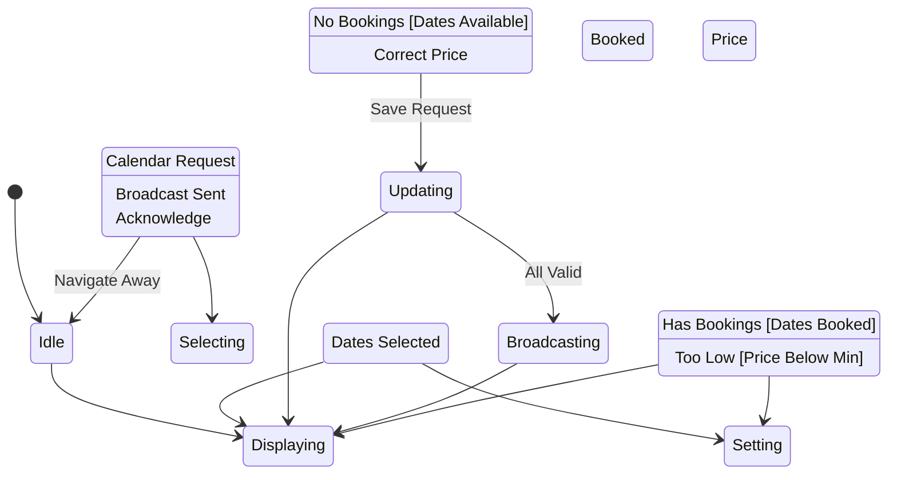

# State Machine: CalendarUpdateControl

**Control Object**: CalendarUpdateControl («state-dependent control»)
**Associated Use Cases**: UC-O03 (Update Calendar)
**Generated**: 2026-01-26

---

## State Identification

| State Name | Description | Entry Action | Exit Action |
|------------|-------------|--------------|-------------|
| Idle | System waiting for calendar interaction | - | - |
| Displaying Calendar | Showing calendar with bookings | entry / Display Calendar | - |
| Selecting Dates | Owner choosing date range | - | - |
| Setting Availability | Owner setting available/unavailable + price | - | - |
| Updating | Saving calendar changes | - | - |
| Broadcasting | Notifying connected guests of changes | - | - |
| Displaying Booked Error | Cannot edit booked dates | entry / Disable Edit | - |
| Displaying Price Error | Price below minimum | entry / Show Min Price Error | - |

**Total States**: 8

---

## Event/Action Mapping

### Events (Messages TO Control)

| Event | Source (Phase 3) | From Object | Use Case | Seq# |
|-------|------------------|-------------|----------|------|
| Calendar Request | Calendar Request | CalendarInteraction | UC-O03 | 1.1 |
| Calendar Data | Calendar Data | Calendar | UC-O03 | 1.3 |
| Existing Bookings | Existing Bookings | Booking | UC-O03 | 1.5 |
| Dates Selected | Dates Selected | CalendarInteraction | UC-O03 | 2.1 |
| No Bookings | No Bookings | Booking | UC-O03 | 2.3 |
| Has Bookings | Has Bookings | Booking | UC-O03 | 2.3A |
| Availability Data | Availability Data | CalendarInteraction | UC-O03 | 3.1 |
| Valid | Valid | CalendarValidator | UC-O03 | 3.3 |
| Too Low | Too Low | CalendarValidator | UC-O03 | 3.3A |
| Save Request | Save Request | CalendarInteraction | UC-O03 | 4.1 |
| All Valid | All Valid | CalendarValidator | UC-O03 | 4.3 |
| Calendar Updated | Calendar Updated | Calendar | UC-O03 | 4.5 |
| Cache Cleared | Cache Cleared | CacheInvalidator | UC-O03 | 4.7 |
| Broadcast Sent | Broadcast Sent | RealTimeBroadcaster | UC-O03 | 4.9 |

**Total Events**: 14

### Actions (Messages FROM Control)

| Action | Target (Phase 3) | To Object | Use Case | Seq# |
|--------|------------------|-----------|----------|------|
| Get Calendar | Get Calendar | Calendar | UC-O03 | 1.2 |
| Get Bookings | Get Bookings | Booking | UC-O03 | 1.4 |
| Display Calendar | Display Calendar | CalendarInteraction | UC-O03 | 1.6 |
| Check Bookings | Check Bookings | Booking | UC-O03 | 2.2 |
| Validate | Validate | CalendarValidator | UC-O03 | 3.2 |
| Validate All | Validate All | CalendarValidator | UC-O03 | 4.2 |
| Update Calendar | Update Calendar | Calendar | UC-O03 | 4.4 |
| Invalidate Cache | Invalidate Cache | CacheInvalidator | UC-O03 | 4.6 |
| Broadcast Update | Broadcast Update | RealTimeBroadcaster | UC-O03 | 4.8 |
| Update Success | Update Success | CalendarInteraction | UC-O03 | 4.10 |
| Disable Edit | Disable Edit | CalendarInteraction | UC-O03 | 2.4A |
| Show Error | Show Error | CalendarInteraction | UC-O03 | 3.4A |

**Total Actions**: 12

---

## Statechart Diagram

---

## Transition Table

| From State | Event | Condition | To State | Action | Use Case Ref |
|------------|-------|-----------|----------|--------|--------------|
| Idle | Calendar Request | - | Displaying Calendar | Get Calendar, Get Bookings, Display Calendar | UC-O03 |
| Displaying Calendar | Dates Selected | - | Selecting Dates | Check Bookings | UC-O03 |
| Selecting Dates | No Bookings | [Dates Available] | Setting Availability | - | UC-O03 |
| Selecting Dates | Has Bookings | [Dates Booked] | Displaying Booked Error | Disable Edit | UC-O03 |
| Setting Availability | Save Request | - | Updating | Validate All | UC-O03 |
| Updating | Too Low | [Price Below Min] | Displaying Price Error | Show Error | UC-O03 |
| Updating | All Valid | - | Broadcasting | Update Calendar, Invalidate Cache, Broadcast Update | UC-O03 |
| Broadcasting | Broadcast Sent | - | Displaying Calendar | Update Success | UC-O03 |
| Displaying Price Error | Correct Price | - | Setting Availability | - | UC-O03 |
| Displaying Booked Error | Acknowledge | - | Displaying Calendar | - | UC-O03 |
| Displaying Calendar | Navigate Away | - | Idle | - | UC-O03 |

**Total Transitions**: 11

---

## Validation Checklist

- [x] All states named with adjectives/gerunds
- [x] Each state has unique name
- [x] Initial state defined
- [x] All states have exit paths
- [x] Transition syntax correct
- [x] All events match Phase 3
- [x] All actions match Phase 3
- [x] Flat structure
- [x] Diagram renders

---

## Phase 5 Integration Notes

This statechart will be validated in Phase 5.

---

## Notes

- BR-021: Dates with bookings cannot be modified
- BR-022: Minimum price enforced
- Real-time updates to connected guests
- Bulk update API
- Audit trail for changes
