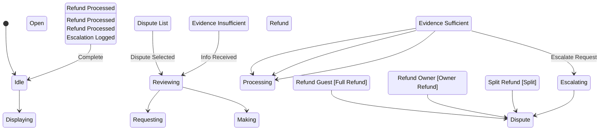

# State Machine: DisputeResolutionControl

**Control Object**: DisputeResolutionControl («state-dependent control»)
**Associated Use Cases**: UC-A05 (Handle Disputes)
**Generated**: 2026-01-26

---

## State Identification

| State Name | Description | Entry Action | Exit Action |
|------------|-------------|--------------|-------------|
| Idle | System waiting for dispute interaction | - | - |
| Displaying Open Disputes | Showing dispute queue with priority | entry / Display Dispute Queue | - |
| Reviewing | Admin reviewing dispute details and evidence | entry / Display for Review | - |
| Requesting Information | Asking for more evidence from parties | entry / Request Info | - |
| Making Ruling | Admin deciding dispute outcome | - | - |
| Processing Refund (Guest) | Executing full refund to guest | - | - |
| Processing Refund (Owner) | Executing refund to owner | - | - |
| Processing Refund (Split) | Executing partial refund split | - | - |
| Escalating | Dispute requires legal review | entry / Log Escalation | - |
| Dispute Resolved | Dispute closed and archived | entry / Display Resolved | exit / Notify Parties, Log Resolution |

**Total States**: 10

---

## Event/Action Mapping

### Events (Messages TO Control)

| Event | Source (Phase 3) | From Object | Use Case | Seq# |
|-------|------------------|-------------|----------|------|
| Dispute List | Dispute List | DisputeManagementInteraction | UC-A05 | 1.1 |
| Open Disputes | Open Disputes | Dispute | UC-A05 | 1.3 |
| Dispute Details | Dispute Details | DisputeManagementInteraction | UC-A05 | 2.1 |
| Dispute Data | Dispute Data | Dispute | UC-A05 | 2.3 |
| Booking Details | Booking Details | Booking | UC-A05 | 2.5 |
| Evidence | Evidence | Message | UC-A05 | 2.7 |
| Evidence Sufficient | Evidence Sufficient | DisputeValidator | UC-A05 | 2.9 |
| Evidence Insufficient | Evidence Insufficient | DisputeValidator | UC-A05 | 2.9A |
| Refund Guest | Refund Guest | DisputeManagementInteraction | UC-A05 | 3.1 |
| Refund Owner | Refund Owner | DisputeManagementInteraction | UC-A05 | 3.1B |
| Split Refund | Split Refund | DisputeManagementInteraction | UC-A05 | 3.1C |
| Ruling Valid | Ruling Valid | DisputeValidator | UC-A05 | 3.3 |
| Payment Data | Payment Data | Payment | UC-A05 | 3.6 |
| Refund Processed | Refund Processed | RefundProcessor | UC-A05 | 3.9 |
| Dispute Resolved | Dispute Resolved | Dispute | UC-A05 | 3.11 |
| Notifications Sent | Notifications Sent | DisputeNotifier | UC-A05 | 3.13 |
| Resolution Logged | Resolution Logged | SLAMonitor | UC-A05 | 3.15 |
| Escalate Request | Escalate Request | DisputeManagementInteraction | UC-A05 | 3.2 |
| Escalated | Escalated | Dispute | UC-A05 | 3.3 |
| Escalation Logged | Escalation Logged | SLAMonitor | UC-A05 | 3.5 |

**Total Events**: 20

### Actions (Messages FROM Control)

| Action | Target (Phase 3) | To Object | Use Case | Seq# |
|--------|------------------|-----------|----------|------|
| Get Open Disputes | Get Open Disputes | Dispute | UC-A05 | 1.2 |
| Display Queue | Display Queue | DisputeManagementInteraction | UC-A05 | 1.4 |
| Get Dispute | Get Dispute | Dispute | UC-A05 | 2.2 |
| Get Booking | Get Booking | Booking | UC-A05 | 2.4 |
| Get Messages | Get Messages | Message | UC-A05 | 2.6 |
| Validate Evidence | Validate Evidence | DisputeValidator | UC-A05 | 2.8 |
| Display for Review | Display for Review | DisputeManagementInteraction | UC-A05 | 2.10 |
| Request Info | Request Info | DisputeManagementInteraction | UC-A05 | 2.10A |
| Validate Ruling | Validate Ruling | DisputeValidator | UC-A05 | 3.2 |
| Process Refund | Process Refund | RefundProcessor | UC-A05 | 3.4 |
| Update Dispute | Update Dispute | Dispute | UC-A05 | 3.10 |
| Notify Parties | Notify Parties | DisputeNotifier | UC-A05 | 3.12 |
| Log Resolution | Log Resolution | SLAMonitor | UC-A05 | 3.14 |
| Resolution Complete | Resolution Complete | DisputeManagementInteraction | UC-A05 | 3.16 |
| Log Escalation | Log Escalation | SLAMonitor | UC-A05 | 3.4 |
| Escalation Complete | Escalation Complete | DisputeManagementInteraction | UC-A05 | 3.6 |

**Total Actions**: 16

---

## Statechart Diagram

---

## Validation Checklist

- [x] All states named with adjectives/gerunds
- [x] Each state has unique name
- [x] Initial state defined
- [x] All states have exit paths
- [x] Transition syntax correct
- [x] All events match Phase 3
- [x] All actions match Phase 3
- [x] Flat structure
- [x] Diagram renders

---

## Notes

- BR-033: Response within 24 hours
- BR-034: Resolution within 72 hours
- BR-035: All decisions auditable
- Ruling options: refund guest, refund owner, split
- Escalation to legal team
