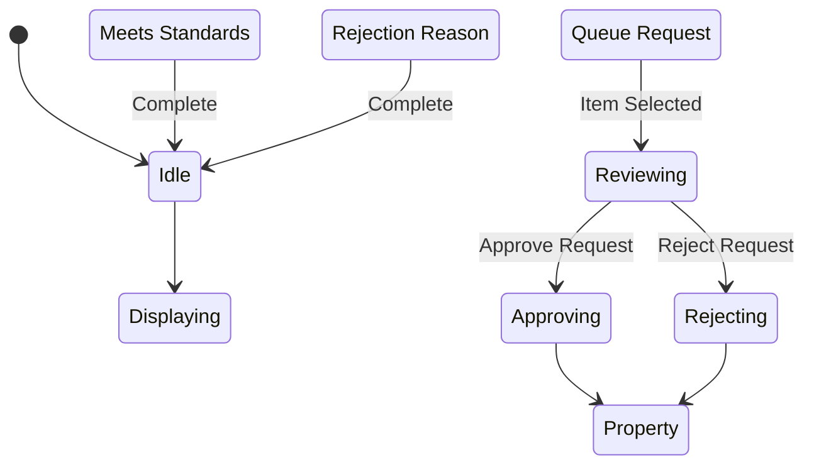

# State Machine: ListingApprovalControl

**Control Object**: ListingApprovalControl («state-dependent control»)
**Associated Use Cases**: UC-A01 (Approve Listings)
**Generated**: 2026-01-26

---

## State Identification

| State Name | Description | Entry Action | Exit Action |
|------------|-------------|--------------|-------------|
| Idle | System waiting for approval interaction | - | - |
| Displaying Queue | Showing pending approval items | entry / Display Pending Queue | - |
| Reviewing | Admin reviewing property/listing | entry / Display for Review | - |
| Approving | Processing approval decision | - | - |
| Rejecting | Processing rejection with reason | entry / Request Rejection Reason | - |
| Property Active | Property approved and visible | entry / Display Success | exit / Make Visible, Notify Owner |
| Property Rejected | Property rejected with feedback | entry / Display Rejected | exit / Notify Owner |

**Total States**: 7

---

## Event/Action Mapping

### Events (Messages TO Control)

| Event | Source (Phase 3) | From Object | Use Case | Seq# |
|-------|------------------|-------------|----------|------|
| Queue Request | Queue Request | ListingApprovalInteraction | UC-A01 | 1.1 |
| Pending List | Pending List | Property | UC-A01 | 1.3 |
| Item Request | Item Request | ListingApprovalInteraction | UC-A01 | 2.1 |
| Property Details | Property Details | Property | UC-A01 | 2.3 |
| Listing Images | Listing Images | Listing | UC-A01 | 2.5 |
| Owner Info | Owner Info | User | UC-A01 | 2.7 |
| Compliance Status | Compliance Status | ComplianceChecker | UC-A01 | 2.9 |
| Approve Request | Approve Request | ListingApprovalInteraction | UC-A01 | 3.1 |
| Meets Standards | Meets Standards | ComplianceChecker | UC-A01 | 3.3 |
| Property Active | Property Active | Property | UC-A01 | 3.5 |
| Listing Active | Listing Active | Listing | UC-A01 | 3.7 |
| Index Updated | Index Updated | SearchIndexUpdater | UC-A01 | 3.9 |
| Notification Sent | Notification Sent | ApprovalNotifier | UC-A01 | 3.11 |
| Reject Request | Reject Request | ListingApprovalInteraction | UC-A01 | 3.1B |
| Rejection Reason | Rejection Reason | ListingApprovalInteraction | UC-A01 | 4.1 |
| Property Rejected | Property Rejected | Property | UC-A01 | 4.3 |

**Total Events**: 15

### Actions (Messages FROM Control)

| Action | Target (Phase 3) | To Object | Use Case | Seq# |
|--------|------------------|-----------|----------|------|
| Get Pending | Get Pending | Property | UC-A01 | 1.2 |
| Display Queue | Display Queue | ListingApprovalInteraction | UC-A01 | 1.4 |
| Get Details | Get Details | Property | UC-A01 | 2.2 |
| Get Images | Get Images | Listing | UC-A01 | 2.4 |
| Get Owner | Get Owner | User | UC-A01 | 2.6 |
| Check Compliance | Check Compliance | ComplianceChecker | UC-A01 | 2.8 |
| Display for Review | Display for Review | ListingApprovalInteraction | UC-A01 | 2.10 |
| Validate Approval | Validate Approval | ComplianceChecker | UC-A01 | 3.2 |
| Update Property (approve) | Update Property | Property | UC-A01 | 3.4 |
| Update Listing (approve) | Update Listing | Listing | UC-A01 | 3.6 |
| Make Visible | Make Visible | SearchIndexUpdater | UC-A01 | 3.8 |
| Notify Owner (approve) | Notify Owner | ApprovalNotifier | UC-A01 | 3.10 |
| Approval Complete | Approval Complete | ListingApprovalInteraction | UC-A01 | 3.12 |
| Request Reason | Request Reason | ListingApprovalInteraction | UC-A01 | 3.4 |
| Update Property (reject) | Update Property | Property | UC-A01 | 4.2 |
| Notify Owner (reject) | Notify Owner | ApprovalNotifier | UC-A01 | 4.4 |
| Rejection Complete | Rejection Complete | ListingApprovalInteraction | UC-A01 | 4.6 |

**Total Actions**: 17

---

## Statechart Diagram

---

## Validation Checklist

- [x] All states named with adjectives/gerunds
- [x] Each state has unique name
- [x] Initial state defined
- [x] All states have exit paths
- [x] Transition syntax correct
- [x] All events match Phase 3
- [x] All actions match Phase 3
- [x] Flat structure
- [x] Diagram renders

---

## Notes

- BR-009: Quality standards must be met
- BR-010: Rejected properties receive feedback
- SLA: Review within 48 hours
