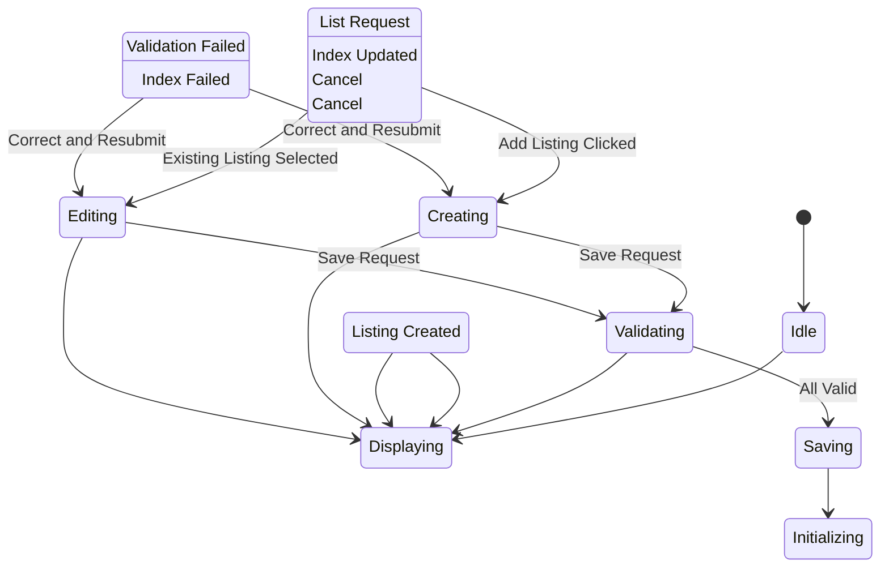

# State Machine: ListingManagementControl

**Control Object**: ListingManagementControl («state-dependent control»)
**Associated Use Cases**: UC-O02 (Manage Listings)
**Generated**: 2026-01-26

---

## State Identification

| State Name | Description | Entry Action | Exit Action |
|------------|-------------|--------------|-------------|
| Idle | System waiting for listing management | - | - |
| Displaying Listings | Showing owner's listing list | entry / Display Listings | - |
| Creating | Creating new listing | entry / Display Creation Form | - |
| Editing | Modifying existing listing | entry / Display Edit Form | - |
| Uploading Images | Processing listing images | - | - |
| Validating | Checking listing data | - | - |
| Saving | Persisting listing changes | - | - |
| Initializing Calendar | Creating calendar entries | - | - |
| Displaying Errors | Showing validation errors | entry / Display Errors | - |

**Total States**: 9

---

## Event/Action Mapping

### Events (Messages TO Control)

| Event | Source (Phase 3) | From Object | Use Case | Seq# |
|-------|------------------|-------------|----------|------|
| List Request | List Request | ListingManagementInteraction | UC-O02 | 1.1 |
| Listings | Listings | Listing | UC-O02 | 1.3 |
| Create Request | Create Request | ListingManagementInteraction | UC-O02 | 2.1 |
| Listing Data | Listing Data | ListingManagementInteraction | UC-O02 | 3.1 |
| Valid | Valid | ListingValidator | UC-O02 | 3.3 |
| Invalid | Invalid | ListingValidator | UC-O02 | 3.3A |
| Images Stored | Images Stored | Image | UC-O02 | 4.2 |
| Save Request | Save Request | ListingManagementInteraction | UC-O02 | 5.1 |
| All Valid | All Valid | ListingValidator | UC-O02 | 5.3 |
| Validation Failed | Validation Failed | ListingValidator | UC-O02 | 5.3A |
| Listing Created | Listing Created | Listing | UC-O02 | 5.5 |
| Amenities Saved | Amenities Saved | Amenity | UC-O02 | 5.7 |
| Ready | Ready | CalendarInitializer | UC-O02 | 5.11 |
| Index Updated | Index Updated | SearchIndexUpdater | UC-O02 | 5.13 |
| Index Failed | Index Failed | SearchIndexUpdater | UC-O02 | 5.13A |

**Total Events**: 15

### Actions (Messages FROM Control)

| Action | Target (Phase 3) | To Object | Use Case | Seq# |
|--------|------------------|-----------|----------|------|
| Get Listings | Get Listings | Listing | UC-O02 | 1.2 |
| Display List | Display List | ListingManagementInteraction | UC-O02 | 1.4 |
| Display Form | Display Form | ListingManagementInteraction | UC-O02 | 2.2 |
| Validate | Validate | ListingValidator | UC-O02 | 3.2 |
| Validate All | Validate All | ListingValidator | UC-O02 | 5.2 |
| Create Listing | Create Listing | Listing | UC-O02 | 5.4 |
| Save Amenities | Save Amenities | Amenity | UC-O02 | 5.6 |
| Initialize Calendar | Initialize Calendar | CalendarInitializer | UC-O02 | 5.8 |
| Update Index | Update Index | SearchIndexUpdater | UC-O02 | 5.12 |
| Listing Active | Listing Active | ListingManagementInteraction | UC-O02 | 5.14 |
| Show Errors | Show Errors | ListingManagementInteraction | UC-O02 | 3.4A |

**Total Actions**: 11

---

## Statechart Diagram

---

## Transition Table

| From State | Event | Condition | To State | Action | Use Case Ref |
|------------|-------|-----------|----------|--------|--------------|
| Idle | List Request | - | Displaying Listings | Get Listings, Display List | UC-O02 |
| Displaying Listings | Add Listing Clicked | - | Creating | Display Form | UC-O02 |
| Displaying Listings | Existing Listing Selected | - | Editing | Get Details, Display Edit Form | UC-O02 |
| Creating | Save Request | - | Validating | Validate All | UC-O02 |
| Editing | Save Request | - | Validating | Validate All | UC-O02 |
| Validating | Validation Failed | - | Displaying Errors | Show Errors | UC-O02 |
| Validating | All Valid | - | Saving | Create Listing, Save Amenities, Initialize Calendar | UC-O02 |
| Displaying Errors | Correct and Resubmit | - | Creating | - | UC-O02 |
| Displaying Errors | Correct and Resubmit | - | Editing | - | UC-O02 |
| Saving | Listing Created | - | Initializing Calendar | - | UC-O02 |
| Initializing Calendar | Index Updated | - | Displaying Listings | Update Index, Listing Active | UC-O02 |
| Initializing Calendar | Index Failed | - | Displaying Errors | Show Errors | UC-O02 |
| Creating | Cancel | - | Displaying Listings | - | UC-O02 |
| Editing | Cancel | - | Displaying Listings | - | UC-O02 |

**Total Transitions**: 13

---

## Validation Checklist

- [x] All states named with adjectives/gerunds
- [x] Each state has unique name
- [x] Initial state defined
- [x] All states have exit paths
- [x] Transition syntax correct
- [x] All events match Phase 3
- [x] All actions match Phase 3
- [x] Flat structure
- [x] Diagram renders

---

## Phase 5 Integration Notes

This statechart will be validated in Phase 5.

---

## Notes

- BR-019: Room type matches property type
- BR-020: Pricing within platform limits
- Max 20 images per listing
- Search index update with retry
- Amenities from predefined list
