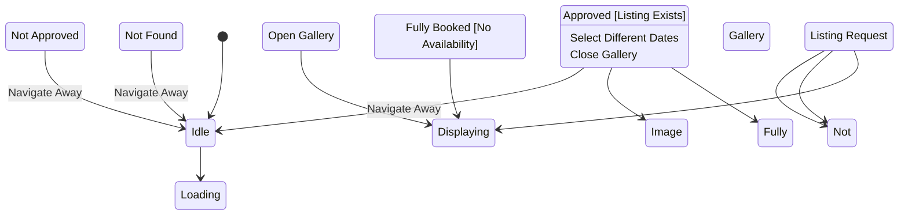

# State Machine: ListingViewControl

**Control Object**: ListingViewControl («state-dependent control»)
**Associated Use Cases**: UC-G02 (View Listing Details)
**Generated**: 2026-01-26

---

## State Identification

| State Name | Description | Entry Action | Exit Action |
|------------|-------------|--------------|-------------|
| Idle | System waiting for listing view request | - | - |
| Loading Listing | Fetching listing data from entities | - | - |
| Displaying Details | Showing listing page with all sections | entry / Display Listing Page | exit / Log View |
| Not Found | Listing does not exist (404) | entry / Display 404 | - |
| Not Approved | Listing exists but not approved | entry / Display Under Review | - |
| Fully Booked | No availability for selected dates | entry / Display Fully Booked Badge | - |
| Image Gallery View | User viewing image gallery | entry / Display Gallery | - |

**Total States**: 7

---

## Event/Action Mapping

### Events (Messages TO Control)

| Event | Source (Phase 3) | From Object | Use Case | Seq# |
|-------|------------------|-------------|----------|------|
| Listing Request | Listing Request | ListingInteraction | UC-G02 | 1.1 |
| Approved | Approved | ListingAccessValidator | UC-G02 | 1.3 |
| Not Found | Not Found | ListingAccessValidator | UC-G02 | 1.3A |
| Not Approved | Not Approved | ListingAccessValidator | UC-G02 | 1.3B |
| Listing Data | Listing Data | Listing | UC-G02 | 2.1 |
| Review Data | Review Data | Review | UC-G02 | 3.1 |
| Available Dates | Available Dates | Calendar | UC-G02 | 4.1 |
| Fully Booked | Fully Booked | Calendar | UC-G02 | 4.1A |
| Optimized URLs | Optimized URLs | ImageOptimizer | UC-G02 | 5.2 |
| Property Data | Property Data | Property | UC-G02 | 6.1 |
| View Logged | View Logged | ViewTracker | UC-G02 | 7.1 |
| Open Gallery | Open Gallery | ListingInteraction | UC-G02 | - |

**Total Events**: 12

### Actions (Messages FROM Control)

| Action | Target (Phase 3) | To Object | Use Case | Seq# |
|--------|------------------|-----------|----------|------|
| Validate Access | Validate Access | ListingAccessValidator | UC-G02 | 1.2 |
| Get Listing Details | Get Listing Details | Listing | UC-G02 | 2 |
| Get Reviews | Get Reviews | Review | UC-G02 | 3 |
| Get Availability | Get Availability | Calendar | UC-G02 | 4 |
| Get Images | Get Images | Image | UC-G02 | 5 |
| Get Property Info | Get Property Info | Property | UC-G02 | 6 |
| Track View | Track View | ViewTracker | UC-G02 | 7 |
| Display Page | Display Page | ListingInteraction | UC-G02 | 8 |
| Display 404 | Display 404 | ListingInteraction | UC-G02 | 1.4A |
| Display Not Approved | Display Not Approved | ListingInteraction | UC-G02 | 1.4B |
| Display Fully Booked | Display Fully Booked | ListingInteraction | UC-G02 | 4.2A |

**Total Actions**: 11

---

## Statechart Diagram

---

## Transition Table

| From State | Event | Condition | To State | Action | Use Case Ref |
|------------|-------|-----------|----------|--------|--------------|
| Idle | Listing Request | - | Loading Listing | Validate Access | UC-G02 |
| Loading Listing | Approved | [Listing Exists] | Displaying Details | Get Listing Details, Get Reviews, Get Availability, Get Images, Get Property Info, Track View, Display Page | UC-G02 |
| Loading Listing | Not Found | [Does Not Exist] | Not Found | Display 404 | UC-G02 |
| Loading Listing | Not Approved | [Pending/Rejected] | Not Approved | Display Not Approved | UC-G02 |
| Displaying Details | Fully Booked | [No Availability] | Fully Booked | Display Fully Booked | UC-G02 |
| Displaying Details | Open Gallery | - | Image Gallery View | - | UC-G02 |
| Displaying Details | Navigate Away | - | Idle | - | UC-G02 |
| Fully Booked | Select Different Dates | - | Displaying Details | Get Availability | UC-G02 |
| Image Gallery View | Close Gallery | - | Displaying Details | - | UC-G02 |
| Not Found | Navigate Away | - | Idle | - | UC-G02 |
| Not Approved | Navigate Away | - | Idle | - | UC-G02 |

**Total Transitions**: 11

---

## Validation Checklist

- [x] All states named with adjectives/gerunds (NOT events/actions)
- [x] Each state has unique name
- [x] Initial state defined ([*] → Idle)
- [x] All states have exit paths
- [x] Transition syntax: `Event [Condition] / Action`
- [x] No action interdependencies on same transition
- [x] All events match messages TO control (from Phase 3)
- [x] All actions match messages FROM control (from Phase 3)
- [x] Flat structure (no composite states)
- [x] Diagram renders correctly

---

## Phase 5 Integration Notes

This statechart will be validated in Phase 5 against Phase 3 communication diagrams.

---

## Notes

- Main flow: Idle → Loading Listing → Displaying Details
- Error states: Not Found, Not Approved, Fully Booked
- View count tracked on successful display
- Image gallery optional sub-state
- Page load < 2s requirement
