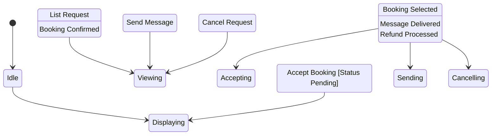

# State Machine: OwnerBookingControl

**Control Object**: OwnerBookingControl («state-dependent control»)
**Associated Use Cases**: UC-O04 (Manage Bookings - Owner View)
**Generated**: 2026-01-26

---

## State Identification

| State Name | Description | Entry Action | Exit Action |
|------------|-------------|--------------|-------------|
| Idle | System waiting for owner booking interaction | - | - |
| Displaying Bookings | Showing owner's booking list | entry / Display Bookings Grouped | - |
| Viewing Details | Showing booking details with actions | entry / Display Details | - |
| Accepting Request | Approving request booking | - | - |
| Sending Message | Communicating with guest | - | - |
| Cancelling Booking | Owner cancelling with penalty | entry / Display Refund | - |

**Total States**: 6

---

## Event/Action Mapping

### Events (Messages TO Control)

| Event | Source (Phase 3) | From Object | Use Case | Seq# |
|-------|------------------|-------------|----------|------|
| List Request | List Request | OwnerBookingManagementInteraction | UC-O04 | 1.1 |
| Booking List | Booking List | Booking | UC-O04 | 1.3 |
| Booking Details | Booking Details | OwnerBookingManagementInteraction | UC-O04 | 2.1 |
| Booking Data | Booking Data | Booking | UC-O04 | 2.3 |
| Guest Info | Guest Info | User | UC-O04 | 2.5 |
| Listing Info | Listing Info | Listing | UC-O04 | 2.7 |
| Status Pending | Status Pending | Booking | UC-O04 | 2.3A |
| Accept Booking | Accept Booking | OwnerBookingManagementInteraction | UC-O04 | 3.1A |
| Booking Confirmed | Booking Confirmed | Booking | UC-O04 | 3.3A |
| Message Data | Message Data | OwnerBookingManagementInteraction | UC-O04 | 3.1 |
| Message Delivered | Message Delivered | MessageDeliveryService | UC-O04 | 3.5 |
| Cancel Request | Cancel Request | OwnerBookingManagementInteraction | UC-O04 | 3.1B |
| Penalty Applies | Penalty Applies | CancellationPolicyValidator | UC-O04 | 3.3B |
| Refund Amount | Refund Amount | RefundCalculator | UC-O04 | 3.5B |
| Cancel Confirmed | Cancel Confirmed | OwnerBookingManagementInteraction | UC-O04 | 4.1 |
| Cancelled | Cancelled | Booking | UC-O04 | 4.3 |
| Refund Processed | Refund Processed | Payment | UC-O04 | 4.5 |

**Total Events**: 16

### Actions (Messages FROM Control)

| Action | Target (Phase 3) | To Object | Use Case | Seq# |
|--------|------------------|-----------|----------|------|
| Get Bookings | Get Bookings | Booking | UC-O04 | 1.2 |
| Display Grouped | Display Grouped | OwnerBookingManagementInteraction | UC-O04 | 1.4 |
| Get Details | Get Details | Booking | UC-O04 | 2.2 |
| Get Guest | Get Guest | User | UC-O04 | 2.4 |
| Get Listing | Get Listing | Listing | UC-O04 | 2.6 |
| Display Details | Display Details | OwnerBookingManagementInteraction | UC-O04 | 2.8 |
| Show Accept Buttons | Show Accept Buttons | OwnerBookingManagementInteraction | UC-O04 | 2.4A |
| Create Message | Create Message | Message | UC-O04 | 3.2 |
| Deliver Message | Deliver Message | MessageDeliveryService | UC-O04 | 3.4 |
| Message Sent | Message Sent | OwnerBookingManagementInteraction | UC-O04 | 3.6 |
| Set Confirmed | Set Confirmed | Booking | UC-O04 | 3.2A |
| Notify Guest | Notify Guest | OwnerBookingManagementInteraction | UC-O04 | 3.4A |
| Check Policy | Check Policy | CancellationPolicyValidator | UC-O04 | 3.2B |
| Calculate Refund | Calculate Refund | RefundCalculator | UC-O04 | 3.4B |
| Show Refund | Show Refund | OwnerBookingManagementInteraction | UC-O04 | 3.6B |
| Update Status | Update Status | Booking | UC-O04 | 4.2 |
| Cancel Success | Cancel Success | OwnerBookingManagementInteraction | UC-O04 | 4.6 |

**Total Actions**: 16

---

## Statechart Diagram

---

## Validation Checklist

- [x] All states named with adjectives/gerunds
- [x] Each state has unique name
- [x] Initial state defined
- [x] All states have exit paths
- [x] Transition syntax correct
- [x] All events match Phase 3
- [x] All actions match Phase 3
- [x] Flat structure
- [x] Diagram renders

---

## Notes

- BR-023: Owner cancellations require reason + penalty
- BR-024: Messages delivered within 1 minute
- Request booking: Accept/Decline buttons
- Instant booking: Confirmed status
