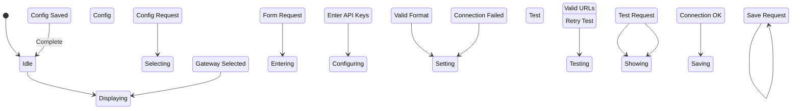

# State Machine: PaymentConfigControl

**Control Object**: PaymentConfigControl («state-dependent control»)
**Associated Use Cases**: UC-A03 (Configure Payments)
**Generated**: 2026-01-26

---

## State Identification

| State Name | Description | Entry Action | Exit Action |
|------------|-------------|--------------|-------------|
| Idle | System waiting for payment configuration | - | - |
| Displaying Gateways | Showing configured payment gateways | entry / Display Gateways | - |
| Selecting Gateway | Admin choosing payment gateway | - | - |
| Displaying Config Form | Showing configuration form | entry / Display Form | - |
| Entering Credentials | Admin inputting API credentials | - | - |
| Configuring Webhooks | Admin setting callback URLs | - | - |
| Setting Commission | Admin setting platform commission rate | - | - |
| Testing Connection | Verifying gateway connectivity | entry / Start Test | - |
| Showing Test Success | Connection test passed | entry / Display Success | - |
| Showing Test Error | Connection test failed | entry / Display Error | - |
| Saving Configuration | Persisting encrypted configuration | entry / Encrypt | exit / Log Change |
| Configuration Active | Configuration saved and active | entry / Display Active | - |

**Total States**: 12

---

## Event/Action Mapping

### Events (Messages TO Control)

| Event | Source (Phase 3) | From Object | Use Case | Seq# |
|-------|------------------|-------------|----------|------|
| Config Request | Config Request | PaymentConfigInteraction | UC-A03 | 1.1 |
| Gateway Selected | Gateway Selected | PaymentConfigInteraction | UC-A03 | 2.1 |
| API Credentials | API Credentials | PaymentConfigInteraction | UC-A03 | 3.1 |
| Valid Format | Valid Format | CredentialValidator | UC-A03 | 3.3 |
| Invalid Format | Invalid Format | CredentialValidator | UC-A03 | 3.3A |
| Webhook URLs | Webhook URLs | PaymentConfigInteraction | UC-A03 | 4.1 |
| Valid URLs | Valid URLs | CredentialValidator | UC-A03 | 4.3 |
| Commission Rate | Commission Rate | PaymentConfigInteraction | UC-A03 | 5.1 |
| Valid Rate | Valid Rate | CredentialValidator | UC-A03 | 5.3 |
| Test Request | Test Request | PaymentConfigInteraction | UC-A03 | 6.1 |
| Connection OK | Connection OK | PolarProxy | UC-A03 | 6.4 |
| Connection Failed | Connection Failed | PolarProxy | UC-A03 | 6.4A |
| Test Success | Test Success | ConnectionTester | UC-A03 | 6.5 |
| Test Failed | Test Failed | ConnectionTester | UC-A03 | 6.5A |
| Save Request | Save Request | PaymentConfigInteraction | UC-A03 | 7.1 |
| Encrypted Data | Encrypted Data | SecureStorage | UC-A03 | 7.3 |
| Config Saved | Config Saved | SecureStorage | UC-A03 | 7.5 |
| Change Logged | Change Logged | ConfigAuditLogger | UC-A03 | 7.7 |

**Total Events**: 18

### Actions (Messages FROM Control)

| Action | Target (Phase 3) | To Object | Use Case | Seq# |
|--------|------------------|-----------|----------|------|
| Get Gateways | Get Gateways | PaymentConfigControl | UC-A03 | 1.2 |
| Display Gateways | Display Gateways | PaymentConfigInteraction | UC-A03 | 1.3 |
| Display Form | Display Form | PaymentConfigInteraction | UC-A03 | 2.2 |
| Validate Format | Validate Format | CredentialValidator | UC-A03 | 3.2 |
| Validate URLs | Validate URLs | CredentialValidator | UC-A03 | 4.2 |
| Validate Rate | Validate Rate | CredentialValidator | UC-A03 | 5.2 |
| Test Connectivity | Test Connectivity | ConnectionTester | UC-A03 | 6.2 |
| Show Test Success | Show Test Success | PaymentConfigInteraction | UC-A03 | 6.6 |
| Show Error | Show Error | PaymentConfigInteraction | UC-A03 | 6.6A |
| Encrypt Credentials | Encrypt Credentials | SecureStorage | UC-A03 | 7.2 |
| Save Config | Save Config | SecureStorage | UC-A03 | 7.4 |
| Log Change | Log Change | ConfigAuditLogger | UC-A03 | 7.6 |
| Config Active | Config Active | PaymentConfigInteraction | UC-A03 | 7.8 |

**Total Actions**: 13

---

## Statechart Diagram

---

## Validation Checklist

- [x] All states named with adjectives/gerunds
- [x] Each state has unique name
- [x] Initial state defined
- [x] All states have exit paths
- [x] Transition syntax correct
- [x] All events match Phase 3
- [x] All actions match Phase 3
- [x] Flat structure
- [x] Diagram renders

---

## Notes

- BR-029: Credentials must be encrypted
- BR-030: Configuration changes require audit log
- Connection test before save
- Credential rotation support
