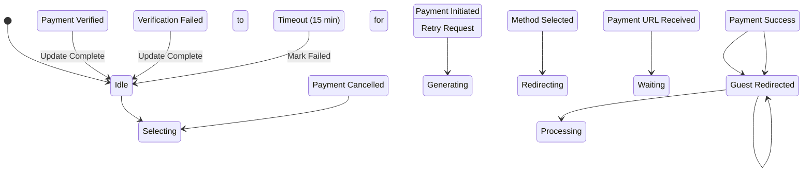

# State Machine: PaymentControl

**Control Object**: PaymentControl («state-dependent control»)
**Associated Use Cases**: UC-G04 (Process Payment)
**Generated**: 2026-01-26

---

## State Identification

| State Name | Description | Entry Action | Exit Action |
|------------|-------------|--------------|-------------|
| Idle | System waiting for payment initiation | - | - |
| Selecting Payment Method | Guest choosing payment option | entry / Display Payment Options | - |
| Generating Payment Request | Creating payment gateway request | - | - |
| Redirecting to Gateway | Forwarding guest to SePay | entry / Redirect | - |
| Waiting for Payment | Awaiting guest completion on gateway | entry / Start Timer | - |
| Processing Notification | Verifying payment callback from SePay | - | - |
| Payment Confirmed | Payment successful, updating booking | - | - |
| Payment Failed | Payment declined or failed | entry / Display Error | - |
| Payment Cancelled | Guest cancelled on gateway | entry / Display Retry Option | - |
| Payment Timeout | 15-minute payment window expired | entry / Mark Failed | exit / Release Reservation |

**Total States**: 10

---

## Event/Action Mapping

### Events (Messages TO Control)

| Event | Source (Phase 3) | From Object | Use Case | Seq# |
|-------|------------------|-------------|----------|------|
| Payment Method | Payment Method | PaymentInteraction | UC-G04 | 1.1 |
| Payment URL | Payment URL | PaymentProcessor | UC-G04 | 1.5 |
| Payment Success | Payment Success | SePayProxy | UC-G04 | 2.1 |
| Payment Failed | Payment Failed | SePayProxy | UC-G04 | 2.1A |
| Payment Cancelled | Payment Cancelled | SePayProxy | UC-G04 | - |
| Payment Verified | Payment Verified | PaymentProcessor | UC-G04 | 2.4 |
| Verification Failed | Verification Failed | PaymentProcessor | UC-G04 | 2.2A |
| Status Updated | Status Updated | BookingStatusUpdater | UC-G04 | 3.3 |
| Reservation Released | Reservation Released | ReservationReleaser | UC-G04 | 4.3 |
| Notifications Sent | Notifications Sent | NotificationService | UC-G04 | 5.3 |
| Timeout | Timeout (Internal) | Timer | UC-G04 | - |

**Total Events**: 11

### Actions (Messages FROM Control)

| Action | Target (Phase 3) | To Object | Use Case | Seq# |
|--------|------------------|-----------|----------|------|
| Generate Request | Generate Request | PaymentProcessor | UC-G04 | 1.2 |
| Redirect to Gateway | Redirect to Gateway | PaymentInteraction | UC-G04 | 1.6 |
| Update Booking | Update Booking | BookingStatusUpdater | UC-G04 | 3 |
| Release Reservation | Release Reservation | ReservationReleaser | UC-G04 | 4 |
| Send Confirmation | Send Confirmation | NotificationService | UC-G04 | 5 |
| Display Confirmation | Display Confirmation | PaymentInteraction | UC-G04 | 6 |
| Display Failure | Display Failure | PaymentInteraction | UC-G04 | 2.8A |

**Total Actions**: 7

---

## Statechart Diagram

---

## Transition Table

| From State | Event | Condition | To State | Action | Use Case Ref |
|------------|-------|-----------|----------|--------|--------------|
| Idle | Payment Initiated | - | Selecting Payment Method | - | UC-G04 |
| Selecting Payment Method | Method Selected | - | Generating Payment Request | Generate Request | UC-G04 |
| Generating Payment Request | Payment URL Received | - | Redirecting to Gateway | Redirect to Gateway | UC-G04 |
| Redirecting to Gateway | Guest Redirected | - | Waiting for Payment | Start Timer | UC-G04 |
| Waiting for Payment | Payment Success | - | Processing Notification | - | UC-G04 |
| Waiting for Payment | Payment Cancelled | - | Payment Cancelled | - | UC-G04 |
| Waiting for Payment | Timeout | [15 min elapsed] | Payment Timeout | Mark Failed, Release Reservation | UC-G04 |
| Processing Notification | Payment Verified | - | Payment Confirmed | Update Booking, Send Confirmation, Display Confirmation | UC-G04 |
| Processing Notification | Verification Failed | - | Payment Failed | Update Booking, Release Reservation, Display Failure | UC-G04 |
| Payment Confirmed | Update Complete | - | Idle | - | UC-G04 |
| Payment Failed | Update Complete | - | Idle | - | UC-G04 |
| Payment Cancelled | Retry Request | - | Selecting Payment Method | - | UC-G04 |
| Payment Timeout | Mark Failed | - | Idle | - | UC-G04 |

**Total Transitions**: 13

---

## Validation Checklist

- [x] All states named with adjectives/gerunds
- [x] Each state has unique name
- [x] Initial state defined
- [x] All states have exit paths
- [x] Transition syntax correct
- [x] All events match Phase 3
- [x] All actions match Phase 3
- [x] Flat structure
- [x] Diagram renders

---

## Phase 5 Integration Notes

This statechart will be validated in Phase 5.

---

## Notes

- 15-minute payment timeout (BR-005)
- Confirmation within 1 minute (BR-006)
- Idempotent notification processing
- PCI DSS compliance
- Payment retry on cancel
