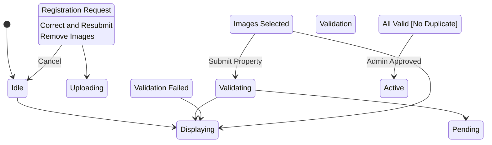

# State Machine: PropertyRegistrationControl

**Control Object**: PropertyRegistrationControl («state-dependent control»)
**Associated Use Cases**: UC-O01 (Register Property)
**Generated**: 2026-01-26

---

## State Identification

| State Name | Description | Entry Action | Exit Action |
|------------|-------------|--------------|-------------|
| Idle | System waiting for property registration | - | - |
| Displaying Form | Showing property registration form | entry / Display Registration Form | - |
| Uploading Images | Processing image uploads | - | - |
| Validating | Checking property data validity | - | - |
| Displaying Validation Errors | Showing inline errors | entry / Display Validation Errors | - |
| Pending Approval | Property created, awaiting admin approval | entry / Display Confirmation | exit / Notify Admin |
| Active | Property approved and visible | entry / Display Active | - |

**Total States**: 7

---

## Event/Action Mapping

### Events (Messages TO Control)

| Event | Source (Phase 3) | From Object | Use Case | Seq# |
|-------|------------------|-------------|----------|------|
| Registration Request | Registration Request | PropertyRegistrationInteraction | UC-O01 | 1.1 |
| Owner Data | Owner Data | User | UC-O01 | 1.3 |
| Property Data | Property Data | PropertyRegistrationInteraction | UC-O01 | 2.1 |
| Valid | Valid | PropertyValidator | UC-O01 | 2.3 |
| Invalid | Invalid | PropertyValidator | UC-O01 | 2.3A |
| Image URLs | Image URLs | ImageUploadHandler | UC-O01 | 3.4 |
| Submit Property | Submit Property | PropertyRegistrationInteraction | UC-O01 | 4.1 |
| No Duplicate | No Duplicate | DuplicateDetector | UC-O01 | 4.3 |
| Duplicate Found | Duplicate Found | DuplicateDetector | UC-O01 | 4.3A |
| All Valid | All Valid | PropertyValidator | UC-O01 | 4.5 |
| Validation Failed | Validation Failed | PropertyValidator | UC-O01 | 4.5A |
| Property Created | Property Created | Property | UC-O01 | 4.7 |
| Admin Notified | Admin Notified | User | UC-O01 | 4.9 |

**Total Events**: 13

### Actions (Messages FROM Control)

| Action | Target (Phase 3) | To Object | Use Case | Seq# |
|--------|------------------|-----------|----------|------|
| Get Owner | Get Owner | User | UC-O01 | 1.2 |
| Display Form | Display Form | PropertyRegistrationInteraction | UC-O01 | 1.4 |
| Validate Address | Validate Address | PropertyValidator | UC-O01 | 2.2 |
| Check Duplicate | Check Duplicate | DuplicateDetector | UC-O01 | 4.2 |
| Validate All | Validate All | PropertyValidator | UC-O01 | 4.4 |
| Create Property | Create Property | Property | UC-O01 | 4.6 |
| Notify Admin | Notify Admin | User | UC-O01 | 4.8 |
| Registration Complete | Registration Complete | PropertyRegistrationInteraction | UC-O01 | 4.10 |
| Show Errors | Show Errors | PropertyRegistrationInteraction | UC-O01 | 2.4A |

**Total Actions**: 9

---

## Statechart Diagram

---

## Transition Table

| From State | Event | Condition | To State | Action | Use Case Ref |
|------------|-------|-----------|----------|--------|--------------|
| Idle | Registration Request | - | Displaying Form | Get Owner, Display Form | UC-O01 |
| Displaying Form | Images Selected | - | Uploading Images | - | UC-O01 |
| Uploading Images | Submit Property | - | Validating | Check Duplicate, Validate All | UC-O01 |
| Validating | Validation Failed | - | Displaying Validation Errors | Show Errors | UC-O01 |
| Validating | All Valid | [No Duplicate] | Pending Approval | Create Property, Notify Admin, Registration Complete | UC-O01 |
| Displaying Validation Errors | Correct and Resubmit | - | Displaying Form | - | UC-O01 |
| Pending Approval | Admin Approved | - | Active | - | UC-O01 |
| Displaying Form | Cancel | - | Idle | - | UC-O01 |
| Uploading Images | Remove Images | - | Displaying Form | - | UC-O01 |

**Total Transitions**: 9

---

## Validation Checklist

- [x] All states named with adjectives/gerunds
- [x] Each state has unique name
- [x] Initial state defined
- [x] All states have exit paths
- [x] Transition syntax correct
- [x] All events match Phase 3
- [x] All actions match Phase 3
- [x] Flat structure
- [x] Diagram renders

---

## Phase 5 Integration Notes

This statechart will be validated in Phase 5.

---

## Notes

- BR-007: Property in Vietnam
- BR-008: Valid address + contact
- Max 10 images, 5MB each
- Status: pending_approval → active
- Admin notified on submission
