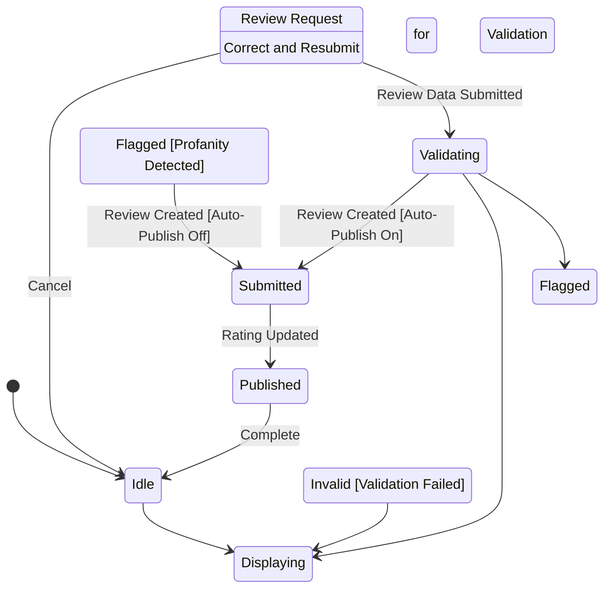

# State Machine: ReviewSubmissionControl

**Control Object**: ReviewSubmissionControl («state-dependent control»)
**Associated Use Cases**: UC-G06 (Submit Review)
**Generated**: 2026-01-26

---

## State Identification

| State Name | Description | Entry Action | Exit Action |
|------------|-------------|--------------|-------------|
| Idle | System waiting for review request | - | - |
| Displaying Form | Showing review input form | entry / Display Review Form | - |
| Validating | Checking review content (rating, length) | - | - |
| Flagged for Moderation | Profanity detected, pending review | entry / Display Warning | - |
| Submitted | Review saved, awaiting moderation | entry / Display Success | exit / Notify Admin |
| Published | Review approved and visible | entry / Display Published | exit / Update Listing Rating |
| Displaying Validation Error | Review validation failed | entry / Display Validation Errors | - |

**Total States**: 7

---

## Event/Action Mapping

### Events (Messages TO Control)

| Event | Source (Phase 3) | From Object | Use Case | Seq# |
|-------|------------------|-------------|----------|------|
| Review Request | Review Request | ReviewInteraction | UC-G06 | 1.1 |
| Eligible | Eligible | Booking | UC-G06 | 1.3 |
| Ineligible | Ineligible | Booking | UC-G06 | 1.3A |
| Review Data | Review Data | ReviewInteraction | UC-G06 | 2.1 |
| Valid | Valid | ReviewValidator | UC-G06 | 2.3 |
| Invalid | Invalid | ReviewValidator | UC-G06 | 2.3A |
| Flagged | Flagged | ProfanityFilter | UC-G06 | 2.5A |
| Clean | Clean | ProfanityFilter | UC-G06 | 2.5 |
| Not Spam | Not Spam | SpamDetector | UC-G06 | 2.7 |
| Spam Detected | Spam Detected | SpamDetector | UC-G06 | 2.7A |
| Review Created | Review Created | Review | UC-G06 | 2.9 |
| Rating Updated | Rating Updated | RatingAggregator | UC-G06 | 2.15 |

**Total Events**: 12

### Actions (Messages FROM Control)

| Action | Target (Phase 3) | To Object | Use Case | Seq# |
|--------|------------------|-----------|----------|------|
| Check Eligibility | Check Eligibility | Booking | UC-G06 | 1.2 |
| Display Form | Display Form | ReviewInteraction | UC-G06 | 1.4 |
| Validate | Validate | ReviewValidator | UC-G06 | 2.2 |
| Check Profanity | Check Profanity | ProfanityFilter | UC-G06 | 2.4 |
| Check Spam | Check Spam | SpamDetector | UC-G06 | 2.6 |
| Create Review | Create Review | Review | UC-G06 | 2.8 |
| Update Rating | Update Rating | RatingAggregator | UC-G06 | 2.10 |
| Review Submitted | Review Submitted | ReviewInteraction | UC-G06 | 2.16 |
| Show Errors | Show Errors | ReviewInteraction | UC-G06 | 2.4A |

**Total Actions**: 9

---

## Statechart Diagram

---

## Transition Table

| From State | Event | Condition | To State | Action | Use Case Ref |
|------------|-------|-----------|----------|--------|--------------|
| Idle | Review Request | - | Displaying Form | Check Eligibility, Display Form | UC-G06 |
| Displaying Form | Review Data Submitted | - | Validating | Validate, Check Profanity, Check Spam | UC-G06 |
| Validating | Flagged | [Profanity Detected] | Flagged for Moderation | - | UC-G06 |
| Validating | Validation Failed | [Invalid] | Displaying Validation Error | Show Errors | UC-G06 |
| Validating | Review Created | [Auto-Publish On] | Submitted | Create Review, Update Rating, Review Submitted | UC-G06 |
| Flagged for Moderation | Review Created | [Auto-Publish Off] | Submitted | Create Review, Review Submitted | UC-G06 |
| Submitted | Rating Updated | - | Published | - | UC-G06 |
| Displaying Validation Error | Correct and Resubmit | - | Displaying Form | - | UC-G06 |
| Published | Complete | - | Idle | - | UC-G06 |
| Displaying Form | Cancel | - | Idle | - | UC-G06 |

**Total Transitions**: 10

---

## Validation Checklist

- [x] All states named with adjectives/gerunds
- [x] Each state has unique name
- [x] Initial state defined
- [x] All states have exit paths
- [x] Transition syntax correct
- [x] All events match Phase 3
- [x] All actions match Phase 3
- [x] Flat structure
- [x] Diagram renders

---

## Phase 5 Integration Notes

This statechart will be validated in Phase 5.

---

## Notes

- BR-016: Only completed stay guests can review
- BR-017: One review per booking
- Max 5 photos, 5MB each
- Profanity filter + spam detection
- Auto-publish vs moderation flow
