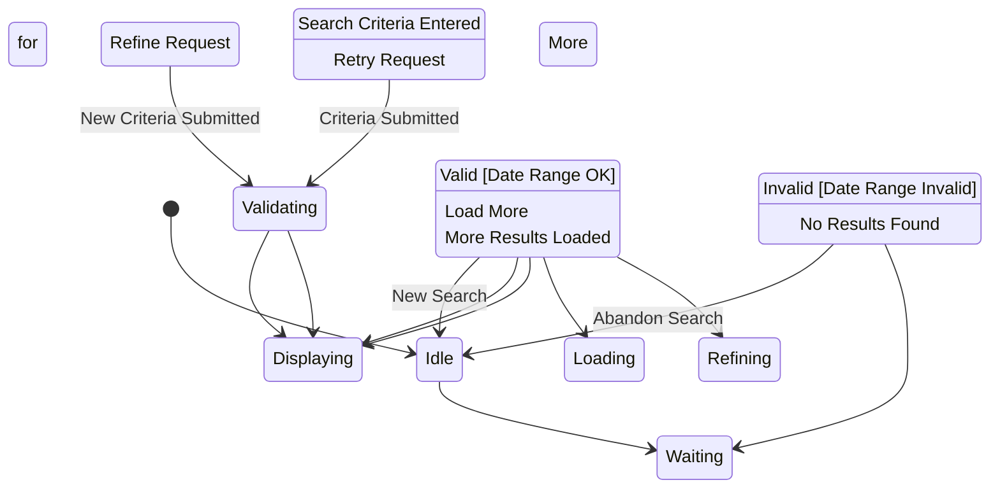

# State Machine: SearchControl

**Control Object**: SearchControl («state-dependent control»)
**Associated Use Cases**: UC-G01 (Search Hostels)
**Generated**: 2026-01-26

---

## State Identification

| State Name | Description | Entry Action | Exit Action |
|------------|-------------|--------------|-------------|
| Idle | System waiting for search interaction | - | - |
| Waiting for Criteria | Awaiting search input from guest | entry / Display Search Form | - |
| Validating | Checking date range and location format | - | - |
| Displaying Results | Showing search results with pagination | entry / Display Results | - |
| Refining Filters | Guest applying additional filters | entry / Show Filter Options | - |
| Loading More Results | Loading next page of results | - | - |
| Displaying Error | Showing validation or no results error | entry / Display Error | - |

**Total States**: 7

---

## Event/Action Mapping

### Events (Messages TO Control)

| Event | Source (Phase 3) | From Object | Use Case | Seq# |
|-------|------------------|-------------|----------|------|
| Search Criteria | Search Criteria | SearchInteraction | UC-G01 | 1.1 |
| Valid | Valid | SearchValidator | UC-G01 | 1.3 |
| Invalid | Invalid | SearchValidator | UC-G01 | 1.3A |
| Matching Listings | Matching Listings | Listing | UC-G01 | 2.1 |
| No Results | No Results | Listing | UC-G01 | 2.1A |
| Availability Data | Availability Data | AvailabilityService | UC-G01 | 3.3 |
| Location Match | Location Match | Property | UC-G01 | 4.1 |
| Sorted Results | Sorted Results | SearchRanker | UC-G01 | 5.1 |
| Refine Request | Refine Request | SearchInteraction | UC-G01 | - |
| Load More | Load More | SearchInteraction | UC-G01 | - |

**Total Events**: 10

### Actions (Messages FROM Control)

| Action | Target (Phase 3) | To Object | Use Case | Seq# |
|--------|------------------|-----------|----------|------|
| Validate Criteria | Validate Criteria | SearchValidator | UC-G01 | 1.2 |
| Search Listings | Search Listings | Listing | UC-G01 | 2 |
| Check Availability | Check Availability | AvailabilityService | UC-G01 | 3 |
| Filter by Location | Filter by Location | Property | UC-G01 | 4 |
| Rank Results | Rank Results | SearchRanker | UC-G01 | 5 |
| Display Results | Display Results | SearchInteraction | UC-G01 | 6 |
| Display Error | Display Error | SearchInteraction | UC-G01 | 1.4A |
| Suggest Alternatives | Suggest Alternatives | SearchInteraction | UC-G01 | 2.2A |

**Total Actions**: 8

---

## Statechart Diagram

---

## Transition Table

| From State | Event | Condition | To State | Action | Use Case Ref |
|------------|-------|-----------|----------|--------|--------------|
| Idle | Search Criteria Entered | - | Waiting for Criteria | - | UC-G01 |
| Waiting for Criteria | Criteria Submitted | - | Validating | Validate Criteria | UC-G01 |
| Validating | Valid | [Date Range OK] | Displaying Results | Search Listings, Check Availability, Filter by Location, Rank Results | UC-G01 |
| Validating | Invalid | [Date Range Invalid] | Displaying Error | Display Error | UC-G01 |
| Displaying Results | No Results Found | [No Listings] | Displaying Error | Suggest Alternatives | UC-G01 |
| Displaying Results | Refine Request | - | Refining Filters | - | UC-G01 |
| Displaying Results | Load More | - | Loading More Results | - | UC-G01 |
| Displaying Results | New Search | - | Idle | - | UC-G01 |
| Refining Filters | New Criteria Submitted | - | Validating | Validate Criteria | UC-G01 |
| Loading More Results | More Results Loaded | - | Displaying Results | Display Results | UC-G01 |
| Displaying Error | Retry Request | - | Waiting for Criteria | - | UC-G01 |
| Displaying Error | Abandon Search | - | Idle | - | UC-G01 |

**Total Transitions**: 12

---

## Validation Checklist

- [x] All states named with adjectives/gerunds (NOT events/actions)
- [x] Each state has unique name
- [x] Initial state defined ([*] → Idle)
- [x] All states have exit paths
- [x] Transition syntax: `Event [Condition] / Action`
- [x] No action interdependencies on same transition
- [x] All events match messages TO control (from Phase 3)
- [x] All actions match messages FROM control (from Phase 3)
- [x] Flat structure (no composite states)
- [x] Diagram renders correctly

---

## Phase 5 Integration Notes

This statechart will be validated in Phase 5 against Phase 3 communication diagrams to ensure:
- All 10 events have corresponding messages TO control
- All 8 actions have corresponding messages FROM control
- Naming consistency between phases

---

## Notes

- Main flow: Idle → Waiting for Criteria → Validating → Displaying Results
- Error handling: Invalid date range → Displaying Error → Waiting for Criteria (retry)
- No results: Displaying Error with suggestions
- Refinement loop: Displaying Results → Refining Filters → Validating → Displaying Results
- Pagination: Displaying Results → Loading More Results → Displaying Results
- Performance requirement: < 500ms p95
