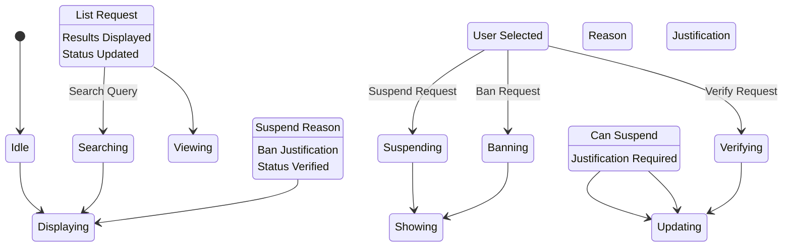

# State Machine: UserManagementControl

**Control Object**: UserManagementControl («state-dependent control»)
**Associated Use Cases**: UC-A02 (Manage Users)
**Generated**: 2026-01-26

---

## State Identification

| State Name | Description | Entry Action | Exit Action |
|------------|-------------|--------------|-------------|
| Idle | System waiting for user management interaction | - | - |
| Displaying Users | Showing user table with filters | entry / Display User Table | - |
| Searching | Filtering users by criteria | - | - |
| Viewing Profile | Showing user details and activity | entry / Display Profile | - |
| Suspending | Processing user suspension | entry / Request Reason | - |
| Showing Reason Prompt | Waiting for suspension reason | entry / Show Reason Input | - |
| Banning | Processing user ban (permanent) | entry / Request Justification | - |
| Showing Justification Prompt | Waiting for ban justification | entry / Show Justification Input | - |
| Verifying | Processing user verification | - | - |
| Updating Status | Changing user status | - | - |

**Total States**: 10

---

## Event/Action Mapping

### Events (Messages TO Control)

| Event | Source (Phase 3) | From Object | Use Case | Seq# |
|-------|------------------|-------------|----------|------|
| List Request | List Request | UserManagementInteraction | UC-A02 | 1.1 |
| User List | User List | User | UC-A02 | 1.3 |
| Search Query | Search Query | UserManagementInteraction | UC-A02 | 2.1 |
| Search Results | Search Results | User | UC-A02 | 2.3 |
| User Details | User Details | UserManagementInteraction | UC-A02 | 3.1 |
| User Data | User Data | User | UC-A02 | 3.3 |
| User Bookings | User Bookings | Booking | UC-A02 | 3.5 |
| Suspend Request | Suspend Request | UserManagementInteraction | UC-A02 | 4.1 |
| Can Suspend | Can Suspend | UserStatusValidator | UC-A02 | 4.3 |
| Suspend Reason | Suspend Reason | UserManagementInteraction | UC-A02 | 5.1 |
| Status Suspended | Status Suspended | User | UC-A02 | 5.3 |
| Action Logged | Action Logged | AuditLogger | UC-A02 | 5.5 |
| Notification Sent | Notification Sent | UserNotificationService | UC-A02 | 5.7 |
| Ban Request | Ban Request | UserManagementInteraction | UC-A02 | 4.1B |
| Justification Required | Justification Required | UserStatusValidator | UC-A02 | 4.3B |
| Ban Justification | Ban Justification | UserManagementInteraction | UC-A02 | 5.1B |
| Bookings Disabled | Bookings Disabled | Booking | UC-A02 | 5.3B |
| Status Banned | Status Banned | User | UC-A02 | 5.5B |
| Verify Request | Verify Request | UserManagementInteraction | UC-A02 | 4.1C |
| Status Verified | Status Verified | User | UC-A02 | 4.3C |

**Total Events**: 20

### Actions (Messages FROM Control)

| Action | Target (Phase 3) | To Object | Use Case | Seq# |
|--------|------------------|-----------|----------|------|
| Get Users | Get Users | User | UC-A02 | 1.2 |
| Display Table | Display Table | UserManagementInteraction | UC-A02 | 1.4 |
| Search Users | Search Users | User | UC-A02 | 2.2 |
| Display Results | Display Results | UserManagementInteraction | UC-A02 | 2.4 |
| Get User | Get User | User | UC-A02 | 3.2 |
| Get Bookings | Get Bookings | Booking | UC-A02 | 3.4 |
| Display Profile | Display Profile | UserManagementInteraction | UC-A02 | 3.8 |
| Validate Suspend | Validate Suspend | UserStatusValidator | UC-A02 | 4.2 |
| Request Reason | Request Reason | UserManagementInteraction | UC-A02 | 4.4 |
| Update Status (suspend) | Update Status | User | UC-A02 | 5.2 |
| Log Action | Log Action | AuditLogger | UC-A02 | 5.4 |
| Notify User | Notify User | UserNotificationService | UC-A02 | 5.6 |
| Suspend Complete | Suspend Complete | UserManagementInteraction | UC-A02 | 5.8 |
| Validate Ban | Validate Ban | UserStatusValidator | UC-A02 | 4.2B |
| Request Justification | Request Justification | UserManagementInteraction | UC-A02 | 4.4B |
| Disable Bookings | Disable Bookings | Booking | UC-A02 | 5.2B |
| Update Status (ban) | Update Status | User | UC-A02 | 5.4B |
| Ban Complete | Ban Complete | UserManagementInteraction | UC-A02 | 5.8B |
| Validate Verify | Validate Verify | UserStatusValidator | UC-A02 | 4.2C |
| Update Status (verify) | Update Status | User | UC-A02 | 4.4C |
| Verify Complete | Verify Complete | UserManagementInteraction | UC-A02 | 4.6C |

**Total Actions**: 21

---

## Statechart Diagram

---

## Validation Checklist

- [x] All states named with adjectives/gerunds
- [x] Each state has unique name
- [x] Initial state defined
- [x] All states have exit paths
- [x] Transition syntax correct
- [x] All events match Phase 3
- [x] All actions match Phase 3
- [x] Flat structure
- [x] Diagram renders

---

## Notes

- BR-027: Suspended users cannot create new bookings
- BR-028: Banned users lose access to platform
- Paginated list (50 per page)
