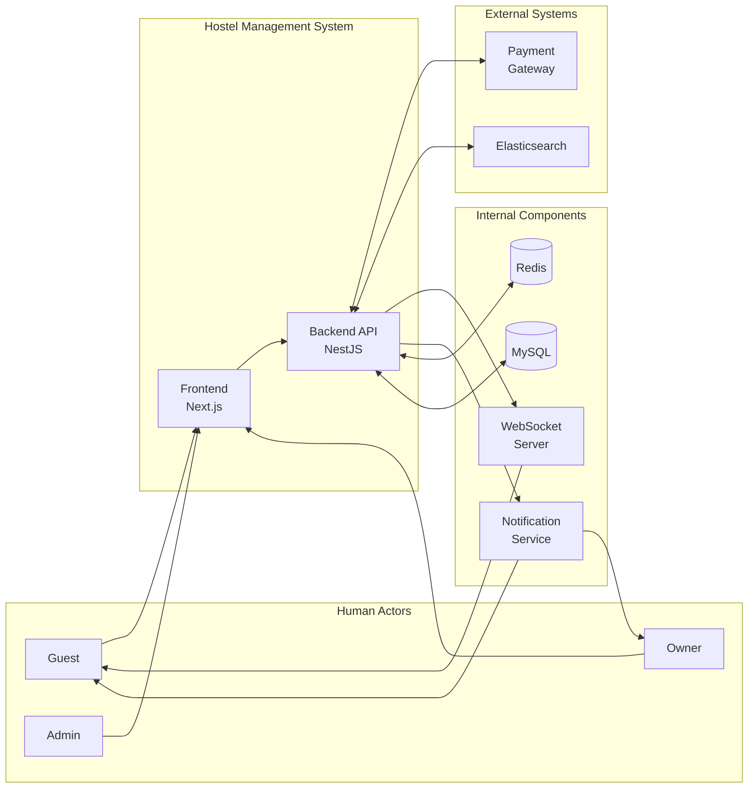
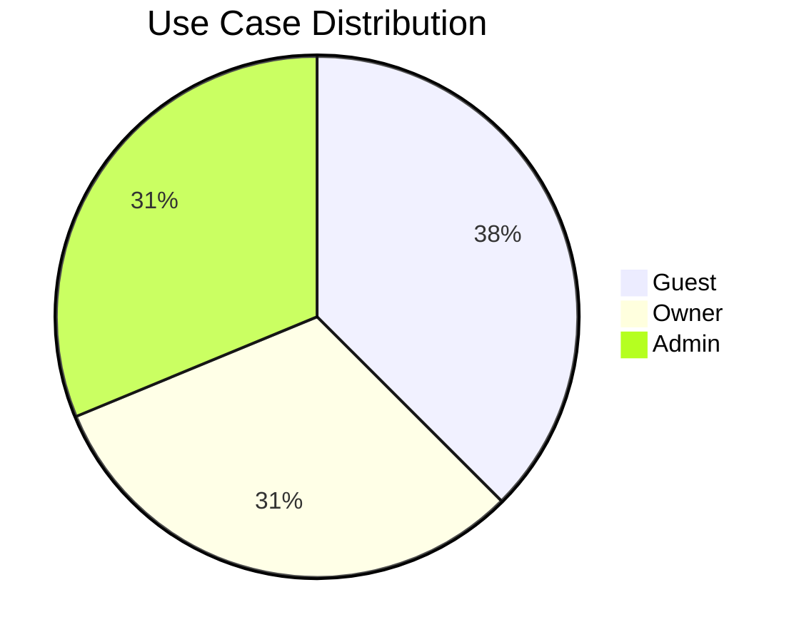
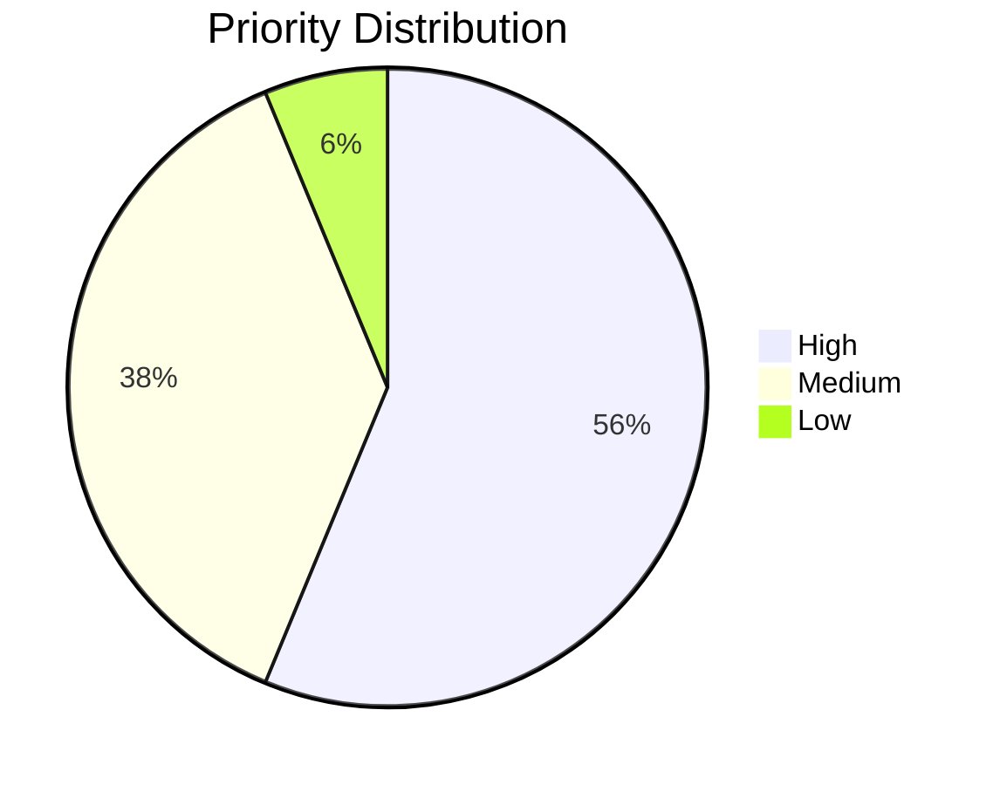
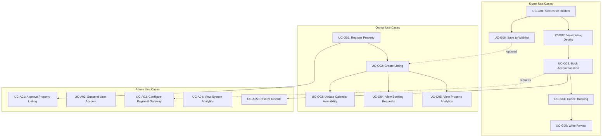

# Functional Requirements
## Hostel Management System

**Version:** 1.2 (Critical & high priority fixes applied)
**Date:** 2026-01-25
**Methodology:** COMET (Component-Object-Based Enterprise Modeling)

---

## Table of Contents

1. [Actor Analysis](#1-actor-analysis)
2. [Use Case Inventory](#2-use-case-inventory)
3. [Use Case Relationships](#3-use-case-relationships)
4. [Detailed Use Cases](#4-detailed-use-cases)

---

## 1. Actor Analysis

### 1.1 Actor Identification Process

Using the COMET 3-Question Test for Actor Identification:

| Question | Purpose |
|----------|---------|
| **Q1: Is it external?** | System boundary definition |
| **Q2: Does it interact directly?** | Direct interaction requirement |
| **Q3: Is it a role (not person)?** | Role-based abstraction |

### 1.2 Actor Registry

| Actor ID | Name | Type | Description | Q1 (External?) | Q2 (Direct?) | Q3 (Role?) |
|----------|------|------|-------------|----------------|--------------|------------|
| **ACT-001** | Guest | Human | Travelers seeking accommodations | Yes | Yes | Yes |
| **ACT-002** | Owner | Human | Property managers | Yes | Yes | Yes |
| **ACT-003** | Admin | Human | Platform administrators | Yes | Yes | Yes |
| **ACT-004** | Payment Gateway | External System | Vietnam payment providers | Yes | Yes | N/A (System) |
| **ACT-005** | Elasticsearch | External System | Search engine | Yes | Yes | N/A (System) |

### 1.3 Actor Classifications

#### Human Actors
```
┌─────────────────────────────────────────────────────────────┐
│                       HUMAN ACTORS                          │
├─────────────────┬─────────────────┬─────────────────────────┤
│                 │                 │                         │
│     GUEST       │     OWNER       │        ADMIN            │
│  • Book stays   │  • List props   │  • Approve listings     │
│  • Submit reviews│  • Manage cal  │  • Manage users         │
│  • Manage bookings│  • View analytics│  • Handle disputes   │
│                 │                 │                         │
└─────────────────┴─────────────────┴─────────────────────────┘
```

#### External System Actors
```
┌─────────────────────────────────────────────────────────────┐
│                   EXTERNAL SYSTEMS                          │
├─────────────────────────────────────────────────────────────┤
│                                                             │
│  ┌─────────────────┐  ┌─────────────────────────────────┐ │
│  │  PAYMENT GATEWAY│  │       ELASTICSEARCH              │ │
│  │  • VNPAY        │  │  • Full-text search             │ │
│  │  • Ngân Lượng  │  │  • Geospatial queries           │ │
│  │  • MoMo        │  │  • Faceted aggregations         │ │
│  └─────────────────┘  └─────────────────────────────────┘ │
│                                                             │
└─────────────────────────────────────────────────────────────┘
```

### 1.3.2 Note: System Components

The following internal components are NOT actors (they fail Q1 - not external):
- **WebSocket Server**: Internal service for real-time updates
- **Notification Service**: Internal service for email/SMS delivery

These are implementation details, not external entities interacting with the system.

### 1.4 Actor Interaction Diagram



---

## 2. Use Case Inventory

### 2.1 Use Case Summary Table

| ID | Use Case Name | Primary Actor | Complexity | Priority |
|----|---------------|---------------|------------|----------|
| **UC-G01** | Search for Hostels | Guest | High | High |
| **UC-G02** | View Listing Details | Guest | Low | High |
| **UC-G03** | Book Accommodation | Guest | High | High |
| **UC-G04** | Cancel Booking | Guest | Medium | Medium |
| **UC-G05** | Write Review | Guest | Medium | Low |
| **UC-G06** | Save to Wishlist | Guest | Low | Low |
| **UC-O01** | Register Property | Owner | Medium | High |
| **UC-O02** | Create Listing | Owner | Medium | High |
| **UC-O03** | Update Calendar Availability | Owner | High | High |
| **UC-O04** | View Booking Requests | Owner | Low | Medium |
| **UC-O05** | View Property Analytics | Owner | Medium | Medium |
| **UC-A01** | Approve Property Listing | Admin | Low | High |
| **UC-A02** | Suspend User Account | Admin | Low | Medium |
| **UC-A03** | Configure Payment Gateway | Admin | Medium | High |
| **UC-A04** | View System Analytics | Admin | Medium | Medium |
| **UC-A05** | Resolve Dispute | Admin | High | High |

**Total:** 16 Use Cases

### 2.2 Use Case Distribution by Actor



### 2.3 Priority Distribution



---

## 3. Use Case Relationships

### 3.1 <<include>> Relationships

**Include** = Mandatory sequence appearing in multiple use cases

| Base Use Case | Included Use Case | Rationale | Specification |
|---------------|-------------------|-----------|----------------|
| UC-G03, UC-G05, UC-O04 | Authenticate User | Authentication required | See section 3.1.1 |
| UC-G04 | Calculate Refund | Refund logic reused | See section 3.1.2 |
| UC-O02 | Sync to Elasticsearch | Index update needed | See section 3.1.3 |
| UC-G03, UC-A03 | Verify Webhook Signature | Security requirement | See section 3.1.4 |

#### 3.1.1 Authenticate User (Shared Sequence)

**Summary:** User provides credentials, system validates and establishes session.

**Steps:**
1. User enters email/username and password
2. System validates credentials
3. System creates session token
4. System returns authentication success

**Alternatives:**
- 2a. Invalid credentials: System shows error, allows retry
- 2b. Account locked: System shows locked message

#### 3.1.2 Calculate Refund (Shared Sequence)

**Summary:** System calculates refund amount based on cancellation timing.

**Steps:**
1. System retrieves booking check-in date
2. System calculates hours until check-in
3. System applies refund policy:
   - 24+ hours: 100% refund
   - 24-48 hours: 50% refund
   - <24 hours: 0% refund
4. System returns refund amount

#### 3.1.3 Sync to Elasticsearch (Shared Sequence)

**Summary:** System updates search index with new/modified listing data.

**Steps:**
1. System prepares listing document
2. System sends update to Elasticsearch
3. System confirms sync success

**Alternatives:**
- 3a. Sync fails: System queues for retry, logs error

#### 3.1.4 Verify Webhook Signature (Shared Sequence)

**Summary:** System validates webhook signature before processing.

**Steps:**
1. System receives webhook payload
2. System extracts signature from headers
3. System computes expected signature
4. System compares signatures
5. If valid, system processes webhook

**Alternatives:**
- 4a. Signatures don't match: System rejects webhook, logs attempt

### 3.2 <<extend>> Relationships

**Extend** = Optional behavior or complex alternative flow

| Base Use Case | Extending Use Case | Condition |
|---------------|-------------------|-----------|
| UC-G04 | Handle Payment Timeout | Payment not completed in 15 min |
| UC-G06 | Flag Inappropriate Content | Profanity detected |
| UC-A01 | Request Additional Information | Insufficient documentation |
| UC-O03 | Apply Season Pricing | Bulk date update requested |

### 3.3 Dependency Graph



---

## 4. Detailed Use Cases

For detailed use case specifications in table format, see:

- **Guest Use Cases:** `docs/use-cases/uc-guest.md`
- **Owner Use Cases:** `docs/use-cases/uc-owner.md`
- **Admin Use Cases:** `docs/use-cases/uc-admin.md`

### 4.1 Quick Reference

#### Guest Use Cases Summary

| ID | Name | Goal | Precondition |
|----|------|------|--------------|
| UC-G01 | Search for Hostels | Find available accommodations | On search page |
| UC-G02 | View Listing Details | Review full listing information | Listing selected |
| UC-G03 | Book Accommodation | Complete booking with payment | Authenticated, dates selected |
| UC-G04 | Cancel Booking | Cancel and get refund | Authenticated, cancellable booking |
| UC-G05 | Write Review | Submit rating and comment | Booking completed |
| UC-G06 | Save to Wishlist | Save favorite listings | None |

#### Owner Use Cases Summary

| ID | Name | Goal | Precondition |
|----|------|------|--------------|
| UC-O01 | Register Property | Submit property for approval | Verified account |
| UC-O02 | Create Listing | Create room listing | Active property |
| UC-O03 | Update Calendar Availability | Set availability and pricing | Listing exists |
| UC-O04 | View Booking Requests | View incoming bookings | Active listings |
| UC-O05 | View Property Analytics | Review performance metrics | Booking history |

#### Admin Use Cases Summary

| ID | Name | Goal | Precondition |
|----|------|------|--------------|
| UC-A01 | Approve Property Listing | Review and approve/reject | Pending items |
| UC-A02 | Suspend User Account | Suspend user for violations | User exists |
| UC-A03 | Configure Payment Gateway | Setup payment gateway | API credentials |
| UC-A04 | View System Analytics | Monitor platform metrics | Admin access |
| UC-A05 | Resolve Dispute | Resolve dispute and refund | Dispute filed |

### 4.2 Use Case Diagram

```mermaid
useCaseDiagram
    actor Guest as G
    actor Owner as O
    actor Admin as A
    actor "Payment Gateway" as PG

    package "Guest Functions" {
        usecase (Search for Hostels) as UC01
        usecase (View Listing Details) as UC02
        usecase (Book Accommodation) as UC03
        usecase (Cancel Booking) as UC04
        usecase (Write Review) as UC05
        usecase (Save to Wishlist) as UC06
    }

    package "Owner Functions" {
        usecase (Register Property) as UC-O01
        usecase (Create Listing) as UC-O02
        usecase (Update Calendar Availability) as UC-O03
        usecase (View Booking Requests) as UC-O04
        usecase (View Property Analytics) as UC-O05
    }

    package "Admin Functions" {
        usecase (Approve Property Listing) as UC-A01
        usecase (Suspend User Account) as UC-A02
        usecase (Configure Payment Gateway) as UC-A03
        usecase (View System Analytics) as UC-A04
        usecase (Resolve Dispute) as UC-A05
    }

    G --> UC01
    G --> UC02
    G --> UC03
    G --> UC04
    G --> UC05
    G --> UC06

    O --> UC-O01
    O --> UC-O02
    O --> UC-O03
    O --> UC-O04
    O --> UC-O05

    A --> UC-A01
    A --> UC-A02
    A --> UC-A03
    A --> UC-A04
    A --> UC-A05

    PG --> UC03

    UC02 ..> UC01 : <<after>>
    UC03 ..> UC02 : <<after>>
    UC04 ..> UC03 : <<after>>
    UC05 ..> UC03 : <<after>>

    UC-O02 ..> UC-O01 : <<after>>
    UC-O03 ..> UC-O02 : <<after>>

    UC-A01 ..> UC-O01 : <<approves>>
```

---

## 5. Validation Checklist

### 5.1 Actor Validation

- [x] All actors pass 3-question test (internal components removed)
- [x] Actor types properly classified (Human, External System only)
- [x] External systems identified
- [x] Internal components documented separately (not actors)

### 5.2 Use Case Validation

- [x] All use cases pass acceptance criteria:
  - [x] Provides useful result to actor
  - [x] Is a sequence (not single step)
  - [x] Treats system as black box
- [x] Use case names follow Verb-Noun format
- [x] No functional decomposition
- [x] No generalization relationships used

### 5.3 Relationship Validation

- [x] <<include>> used for mandatory sequences
- [x] <<extend>> used for optional behaviors
- [x] No generalization relationships
- [x] Dependency graph is acyclic

---

**Document Version:** 1.1
**Last Updated:** 2026-01-25 (COMET BA fixes applied)
**Maintained By:** Product Team
**Methodology:** COMET (Component-Object-Based Enterprise Modeling)