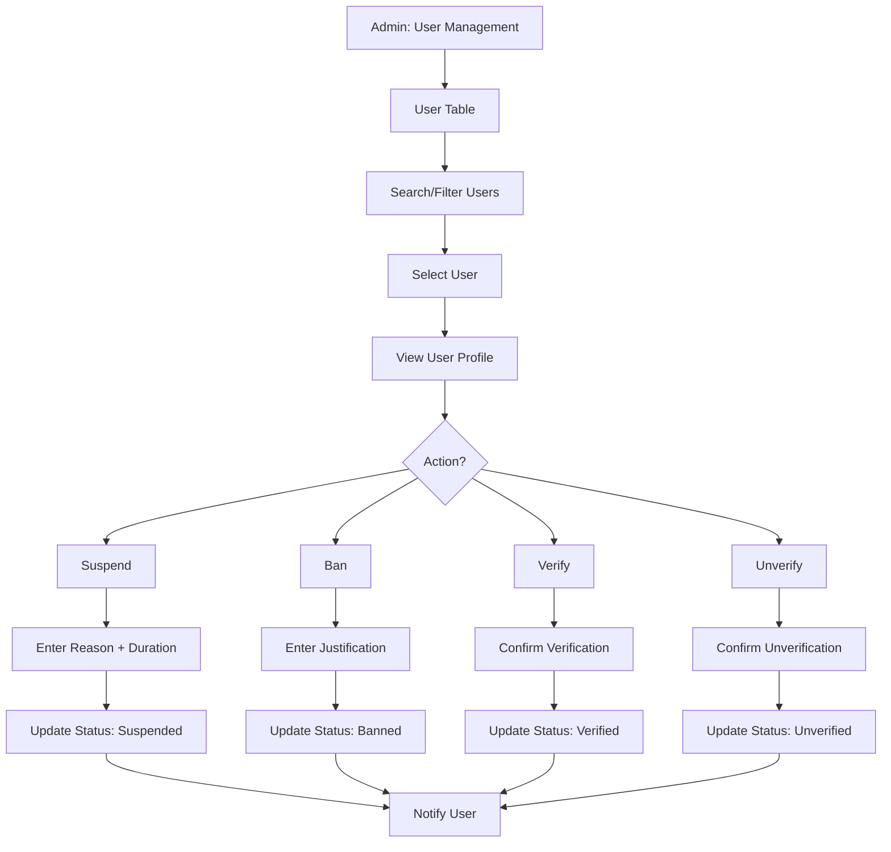
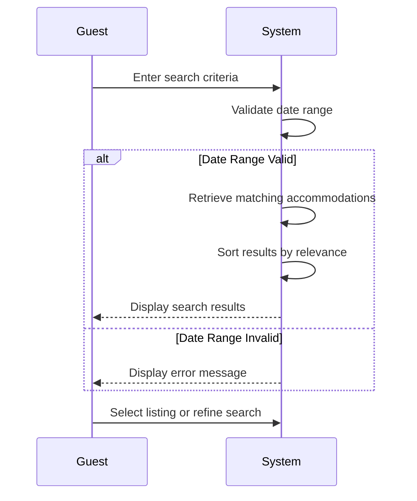
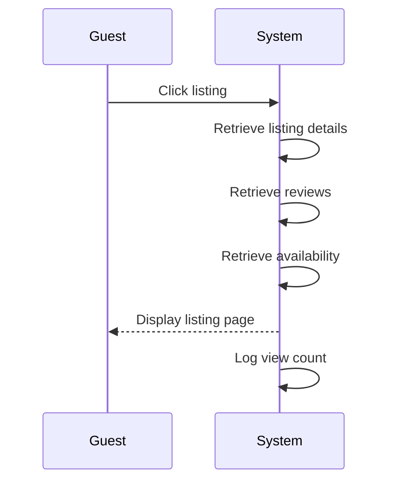
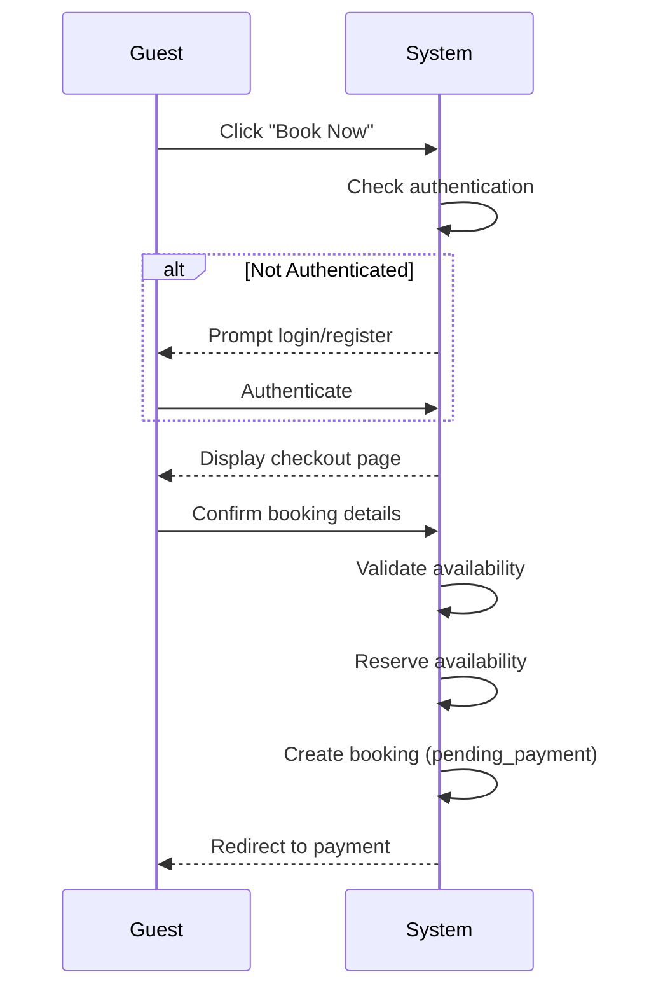
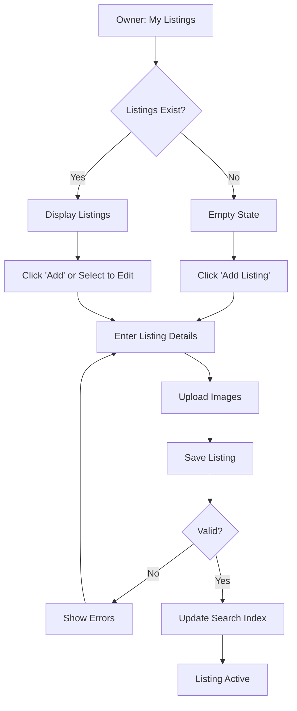

# Hostel Management System - Use Cases Documentation

This document consolidates key use cases for the Hostel Management System, covering admin, guest, and owner interactions.

---

## Table of Contents

1. [UC-A02: Manage Users](#uc-a02-manage-users)
2. [UC-G01: Search Hostels](#uc-g01-search-hostels)
3. [UC-G02: View Listing Details](#uc-g02-view-listing-details)
4. [UC-G03: Create Booking](#uc-g03-create-booking)
5. [UC-O02: Manage Listings](#uc-o02-manage-listings)

---

## UC-A02: Manage Users

| Field | Description |
|-------|-------------|
| **Use Case Name** | Manage Users |
| **Created By** | Product Team |
| **Created Date** | 2026-01-25 |
| **Last Updated By** | Product Team |
| **Last Updated Date** | 2026-01-25 |
| **Summary** | Admin views, searches, and manages user accounts. Can suspend/ban users, verify accounts, and view user activity. |
| **Dependency** | None (independent admin function) |
| **Actors** | Primary: Admin<br>Secondary: Users (affected by actions) |
| **Preconditions** | Admin authenticated. Has user management permissions. |
| **Trigger** | Admin navigates to "User Management" |
| **Main Sequence** | 1. Admin navigates to "User Management"<br>2. System displays user table with search and filters<br>3. Admin searches by email, name, phone<br>4. Admin filters by role, status, verification level<br>5. Admin selects a user to view details<br>6. System displays user profile, bookings, reviews, activity log<br>7. Admin may suspend, ban, verify, or unverify user |
| **Alternative Sequences** | Step 3: If user not found, System displays "No users found" message<br>Step 5: If user has bookings, System shows booking summary with links<br>Step 7: If suspend user, Admin must enter reason and duration<br>Step 7: If ban user, Admin must provide justification, System disables all bookings |
| **Postconditions** | User status updated. User notified via email. Audit log created. |
| **Nonfunctional Requirements** | Paginated user list (50 per page). Quick search < 1s. Action confirmation dialogs. Email notifications to users. |
| **Business Requirements** | BR-027: Suspended users cannot create new bookings<br>BR-028: Banned users lose access to platform |
| **Frequency of Use** | Medium |
| **Priority** | High |
| **Outstanding Questions** | Appeal process for banned users? Data retention for banned users? |

### Sequence Diagram



### Boundary Objects

| Boundary Object | Description | Data Elements |
|----------------|-------------|---------------|
| **UserList** | Paginated user list | users[], totalCount, page, filters |
| **UserDetails** | Complete user profile | userId, email, name, role, status, verificationLevel, bookings[], reviews[], activityLog[] |
| **UserAction** | Admin action on user | actionType (suspend/ban/verify/unverify), reason, duration, notes |
| **UserSearchRequest** | Search criteria | searchTerm, filters (role, status, verificationLevel) |
| **ActionConfirmation** | Action result | userId, newStatus, effectiveAt, expiresAt |

### Internal Software Objects

| Internal Object | Responsibility |
|-----------------|---------------|
| **UserService** | Manages user CRUD operations |
| **UserSearchService** | Handles user search and filtering |
| **UserActionService** | Processes suspend/ban/verify actions |
| **BookingService** | Fetches user booking history |
| **ReviewService** | Fetches user review history |
| **ActivityLogService** | Retrieves user activity |
| **NotificationService** | Sends action notifications to users |
| **UserRepository** | Queries user data |
| **AuditLogService** | Logs all admin actions |
| **AuthService** | Handles auth token invalidation |

### Message Communication Sequence

#### View Users Flow
```
Admin → System: ViewUsers (HTTP GET /api/admin/users)
    ↓
System → UserRepository: Query users with pagination
    ← users[]
System → UserSearchService: Apply search/filters
    ← filteredUsers
System → Admin: UserList (HTTP 200)
```

#### Search Users Flow
```
Admin → System: SearchUsers (HTTP POST /api/admin/users/search)
    ↓
System → UserSearchService: Search by email/name/phone
    ← matchingUsers
System → Admin: UserList (HTTP 200)
```

#### Suspend User Flow
```
Admin → System: SuspendUser (HTTP POST /api/admin/users/:id/suspend)
    ↓
System → UserActionService: Process suspension
    ↓
System → UserRepository: Update status (suspended)
    ← Updated
System → BookingService: Cancel upcoming bookings
    ← Cancelled
System → AuthService: Invalidate all tokens
    ← Invalidated
System → NotificationService: Notify user
    ← Queued
System → AuditLogService: Log suspension with reason
    ← Logged
System → Admin: ActionConfirmation (HTTP 200)
```

#### Ban User Flow
```
Admin → System: BanUser (HTTP POST /api/admin/users/:id/ban)
    ↓
System → UserActionService: Process ban
    ↓
System → UserRepository: Update status (banned)
    ← Updated
System → BookingService: Cancel all bookings
    ← Cancelled
System → AuthService: Invalidate all tokens
    ← Invalidated
System → NotificationService: Notify user
    ← Queued
System → AuditLogService: Log ban with justification
    ← Logged
System → Admin: ActionConfirmation (HTTP 200)
```

#### Verify User Flow
```
Admin → System: VerifyUser (HTTP POST /api/admin/users/:id/verify)
    ↓
System → UserRepository: Update verification level
    ← Verified
System → NotificationService: Notify user
    ← Queued
System → Admin: ActionConfirmation (HTTP 200)
```

### Expanded Alternative Sequences

#### Step 3: User Search Results
| Condition | System Response | Recovery |
|-----------|-----------------|----------|
| No users found | "No users found" message | Suggest broader search |
| Multiple matches | Show all matches | Refine filters |
| Exact email match | Direct to user profile | Single result |
| Suspended user found | Show "Suspended" badge | Action history available |

#### Step 5: Action Confirmations
| Condition | System Response | Recovery |
|-----------|-----------------|----------|
| Suspend - no duration | Require duration input | Minimum/max duration hints |
| Ban - insufficient justification | Require detailed reason | Policy link provided |
| Verify - pending flags | Show unresolved flags | Resolve before verifying |
| Bulk action | Show affected user count | Confirm batch operation |

#### Step 7: Action Failures
| Condition | System Response | Recovery |
|-----------|-----------------|----------|
| Database constraint violation | Retry with fresh data | Concurrent modification handling |
| Token invalidation failed | Log for manual cleanup | Cron job retry |
| Booking cancellation failed | Partial success report | Manual follow-up required |
| User already in target state | No-op with notice | "Already suspended" message |

#### User State Conflicts
| Condition | System Response | Recovery |
|-----------|-----------------|----------|
| Active bookings during ban | Warning: "Will cancel X bookings" | Force confirmation |
| Pending reviews during ban | Reviews preserved | Reviews stay visible |
| Refund due to ban | Queue refund processing | Payment gateway retry |
| Appeal submitted | Show appeal status | Override option for admins |

---

## UC-G01: Search Hostels

| Field | Description |
|-------|-------------|
| **Use Case Name** | Search Hostels |
| **Created By** | Product Team |
| **Created Date** | 2026-01-25 |
| **Last Updated By** | Product Team |
| **Last Updated Date** | 2026-01-25 |
| **Summary** | Guest searches for available hostels using filters like location, dates, price range, amenities, and room type. System retrieves and displays matching results. |
| **Dependency** | UC-G02 (View Listing Details) |
| **Actors** | Primary: Guest |
| **Preconditions** | Guest is on homepage or search page |
| **Trigger** | Guest enters search criteria and clicks search |
| **Main Sequence** | 1. Guest enters search criteria (location, check-in/out dates, number of guests)<br>2. System validates date range (check-out must be after check-in)<br>3. System retrieves accommodations matching search criteria<br>4. System sorts results by relevance and availability<br>5. System displays search results with pagination<br>6. Guest may refine filters or select a listing |
| **Alternative Sequences** | Step 2: If date range invalid, System displays error "Check-out date must be after check-in"<br>Step 3: If no results found, System displays "No hostels found" message with suggested nearby locations or date adjustments<br>Step 5: If search service unavailable, System displays error and offers alternative search options |
| **Postconditions** | Search results displayed to guest. Search criteria stored for navigation. Search analytics logged. |
| **Nonfunctional Requirements** | System shall display search results within 500ms (p95). Support 1000 concurrent searches. Vietnamese/English localization. Mobile-responsive. WCAG 2.1 AA compliance. |
| **Business Requirements** | BR-001: Location must be in Vietnam<br>BR-002: Check-out date must be after check-in date |
| **Frequency of Use** | High |
| **Priority** | High |
| **Outstanding Questions** | Should we save search history for logged-in guests? How to handle location typo corrections? |

### Sequence Diagram



### Boundary Objects

| Boundary Object | Description | Data Elements |
|----------------|-------------|---------------|
| **SearchRequest** | Guest's search criteria submitted to system | location, checkInDate, checkOutDate, guestCount, priceRange (min/max), amenities[], roomType[], rating (min) |
| **SearchResults** | System response containing matching accommodations | totalCount, results[], page, pageSize, sortBy, filters |
| **ListingSummary** | Brief listing info for search results display | listingId, title, thumbnailUrl, location (city, country), basePrice, currency, rating, reviewCount, amenities[], availableStatus |
| **FilterOptions** | Available filter values for refinement | priceRange (min/max), locations[], amenityOptions[], roomTypeOptions[], ratingRange |
| **SuggestionItem** | Alternative suggestions when no results found | suggestedLocation, suggestedDates, nearbyListings[] |

### Internal Software Objects

| Internal Object | Responsibility |
|-----------------|---------------|
| **SearchService** | Validates search criteria, coordinates search orchestration |
| **SearchQueryValidator** | Validates date range logic, filter constraints, guest count limits |
| **ListingSearchEngine** | Queries Elasticsearch for matching listings |
| **AvailabilityService** | Checks real-time availability for search dates |
| **PricingService** | Calculates total prices for search date range |
| **GeoLocationService** | Handles location-based queries and nearby searches |
| **SearchCacheService** | Manages cached search results (5-minute TTL) |
| **SearchAnalyticsLogger** | Logs search queries for analytics and optimization |
| **PaginationService** | Handles result pagination and cursor-based navigation |
| **RelevanceScorer** | Calculates relevance scores for result sorting |

### Message Communication Sequence

#### Search Flow
```
Guest → System: SearchRequest (HTTP POST /api/search)
    ↓
System → SearchQueryValidator: Validate criteria
    ← ValidationResult
System → SearchCacheService: Check cache
    ← CacheMiss
System → ListingSearchEngine: Search listings (Elasticsearch)
    ← RawResults[]
System → AvailabilityService: Batch check availability
    ← AvailabilityMap
System → PricingService: Calculate prices
    ← PriceMap
System → RelevanceScorer: Score and sort
    ← SortedResults[]
System → SearchAnalyticsLogger: Log search
System ← SearchAnalyticsLogger: Logged
System → Guest: SearchResults (HTTP 200)
```

#### Filter Update Flow
```
Guest → System: UpdateFilters (HTTP POST /api/search/filters)
    ↓
System → ListingSearchEngine: Refine search
    ← FilteredResults[]
System → Guest: SearchResults
```

#### Suggestion Flow (No Results)
```
System → GeoLocationService: Find nearby locations
    ← NearbyLocations[]
System → AvailabilityService: Check nearby availability
    ← NearbyAvailability[]
System → Guest: SuggestionItem
```

### Expanded Alternative Sequences

#### Step 2: Date Range Validation
| Condition | System Response | Recovery |
|-----------|-----------------|----------|
| Check-out before check-in | Error: "Check-out must be after check-in" | Auto-swap dates option |
| Check-out equals check-in | Error: "Minimum stay is 1 night" | Suggest next day |
| Check-out beyond 365 days | Error: "Booking limited to 1 year ahead" | Suggest max date |
| Check-in before today | Error: "Check-in cannot be in the past" | Set to today |
| Date range exceeds 90 days | Error: "Maximum stay is 90 nights" | Suggest 90-day limit |
| Guest count exceeds capacity | Error: "Enter valid guest count" | Show max guest hint |

#### Step 3: No Results Found
| Condition | System Response | Recovery |
|-----------|-----------------|----------|
| Exact location no results | Show nearby listings (within 50km) | "Show results nearby" button |
| Date range no availability | Suggest alternative dates | Flexible date picker |
| Filter too restrictive | Relax filters gradually | "Remove some filters" suggestion |
| Price range no matches | Suggest price adjustment | Show available price range |
| Complete no results | Popular destinations list | Browse all listings |

#### Step 5: Search Service Unavailable
| Condition | System Response | Recovery |
|-----------|-----------------|----------|
| Elasticsearch timeout | Fallback to MySQL search | "Showing partial results" warning |
| Complete service failure | Cached results only | "Last updated X min ago" notice |
| Network latency | Loading indicator + retry | Auto-retry after 3s |
| Partial results returned | Return available results | "Some results unavailable" message |

#### Step 6: Real-time Updates
| Condition | System Response | Recovery |
|-----------|-----------------|----------|
| Listing sold during search | Mark as unavailable | Show alternative listings |
| Price changed during search | Update displayed price | "Price may vary" disclaimer |
| New listing matches criteria | Optional refresh prompt | "New listings available" toast |

---

## UC-G02: View Listing Details

| Field | Description |
|-------|-------------|
| **Use Case Name** | View Listing Details |
| **Created By** | Product Team |
| **Created Date** | 2026-01-25 |
| **Last Updated By** | Product Team |
| **Last Updated Date** | 2026-01-25 |
| **Summary** | Guest views comprehensive details of a specific hostel including photos, amenities, pricing, reviews, and availability calendar. |
| **Dependency** | UC-G01 (Search Hostels) |
| **Actors** | Primary: Guest |
| **Preconditions** | Guest has selected a listing from search results or direct link. Listing status is 'approved'. |
| **Trigger** | Guest clicks on a listing from search results |
| **Main Sequence** | 1. Guest clicks on a listing from search results<br>2. System retrieves listing details<br>3. System retrieves current reviews and ratings<br>4. System retrieves available dates<br>5. System displays listing page with all sections<br>6. System increments view count |
| **Alternative Sequences** | Step 2: If listing not found, System displays 404 error with similar listing suggestions<br>Step 2: If listing not approved, System displays "This listing is under review" message<br>Step 4: If no availability for selected dates, System shows "Fully Booked" badge with nearest available dates<br>Step 5: If image delivery fails, System displays placeholder images |
| **Postconditions** | Listing viewed event logged. View count incremented. Listing added to "Recently Viewed" (if logged in). |
| **Nonfunctional Requirements** | Page load < 2s. Images optimized (WebP, lazy loading). CDN delivery for images. Mobile-responsive. Vietnamese diacritics support. |
| **Business Requirements** | BR-011: Only approved listings are visible to guests<br>BR-012: View count must be tracked for analytics |
| **Frequency of Use** | High |
| **Priority** | High |
| **Outstanding Questions** | Should we show "X people viewing this now" for urgency? How many images per listing max? |

### Sequence Diagram



### Boundary Objects

| Boundary Object | Description | Data Elements |
|----------------|-------------|---------------|
| **ListingDetailView** | Complete listing data for display | listingId, title, description, location, images[], amenities[], policies, hostInfo, rating, reviewCount |
| **ReviewSummary** | Aggregated review data | averageRating, ratingDistribution, recentReviews[], totalReviews |
| **AvailabilityCalendar** | Calendar data for selected month | dates[], availableDates[], bookedDates[], priceByDate{} |
| **PriceBreakdown** | Pricing details for search dates | basePrice, cleaningFee, serviceFee, taxes, totalPrice, currency |
| **MediaItem** | Individual image/video data | mediaId, type (image/video), url, thumbnailUrl, caption, order |
| **LocationInfo** | Location and map data | address, city, country, coordinates (lat, lng), nearbyPlaces[], distanceFromCenter |

### Internal Software Objects

| Internal Object | Responsibility |
|-----------------|---------------|
| **ListingService** | Retrieves listing details by ID |
| **ReviewService** | Fetches reviews and aggregates ratings |
| **AvailabilityService** | Loads availability calendar data |
| **PricingService** | Calculates pricing for date ranges |
| **MediaService** | Handles image URLs, CDN delivery, thumbnails |
| **LocationService** | Provides map data and nearby places |
| **ViewCountService** | Increments and tracks listing views |
| **RecentlyViewedService** | Manages "Recently Viewed" for logged-in users |
| **ListingCacheService** | Caches listing details (15-minute TTL) |
| **ImageOptimizationService** | Generates WebP variants and responsive images |

### Message Communication Sequence

#### Listing View Flow
```
Guest → System: ViewListing (HTTP GET /api/listings/:id)
    ↓
System → ListingCacheService: Check cache
    ← CacheMiss
System → ListingService: Get listing
    ← ListingData
System → ReviewService: Get reviews
    ← ReviewSummary
System → AvailabilityService: Get calendar
    ← AvailabilityCalendar
System → PricingService: Calculate base pricing
    ← PriceInfo
System → MediaService: Get optimized image URLs
    ← MediaItem[]
System → ViewCountService: Increment view (async, non-blocking)
System → RecentlyViewedService: Add to history (if logged in)
System → ListingCacheService: Cache response
System → Guest: ListingDetailView (HTTP 200)
```

#### Image Load Flow
```
Guest → System: RequestImage (HTTP GET /cdn/images/:id)
    ↓
System → MediaService: Validate access
System → CDN: Serve image (WebP, resized)
System → Guest: ImageResponse
```

#### WebSocket: Real-time Availability Update
```
Owner → System: CalendarUpdate (WebSocket)
    ↓
System → AvailabilityService: Update calendar
System → WebSocket: Broadcast to connected guests viewing listing
Guest ← System: AvailabilityUpdate (WebSocket event)
```

### Expanded Alternative Sequences

#### Step 2: Listing Not Found
| Condition | System Response | Recovery |
|-----------|-----------------|----------|
| Invalid listing ID | 404 error page | Similar listings suggestions |
| Listing deleted | 410 Gone error | Alternative properties in same area |
| Listing not approved | "Under review" message | Estimated approval date |
| Listing suspended | "Temporarily unavailable" | Contact support option |
| Listing inactive | "Not currently bookable" | Owner's other listings |

#### Step 4: No Availability
| Condition | System Response | Recovery |
|-----------|-----------------|----------|
| Fully booked for dates | "Fully Booked" badge | Nearest available dates |
| Partial availability | Show available dates only | Split booking option |
| Calendar not published | "Contact owner for availability" | Message owner button |
| Blackout dates | "Not available these dates" | Alternative date suggestions |

#### Step 5: Image Delivery Failures
| Condition | System Response | Recovery |
|-----------|-----------------|----------|
| CDN timeout | Fallback to origin | Loading retry |
| Image not found | Placeholder image | "Image unavailable" badge |
| Slow image load | Progressive loading | Low-res placeholder first |
| Video playback error | Show thumbnail | "Video unavailable" message |

#### Step 6: Authentication Edge Cases
| Condition | System Response | Recovery |
|-----------|-----------------|----------|
| Not logged in | Skip "Recently Viewed" | "Sign in to save" prompt |
| Session expired | Silently fail history save | Continue viewing normally |
| Rate limit exceeded | Cache view count locally | Batch update later |

---

## UC-G03: Create Booking

| Field | Description |
|-------|-------------|
| **Use Case Name** | Create Booking |
| **Created By** | Product Team |
| **Created Date** | 2026-01-25 |
| **Last Updated By** | Product Team |
| **Last Updated Date** | 2026-01-25 |
| **Summary** | Guest initiates a booking request by selecting dates, room type, and number of guests. System validates availability, reserves the dates, and creates a pending booking record. |
| **Dependency** | UC-G02 (View Listing Details) |
| **Actors** | Primary: Guest |
| **Preconditions** | Guest is authenticated (or will authenticate in flow). Selected listing is available for desired dates. |
| **Trigger** | Guest clicks "Book Now" from listing page |
| **Main Sequence** | 1. Guest clicks "Book Now" from listing page<br>2. System redirects to checkout page (or prompts login if not authenticated)<br>3. Guest selects or confirms dates, room type, number of guests<br>4. System validates availability for selected dates<br>5. System displays price breakdown (base rate, fees, taxes)<br>6. Guest confirms booking details<br>7. System reserves availability for selected dates<br>8. System creates booking record with status 'pending_payment'<br>9. System redirects guest to payment flow |
| **Alternative Sequences** | Step 2: If guest not authenticated, System prompts login/register, preserves booking data temporarily<br>Step 3: If dates no longer available, System displays error "Selected dates no longer available" with available alternatives<br>Step 4: If availability reservation fails, System displays "Someone is booking this room. Please try again in a moment"<br>Step 7: If booking creation fails, System releases reservation and displays error with retry option |
| **Postconditions** | Booking record created (status: pending_payment). Availability reserved. Payment initiated. Notification queued. |
| **Nonfunctional Requirements** | Availability reservation timeout: 15 minutes. Zero double-bookings guarantee. Atomic booking creation. Payment gateway failover support. |
| **Business Requirements** | BR-003: Guest must provide valid contact information<br>BR-004: Availability reservation expires after 15 minutes if payment not completed |
| **Frequency of Use** | High |
| **Priority** | High |
| **Outstanding Questions** | Reservation timeout: 10 or 15 minutes? How to handle abandoned bookings (cleanup schedule)? |

### Sequence Diagram



### Boundary Objects

| Boundary Object | Description | Data Elements |
|----------------|-------------|---------------|
| **BookingRequest** | Guest's booking initiation | listingId, roomId, checkInDate, checkOutDate, guestCount, specialRequests |
| **BookingConfirmation** | Created booking details | bookingId, status, reservationExpiresAt, priceBreakdown |
| **PriceBreakdown** | Detailed cost calculation | basePrice, cleaningFee, serviceFee, taxes, totalPrice, currency |
| **AvailabilityReservation** | Temporary hold on dates | reservationId, roomId, dateRange, expiresAt |
| **GuestDetails** | Guest information for booking | guestId, name, email, phone, specialRequests |
| **CheckoutSession** | Checkout page session data | sessionId, listingData, dateData, pricingData, expiresAt |

### Internal Software Objects

| Internal Object | Responsibility |
|-----------------|---------------|
| **BookingService** | Orchestrates booking creation flow |
| **AvailabilityService** | Manages availability reservations and locks |
| **PricingService** | Calculates total pricing with fees and taxes |
| **BookingRepository** | Persists booking records |
| **ReservationLockService** | Manages distributed locks for availability (Redis) |
| **GuestService** | Fetches guest details |
| **AuthService** | Validates authentication state |
| **BookingValidator** | Validates booking constraints (dates, capacity) |
| **NotificationService** | Queues booking notifications |
| **SessionService** | Manages temporary booking session data |

### Message Communication Sequence

#### Booking Creation Flow
```
Guest → System: BookNow (HTTP POST /api/bookings/initiate)
    ↓
System → AuthService: Check authentication
    ← NotAuthenticated
System → Guest: Redirect to login (HTTP 302)
Guest → System: Authenticate
    ↓
System → BookingService: Create booking session
    ← SessionId
System → Guest: Checkout page (HTTP 200)
    ↓
Guest → System: ConfirmBooking (HTTP POST /api/bookings)
    ↓
System → BookingValidator: Validate constraints
    ← Valid
System → AvailabilityService: Check availability
    ← Available
System → ReservationLockService: Acquire lock (Redis, 15min TTL)
    ← LockAcquired (reservationId)
System → PricingService: Calculate total
    ← PriceBreakdown
System → BookingRepository: Create booking (status: pending_payment)
    ← BookingRecord
System → NotificationService: Queue notifications
    ← Queued
System → Guest: Redirect to payment (HTTP 302)
```

#### Lock Expiration Flow
```
System (scheduler) → BookingRepository: Find expired pending bookings
    ← expiredBookings[]
System → ReservationLockService: Release locks
    ← Released
System → BookingRepository: Update status (expired)
```

#### WebSocket: Real-time Availability
```
System → WebSocket: Broadcast booking.created event
Guest(s) viewing listing ← System: AvailabilityUpdate
```

### Expanded Alternative Sequences

#### Step 2: Authentication States
| Condition | System Response | Recovery |
|-----------|-----------------|----------|
| Not logged in | Redirect to login | Preserve booking data in session |
| Session expired | Re-authenticate required | Restore booking session after login |
| Email not verified | Block with verification prompt | Verify email to continue |
| Account suspended | Block with message | Contact support |

#### Step 3: Availability Changes
| Condition | System Response | Recovery |
|-----------|-----------------|----------|
| Dates became unavailable | Error: "No longer available" | Show alternative dates |
| Price increased since page load | Show new price | Confirm or cancel |
| Room capacity exceeded | Error: "Too many guests" | Suggest additional rooms |
| Minimum stay not met | Error: "Minimum X nights" | Adjust dates |

#### Step 4: Reservation Failures
| Condition | System Response | Recovery |
|-----------|-----------------|----------|
| Concurrent booking attempt | Error: "Someone is booking this room" | Retry button with countdown |
| Lock acquisition timeout | Error: "Unable to reserve. Try again" | Auto-retry up to 3 times |
| Redis connection failure | Fallback to database lock | Degraded performance notice |
| Duplicate booking detected | Error: "You already have a booking" | Link to existing booking |

#### Step 7: Booking Creation Failures
| Condition | System Response | Recovery |
|-----------|-----------------|----------|
| Database constraint violation | Error: "Booking creation failed" | Release lock, retry |
| Payment gateway unavailable | Queue for retry | Notify when payment available |
| Notification queue full | Continue booking | Log for later notification |
| Session expired | Error: "Session expired" | Restart booking flow |

---

## UC-O02: Manage Listings

| Field | Description |
|-------|-------------|
| **Use Case Name** | Manage Listings |
| **Created By** | Product Team |
| **Created Date** | 2026-01-25 |
| **Last Updated By** | Product Team |
| **Last Updated Date** | 2026-01-25 |
| **Summary** | Owner creates, updates, and deactivates listings under their approved properties. Each listing has room types, pricing, and amenities. |
| **Dependency** | UC-O01 (Register Property) |
| **Actors** | Primary: Owner |
| **Preconditions** | Owner authenticated. At least one approved property exists. |
| **Trigger** | Owner navigates to "My Listings" |
| **Main Sequence** | 1. Owner navigates to "My Listings"<br>2. System displays all listings with status indicators<br>3. Owner clicks "Add Listing" or selects existing to edit<br>4. Owner enters listing details (room type, capacity, base price, amenities)<br>5. Owner uploads listing images<br>6. Owner saves listing<br>7. System updates listing<br>8. System initializes availability calendar |
| **Alternative Sequences** | Step 2: If no listings, System displays empty state with "Create your first listing" CTA<br>Step 4: If duplicate listing detected, System warns "Similar listing exists"<br>Step 7: If search index update fails, System queues for retry and shows warning to owner<br>Step 8: If calendar initialization fails, System logs error for manual intervention |
| **Postconditions** | Listing created/updated. Search index updated. Calendar initialized. Audit log created. |
| **Nonfunctional Requirements** | Max 20 images per listing. Amenities predefined list. Price validation (min/max). Search index update reliability. |
| **Business Requirements** | BR-019: Room type must match property type<br>BR-020: Pricing must be within platform limits |
| **Frequency of Use** | Medium |
| **Priority** | High |
| **Outstanding Questions** | How many listings per property? Should changes require re-approval? |

### Sequence Diagram



### Boundary Objects

| Boundary Object | Description | Data Elements |
|----------------|-------------|---------------|
| **ListingDetails** | Listing form data | propertyId, title, description, roomType, capacity, basePrice, currency, amenities[] |
| **ListingResponse** | Created/updated listing | listingId, status, searchIndexStatus, updatedAt |
| **ListingImage** | Listing media | imageId, url, order, caption |
| **AmenityItem** | Amenity selection | amenityId, name, category |
| **PriceValidation** | Price constraint check | minPrice, maxPrice, platformLimits |

### Internal Software Objects

| Internal Object | Responsibility |
|-----------------|---------------|
| **ListingService** | Manages listing CRUD operations |
| **ListingValidator** | Validates listing constraints |
| **PricingService** | Validates and enforces price limits |
| **AmenityService** | Manages available amenities |
| **ImageUploadService** | Handles listing image uploads |
| **SearchIndexService** | Syncs listings to Elasticsearch |
| **ListingRepository** | Persists listing records |
| **PropertyRepository** | Verifies property ownership |
| **NotificationService** | Notifies of search index issues |
| **AuditLogService** | Logs listing changes |

### Message Communication Sequence

#### Create/Update Listing Flow
```
Owner → System: CreateListing (HTTP POST /api/listings)
    ↓
System → ListingValidator: Validate data
    ← Valid
System → PropertyRepository: Verify property ownership
    ← Verified
System → PricingService: Check price limits
    ← Within limits
System → ImageUploadService: Upload images
    ← imageUrls[]
System → ListingRepository: Create listing
    ← ListingRecord
System → SearchIndexService: Sync to Elasticsearch
    ← Indexed
System → AuditLogService: Log creation
    ← Logged
System → Owner: ListingResponse (HTTP 201)
```

#### Search Index Sync Flow
```
System → RabbitMQ: Publish listing.created
    ↓
Search Index Worker → SearchIndexService: Index in Elasticsearch
    ← Success (or Failure)
    ↓
If Failure → NotificationService: Alert admins
    ← Alerted
```

### Expanded Alternative Sequences

#### Step 4: Duplicate Detection
| Condition | System Response | Recovery |
|-----------|-----------------|----------|
| Same room type + property | Warning: "Similar listing exists" | Allow with confirmation |
| Same capacity + price range | Warning: "May duplicate existing" | Show existing listing |
| Different property | No warning | Continue normally |

#### Step 7: Search Index Failures
| Condition | System Response | Recovery |
|-----------|-----------------|----------|
| Elasticsearch down | Queue for retry | Listing created, "Pending search" badge |
| Index timeout | Retry in background | Notify when indexed |
| Partial success | Warning: "Some fields not searchable" | Re-sync available |
| Connection lost | Queue in RabbitMQ | Worker will retry |

#### Step 8: Calendar Initialization
| Condition | System Response | Recovery |
|-----------|-----------------|----------|
| Date range invalid | Error: "Invalid date range" | Prompt for valid dates |
| Database constraint | Log error, manual fix | Flag for admin review |
| Async init succeeded | Silent success | Calendar ready |
| Init timeout | Background retry | Notify when ready |

---

## Document Information

- **Document Version**: 1.0
- **Last Updated**: 2026-01-29
- **Author**: Product Team
- **Status**: Consolidated Use Cases Documentation

This document provides a comprehensive overview of the core use cases for the Hostel Management System. Each use case includes detailed sequence diagrams, boundary objects, internal software objects, message communication sequences, and expanded alternative sequences to support full implementation and testing.
