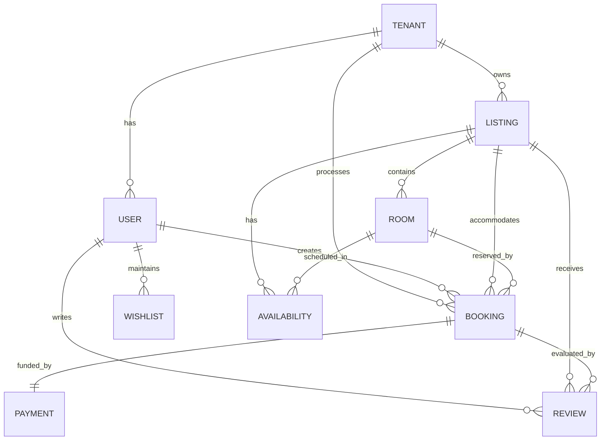

# Project Overview - Product Development Requirements (PDR)
## Hostel Management System

**Version:** 1.1 (Critical fixes applied)
**Date:** 2026-01-25
**Status:** Requirements Complete
**Methodology:** COMET (Component-Object-Based Enterprise Modeling)

---

## Executive Summary

The Hostel Management System is a **multi-tenant SaaS platform** designed for the Vietnam hospitality market, enabling travelers to discover and book hostel accommodations while providing property owners with comprehensive management tools.

**Key Highlights:**
- **Multi-tenant architecture** with single database, logical isolation
- **Real-time availability** via WebSocket
- **Vietnam-specific payment integration** (VNPAY, Ngân Lượng, MoMo)
- **Elasticsearch-powered search** with geospatial queries
- **Bilingual support** (English/Vietnamese)

---

## 1. Product Vision

### 1.1 Vision Statement

> "To become Vietnam's leading hostel booking platform, connecting travelers with authentic local accommodations through a seamless, trustworthy, and locally-optimized experience."

### 1.2 Target Market

| Segment | Description | Size Estimate |
|---------|-------------|---------------|
| **Primary** | Domestic travelers (Vietnam) | ~50M travelers/year |
| **Secondary** | International tourists visiting Vietnam | ~18M tourists/year (2024) |
| **Property Owners** | Hostel operators in Vietnam | ~10,000 hostels |

### 1.3 Value Proposition

**For Guests:**
- Real-time availability and pricing
- Vietnam-specific payment methods
- Verified reviews from actual guests
- Bilingual local support

**For Owners:**
- Dynamic pricing and calendar management
- Real-time booking notifications
- Analytics and revenue insights
- Zero commission during launch phase

---

## 2. System Architecture Overview

### 2.1 Architecture Diagram

```
┌─────────────────────────────────────────────────────────────┐
│                      Presentation Layer                      │
│  ┌─────────────────────────────────────────────────────────┐ │
│  │            Next.js 15 (App Router)                      │ │
│  │  ┌─────────────────┐  ┌──────────────────────────────┐ │ │
│  │  │  Guest Website  │  │  Owner/Admin Dashboard       │ │ │
│  │  │  (Public)       │  │  (Authenticated)             │ │ │
│  │  └─────────────────┘  └──────────────────────────────┘ │ │
│  └─────────────────────────────────────────────────────────┘ │
├─────────────────────────────────────────────────────────────┤
│                      Application Layer                       │
│  ┌─────────────────────────────────────────────────────────┐ │
│  │              NestJS API Gateway                          │ │
│  │  ┌─────────────────────────────────────────────────────┐ │ │
│  │  │  REST API │ WebSocket Gateway │ Microservices       │ │ │
│  │  └─────────────────────────────────────────────────────┘ │ │
│  └─────────────────────────────────────────────────────────┘ │
├─────────────────────────────────────────────────────────────┤
│                         Data Layer                           │
│  ┌──────────┐ ┌──────────┐ ┌──────────┐ ┌──────────┐      │
│  │  MySQL   │ │ Elastic  │ │  Redis   │ │RabbitMQ  │      │
│  │  Primary │ │  Search  │ │  Cache   │ │   MQ     │      │
│  └──────────┘ └──────────┘ └──────────┘ └──────────┘      │
│                                                                  │
│  ┌──────────┐ ┌──────────┐ ┌──────────────────────────┐    │
│  │   S3     │ │CloudFront│ │   External Services       │    │
│  │  Images  │ │   CDN    │ │ │ Payment │ Maps │ Email │    │
│  └──────────┘ └──────────┘ └──────────────────────────┘    │
└─────────────────────────────────────────────────────────────┘
```

### 2.2 Technology Stack Summary

| Layer | Technology | Version | Purpose |
|-------|-----------|---------|---------|
| **Frontend** | Next.js | 15 | React Server Components, SEO |
| **Backend** | NestJS | Latest | API, WebSocket, DI |
| **Database** | MySQL | 8.0 | Primary data store |
| **Search** | Elasticsearch | 8.x | Full-text search |
| **Cache** | Redis | 7 | Sessions, locks, cache |
| **Queue** | RabbitMQ | 3 | Async jobs, events |
| **Storage** | AWS S3 + CloudFront | - | Images, CDN |
| **Payment** | VNPAY, Ngân Lượng, MoMo | - | Vietnam gateways |

---

## 3. Functional Requirements Summary

### 3.1 Use Case Inventory

**Total Use Cases: 16**

| Actor | Count | Use Cases |
|----------|-------|-----------|
| **Guest** | 6 | Search, View Details, Book, Cancel, Review, Wishlist |
| **Owner** | 5 | Register Property, Create Listing, Update Calendar, View Bookings, Analytics |
| **Admin** | 5 | Approve Listing, Suspend User, Configure Payments, Analytics, Resolve Dispute |

### 3.2 Functional Requirements Distribution

```
┌────────────────────────────────────────────────────────────┐
│                   Functional Requirements                   │
│  ┌────────────────────────────────────────────────────────┐ │
│  │  Guest (46 FRs)                                       │ │
│  │  • Search & Discovery                                 │ │
│  │  • Booking & Payment                                  │ │
│  │  • Reviews & Wishlist                                 │ │
│  ├────────────────────────────────────────────────────────┤ │
│  │  Owner (30 FRs)                                       │ │
│  │  • Property & Listing Management                      │ │
│  │  • Calendar & Availability                            │ │
│  │  • Analytics                                          │ │
│  ├────────────────────────────────────────────────────────┤ │
│  │  Admin (30 FRs)                                       │ │
│  │  • Platform Administration                            │ │
│  │  • User & Dispute Management                          │ │
│  │  • System Monitoring                                  │ │
│  └────────────────────────────────────────────────────────┘ │
│                                                             │
│  Total Functional Requirements: 106                        │
└────────────────────────────────────────────────────────────┘
```

### 3.3 Key Business Flows

#### Guest Booking Flow
```
Search → View Listing → Create Booking → Process Payment → Confirm → Stay → Review
```

#### Owner Property Flow
```
Register → Approve → Create Listings → Set Calendar → Receive Bookings → View Analytics
```

#### Admin Moderation Flow
```
Review Pending → Approve/Reject → Sync to Search → Monitor Platform
```

---

## 4. Non-Functional Requirements Summary

### 4.1 NFR Categories

| Category | Count | Critical Items |
|----------|-------|----------------|
| **Performance** | 11 | <500ms search, <1s booking |
| **Security** | 16 | PCI DSS, zero card storage |
| **Availability** | 7 | 99.9% uptime, 4h recovery |
| **Usability** | 12 | WCAG 2.1 AA, bilingual |
| **Reliability** | 6 | Zero double-bookings |
| **Scalability** | 6 | 10K concurrent users |
| **Maintainability** | 8 | 80% test coverage |
| **Data Integrity** | 7 | ACID compliance |

**Total Non-Functional Requirements: 73**

### 4.2 Critical NFRs

| Priority | Requirements |
|----------|--------------|
| **P0 (Critical)** | Zero double-bookings, PCI DSS compliance, 99.9% uptime |
| **P1 (High)** | <500ms search, ACID compliance, WCAG 2.1 AA |
| **P2 (Medium)** | 10K concurrent users, 80% test coverage |
| **P3 (Low)** | 200% font scaling, loading indicators |

---

## 5. Data Model Overview

### 5.1 Core Entities



### 5.2 Multi-Tenancy Model

**Isolation Strategy:** Row-level security via `tenant_id`

| Table | Tenant Column | Notes |
|-------|---------------|-------|
| users | tenant_id | Each user belongs to one tenant |
| listings | tenant_id | Owner's listings under tenant |
| bookings | tenant_id | Guest bookings under their tenant |
| properties | tenant_id | Properties under owner's tenant |

---

## 6. API Architecture

### 6.1 API Endpoints Summary

| Category | Endpoint Count | Examples |
|----------|----------------|----------|
| **Guest/Public** | ~15 | `/search`, `/listings/:id`, `/bookings` |
| **Owner** | ~12 | `/my-listings`, `/calendar`, `/analytics` |
| **Admin** | ~10 | `/admin/approvals`, `/admin/users` |
| **Auth** | ~5 | `/login`, `/register`, `/refresh` |
| **Webhooks** | ~4 | `/webhooks/payment/*` |
| **Internal** | ~8 | `/internal/sync-es`, `/internal/jobs` |

**Total API Endpoints: ~54**

### 6.2 WebSocket Events

| Direction | Events |
|-----------|--------|
| **Client → Server** | `subscribe_calendar`, `ping` |
| **Server → Client** | `calendar_updated`, `booking_created`, `pong` |

---

## 7. Integration Points

### 7.1 Payment Gateways

| Gateway | Type | Status Change |
|---------|------|---------------|
| **VNPAY** | QR/Bank | pending_payment → confirmed/failed |
| **Ngân Lượng** | Wallet/Card | pending_payment → confirmed/failed |
| **MoMo** | Mobile Wallet | pending_payment → confirmed/failed |

### 7.2 External Services

| Service | Purpose | Integration Method |
|---------|---------|-------------------|
| **Elasticsearch** | Search | HTTP REST API |
| **AWS S3** | Image Storage | SDK + Presigned URLs |
| **CloudFront** | CDN | Signed URLs |
| **Email/SMS** | Notifications | SMTP / SMS API |

---

## 8. Deployment Architecture

### 8.1 Infrastructure (AWS EC2)

| Service | Instance Type | Count | Purpose |
|---------|---------------|-------|---------|
| **App Server** | t3.xlarge | 1 | NestJS + Next.js |
| **MySQL** | t3.medium | 1 | Primary database |
| **ELK** | t3.large | 1 | ES + Logstash + Kibana |
| **RabbitMQ** | t3.small | 1 | Message queue |
| **Monitoring** | t3.small | 1 | Prometheus + Grafana |

**Estimated Cost:** ~$193/month

### 8.2 Deployment Strategy

**Phase 1 (MVP):** Single EC2 per service, Docker Compose
**Phase 2 (Growth):** ALB + Auto-scaling (2-3 instances)
**Phase 3 (Scale):** Consider managed AWS services

---

## 9. Security Architecture

### 9.1 Security Layers

```
┌─────────────────────────────────────────────────────────────┐
│  Layer 1: Network (TLS 1.3, Firewall Rules)                 │
├─────────────────────────────────────────────────────────────┤
│  Layer 2: Application (JWT, Rate Limiting, Input Validation) │
├─────────────────────────────────────────────────────────────┤
│  Layer 3: Data (AES-256 Encryption, Row-level Security)      │
├─────────────────────────────────────────────────────────────┤
│  Layer 4: Audit (Comprehensive Logging, Monitoring)          │
└─────────────────────────────────────────────────────────────┘
```

### 9.2 Compliance Matrix

| Standard | Compliance | Notes |
|----------|------------|-------|
| **PCI DSS** | Level 4 | No card data stored |
| **OWASP** | Top 10 | Injection, XSS, CSRF prevention |
| **WCAG** | 2.1 AA | Accessibility compliance |
| **Vietnam Cybersecurity** | Pending | Legal consultation needed |

---

## 10. Development Phases

### 10.1 Phase 1: MVP (Months 1-3)

**Scope:**
- Core booking flow (search → book → pay)
- Owner property listing
- Basic admin panel
- Single payment gateway

**Deliverables:**
- Guest: UC-G01 to UC-G05
- Owner: UC-O01 to UC-O04
- Admin: UC-A01, UC-A02
- Infrastructure: Full stack deployed

### 10.2 Phase 2: Enhancement (Months 4-6)

**Scope:**
- Reviews and ratings
- Analytics dashboards
- Real-time calendar
- All payment gateways
- Dispute resolution

**Deliverables:**
- Guest: UC-G06
- Owner: UC-O05, real-time calendar
- Admin: UC-A03 to UC-A05
- Infrastructure: Read replicas

### 10.3 Phase 3: Scale (Months 7+)

**Scope:**
- Auto-scaling
- Advanced analytics
- Multi-language expansion
- Mobile apps (optional)

---

## 11. Documentation Structure

```
docs/
├── srs.md                          # IEEE 830 compliant SRS
├── functional-requirements.md      # Actor + Use case analysis
├── non-functional-requirements.md  # Planguage NFRs
├── project-overview-pdr.md         # This document
├── tech-stack.md                   # Technology details
├── design-guidelines.md            # UI/UX standards
├── models/                         # Database models
├── wireframes/                     # UI wireframes
└── use-cases/
    ├── uc-guest.md                 # Guest use cases (6)
    ├── uc-owner.md                 # Owner use cases (5)
    └── uc-admin.md                 # Admin use cases (5)
```

---

## 12. Key Metrics & KPIs

### 12.1 Product KPIs

| Metric | Target (Month 6) | Target (Year 1) |
|--------|------------------|-----------------|
| **Active Hostels** | 100 | 500 |
| **Monthly Bookings** | 500 | 5,000 |
| **Platform Revenue** | $2,500 | $25,000 |
| **Guest NPS** | 40 | 50 |
| **Owner NPS** | 30 | 45 |

### 12.2 Technical KPIs

| Metric | Target |
|--------|--------|
| **Uptime** | 99.9% |
| **p95 Latency** | <500ms (search) |
| **Error Rate** | <0.1% |
| **Test Coverage** | 80% |
| **Security Incidents** | 0 critical |

---

## 13. Risk Assessment

### 13.1 Technical Risks

| Risk | Probability | Impact | Mitigation |
|------|-------------|--------|------------|
| **Payment gateway downtime** | Medium | High | Multiple gateways, retry logic |
| **Elasticsearch failure** | Low | Medium | MySQL fallback, cached results |
| **Double-bookings** | Low | Critical | Distributed locks, testing |
| **Data breach** | Low | Critical | Encryption, audit, pen testing |

### 13.2 Business Risks

| Risk | Probability | Impact | Mitigation |
|------|-------------|--------|------------|
| **Low adoption** | Medium | High | Marketing, owner incentives |
| **Competition** | High | Medium | Local focus, unique features |
| **Regulatory changes** | Low | Medium | Legal consultation, flexibility |

---

## 14. Open Questions & Decisions Needed

### 14.1 Business Decisions

| ID | Question | Impact | Priority |
|----|----------|--------|----------|
| BQ-001 | Cancellation policy specifics? | UX, Revenue | High |
| BQ-002 | Commission structure? | Revenue model | High |
| BQ-003 | Business license requirement? | Compliance | Medium |
| BQ-004 | Marketing budget? | User acquisition | High |

### 14.2 Technical Decisions

| ID | Question | Impact | Priority |
|----|----------|--------|----------|
| TQ-001 | Lock timeout duration (10 or 15 min)? | Booking UX | Medium |
| TQ-002 | Search history for logged-in guests? | Privacy, UX | Low |
| TQ-003 | Season pricing templates? | Calendar feature | Medium |
| TQ-004 | Appeal process for banned users? | Support overhead | Low |

---

## 15. Approval Status

| Document | Status | Approved By | Date |
|----------|--------|-------------|------|
| SRS | Approved | COMET BA Validation | 2026-01-25 |
| Functional Requirements | Approved | COMET BA Validation | 2026-01-25 |
| NFRs | Approved | COMET BA Validation | 2026-01-25 |
| Use Cases | Approved | COMET BA Validation | 2026-01-25 |
| Tech Stack | Approved | Product Owner | 2026-01-11 |

---

## 16. Next Steps

1. **Requirements Review** (Week 1)
   - Stakeholder review of all requirements
   - Address open questions
   - Get approvals

2. **Design Phase** (Week 2-3)
   - Detailed database schema
   - API specification (OpenAPI)
   - UI/UX wireframes

3. **Development Kickoff** (Week 4)
   - Set up repositories
   - Configure CI/CD
   - Start sprint planning

---

**Document Version:** 1.1 (Critical fixes applied)
**Last Updated:** 2026-01-25
**Maintained By:** Product Team
**Methodology:** COMET

---

## Appendix A: Document References

| Document | Location | Purpose |
|----------|----------|---------|
| SRS | `docs/srs.md` | Complete requirements specification |
| Functional Requirements | `docs/functional-requirements.md` | Actor and use case analysis |
| NFRs | `docs/non-functional-requirements.md` | Planguage non-functional requirements |
| Use Cases | `docs/use-cases/*.md` | Detailed use case specifications |
| Tech Stack | `docs/tech-stack.md` | Technology details and rationale |
| Design Guidelines | `docs/design-guidelines.md` | UI/UX standards |

## Appendix B: Glossary

| Term | Definition |
|------|------------|
| **Multi-tenant** | Single application serving multiple customers with data isolation |
| **COMET** | Component-Object-Based Enterprise Modeling (requirements methodology) |
| **Planguage** | Programming Language specification language for NFRs |
| **SRS** | Software Requirements Specification |
| **NFR** | Non-Functional Requirement |
| **WS** | WebSocket |
| **ES** | Elasticsearch |
| **MQ** | Message Queue |