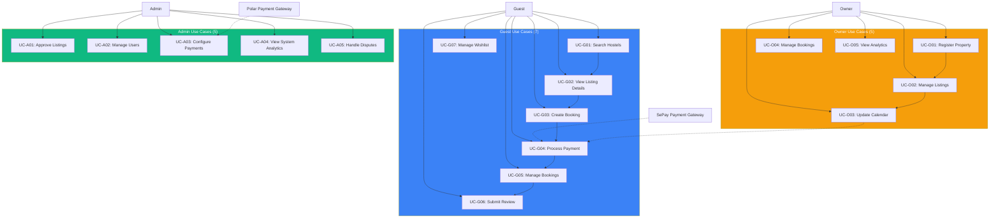
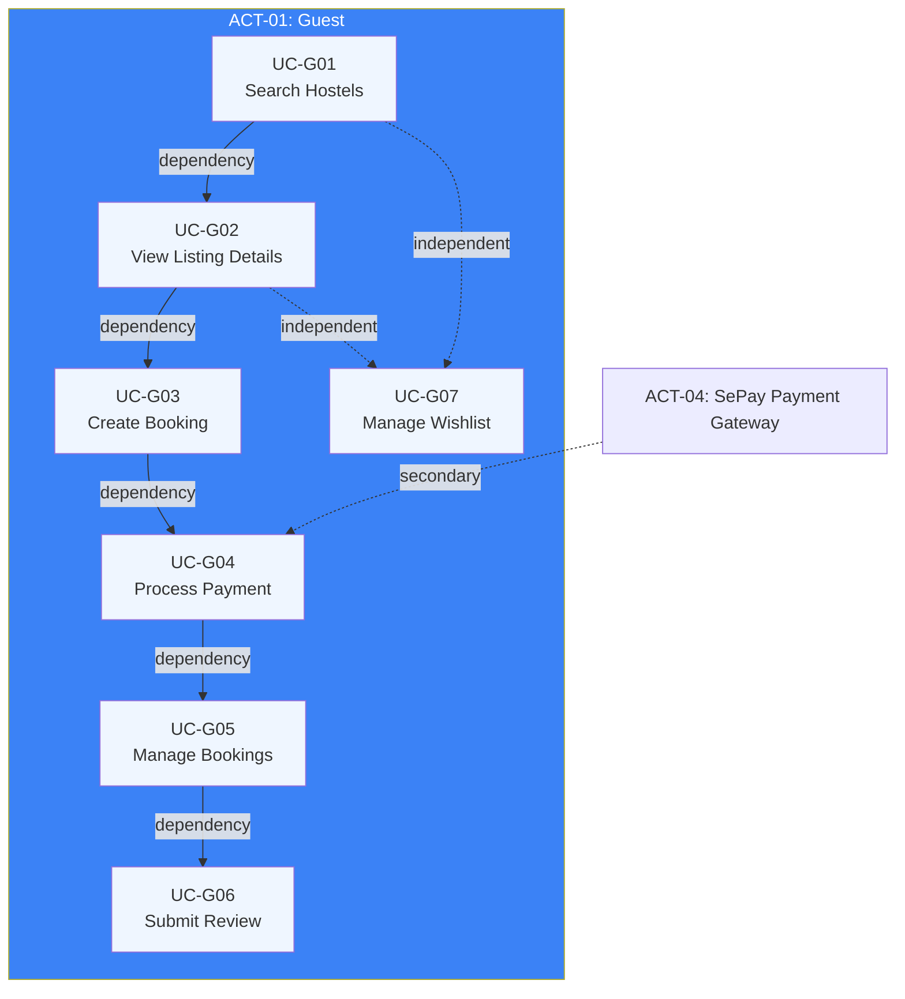
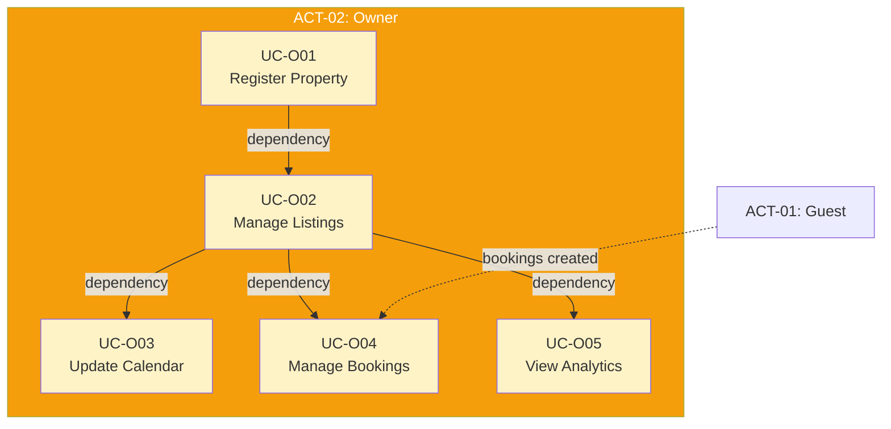
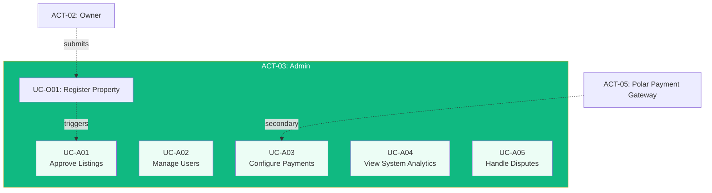
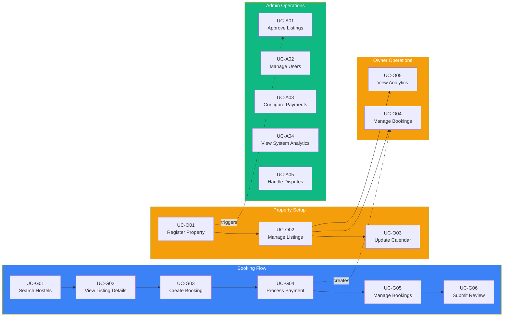

# 2. User Requirements

**Project:** Hostel Management System
**Version:** 1.0
**Last Updated:** 2026-01-25

---

## 2.1 Actors

### Actor Identification Process

Actors were identified by analyzing the system boundary and applying the **COMET 3-Question Validation Test**:
1. Is the entity **external** to the system?
2. Does it interact **directly** with the system?
3. Does it represent a **role** (not an individual)?

All actors below passed all three questions.

---

### 2.1.1 Actor Table

| Actor ID | Actor Name | Type | Description |
|----------|------------|------|-------------|
| **ACT-01** | Guest | Human User | Traveler seeking accommodation, searches and books hostels |
| **ACT-02** | Owner | Human User | Hostel operator managing property listings and bookings |
| **ACT-03** | Admin | Human User | Platform administrator managing system-wide operations |
| **ACT-04** | SePay Payment Gateway | External System | Payment processor for VietQR and bank transfers |
| **ACT-05** | Polar Payment Gateway | External System | Payment processor for SaaS subscription payments |
| **ACT-06** | Email Service | External System | Transactional email service for notifications |
| **ACT-07** | Daily Report Scheduler | Timer | Automated process generating daily analytics reports |

---

### 2.1.2 Actor Validation

#### ACT-01: Guest

**3-Question Test:**
| Question | Answer | Rationale |
|----------|--------|-----------|
| Q1: External to system? | ✅ YES | Guest is a user outside the system boundary |
| Q2: Direct interaction? | ✅ YES | Guest interacts via web interface (browser) |
| Q3: Represents a role? | ✅ YES | "Guest" is a role, not a specific individual |

**Type:** Human User
**Status:** ✅ VALID

**Description:** Travelers (domestic and international) seeking budget accommodation in Vietnam. Guests search for hostels, view listings, create bookings, process payments, manage reservations, submit reviews, and maintain wishlists.

---

#### ACT-02: Owner

**3-Question Test:**
| Question | Answer | Rationale |
|----------|--------|-----------|
| Q1: External to system? | ✅ YES | Owner is a user outside the system boundary |
| Q2: Direct interaction? | ✅ YES | Owner interacts via web dashboard |
| Q3: Represents a role? | ✅ YES | "Owner" is a role, not a specific individual |

**Type:** Human User
**Status:** ✅ VALID

**Description:** Hostel operators who list and manage their properties on the platform. Owners register properties, manage listings (photos, amenities, descriptions), update pricing and availability calendar, accept/reject booking requests, check guests in/out, and view analytics.

---

#### ACT-03: Admin

**3-Question Test:**
| Question | Answer | Rationale |
|----------|--------|-----------|
| Q1: External to system? | ✅ YES | Admin is a user outside the system boundary |
| Q2: Direct interaction? | ✅ YES | Admin interacts via admin dashboard |
| Q3: Represents a role? | ✅ YES | "Admin" is a role, not a specific individual |

**Type:** Human User
**Status:** ✅ VALID

**Description:** Platform staff responsible for system-wide operations. Admins approve/reject hostel listings, manage user accounts, configure payment settings, view system analytics, and handle disputes between guests and owners.

---

#### ACT-04: SePay Payment Gateway

**3-Question Test:**
| Question | Answer | Rationale |
|----------|--------|-----------|
| Q1: External to system? | ✅ YES | SePay is an external third-party service |
| Q2: Direct interaction? | ✅ YES | System interacts via SePay API directly |
| Q3: Represents a role? | ✅ YES | "SePay Payment Gateway" is a system role |

**Type:** External System
**Status:** ✅ VALID

**Description:** External payment processing service for VietQR codes and bank transfer payments. The system sends payment requests to SePay and receives payment status callbacks.

---

#### ACT-05: Polar Payment Gateway

**3-Question Test:**
| Question | Answer | Rationale |
|----------|--------|-----------|
| Q1: External to system? | ✅ YES | Polar is an external third-party service |
| Q2: Direct interaction? | ✅ YES | System interacts via Polar API directly |
| Q3: Represents a role? | ✅ YES | "Polar Payment Gateway" is a system role |

**Type:** External System
**Status:** ✅ VALID

**Description:** External payment processing service for SaaS subscription payments (for owner subscriptions). The system sends subscription billing requests to Polar and receives payment status.

---

#### ACT-06: Email Service

**3-Question Test:**
| Question | Answer | Rationale |
|----------|--------|-----------|
| Q1: External to system? | ✅ YES | Email service is an external third-party service |
| Q2: Direct interaction? | ✅ YES | System interacts via email API directly |
| Q3: Represents a role? | ✅ YES | "Email Service" is a system role |

**Type:** External System
**Status:** ✅ VALID

**Description:** External transactional email service provider. The system sends booking confirmations, payment receipts, notifications, and promotional emails through this service.

---

#### ACT-07: Daily Report Scheduler

**3-Question Test:**
| Question | Answer | Rationale |
|----------|--------|-----------|
| Q1: External to system? | ✅ YES | Timer is external to business logic |
| Q2: Direct interaction? | ✅ YES | Timer triggers system action directly |
| Q3: Represents a role? | ✅ YES | "Scheduler" is a system role |

**Type:** Timer/Scheduler
**Status:** ✅ VALID

**Description:** Automated timer that triggers daily report generation. At scheduled times (e.g., midnight), it initiates the process to compile daily booking, revenue, and occupancy reports for owners and admins.

---

### 2.1.3 Rejected Entities

The following entities were **REJECTED** as actors:

| Entity | Rejection Reason | Question Failed |
|--------|------------------|-----------------|
| **MySQL Database** | Internal component | Q1: Not external to system |
| **Elasticsearch** | Internal component | Q1: Not external to system |
| **Redis Cache** | Internal component | Q1: Not external to system |
| **BookingRepository** | Internal module | Q1: Not external to system |
| **Guest (on phone to Owner)** | Indirect interaction | Q2: Owner inputs to system, not guest |
| **"Nguyen Van A"** | Specific individual | Q3: Use role "Guest" or "Owner" instead |

---

### 2.1.4 Actor Summary

**Total Valid Actors:** 7

| Type | Count | Actors |
|------|-------|--------|
| Human User | 3 | Guest, Owner, Admin |
| External System | 3 | SePay, Polar, Email Service |
| Timer | 1 | Daily Report Scheduler |

---

## 2.2 Use Cases

### 2.2.1 Use Case Validation Process

Use cases were validated using the **COMET 4-Acceptance Criteria Test**:
1. **Delivers Useful Result?** - Complete value to primary actor
2. **Avoids Functional Decomposition?** - Complete sequence, not fragment
3. **Maintains Black Box View?** - WHAT system does, never HOW
4. **Actors Identified?** - Primary and secondary actors specified

All 17 use cases below passed all four criteria.

---

### 2.2.2 Overall Use Case Diagram

---

### 2.2.3 Guest Use Case Package

**Guest Use Case Relationships:**
- **UC-G01** must complete before **UC-G02** (view specific listing)
- **UC-G02** must complete before **UC-G03** (book from listing)
- **UC-G03** must complete before **UC-G04** (pay for booking)
- **UC-G04** must complete before **UC-G05** (manage confirmed booking)
- **UC-G05** must complete before **UC-G06** (review completed stay)
- **UC-G07** is independent (can add to wishlist anytime)

**Secondary Actor Participation:**
- **ACT-04 (SePay)**: Participates in UC-G04 (Process Payment)

---

### 2.2.4 Owner Use Case Package

**Owner Use Case Relationships:**
- **UC-O01** must complete before **UC-O02** (register property before listing)
- **UC-O02** must complete before **UC-O03** (listing required for calendar)
- **UC-O02** must complete before **UC-O04** (listing required for bookings)
- **UC-O02** must complete before **UC-O05** (listing required for analytics)

**Secondary Actor Participation:**
- **ACT-01 (Guest)**: Guest bookings trigger UC-O04 activities

---

### 2.2.5 Admin Use Case Package

**Admin Use Case Relationships:**
- All admin use cases are **independent** of each other
- **UC-O01** (Register Property) triggers **UC-A01** (Approve Listings)

**Secondary Actor Participation:**
- **ACT-05 (Polar)**: Participates in UC-A03 (Configure Payments)

---

### 2.2.6 Use Case Count Summary

| Actor Role | Use Case Count | Complexity |
|------------|----------------|------------|
| Guest (ACT-01) | 7 | High (payment, real-time updates) |
| Owner (ACT-02) | 5 | Medium (CRUD, analytics) |
| Admin (ACT-03) | 5 | Medium (management, config) |
| **Total** | **17** | - |

---

## 2.3 Use Case Descriptions

### 2.3.1 Use Case List (Brief)

| UC ID | Name | Primary Actor | Secondary Actors | Summary |
|-------|------|---------------|------------------|---------|
| **UC-G01** | Search Hostels | Guest | - | Search available hostels with filters |
| **UC-G02** | View Listing Details | Guest | - | View comprehensive listing information |
| **UC-G03** | Create Booking | Guest | - | Initiate booking with availability validation |
| **UC-G04** | Process Payment | Guest | SePay | Complete payment via gateway |
| **UC-G05** | Manage Bookings | Guest | Owner | View, modify, cancel bookings |
| **UC-G06** | Submit Review | Guest | Admin | Submit rating and review for completed stay |
| **UC-G07** | Manage Wishlist | Guest | - | Save listings for later |
| **UC-O01** | Register Property | Owner | Admin | Register new hostel property |
| **UC-O02** | Manage Listings | Owner | - | Create, update, deactivate listings |
| **UC-O03** | Update Calendar | Owner | - | Manage availability and pricing |
| **UC-O04** | Manage Bookings (Owner) | Owner | Guest | View and manage incoming bookings |
| **UC-O05** | View Analytics | Owner | - | Access performance dashboard |
| **UC-A01** | Approve Listings | Admin | Owner | Review and approve property/listing submissions |
| **UC-A02** | Manage Users | Admin | - | View, suspend, ban, verify users |
| **UC-A03** | Configure Payments | Admin | Polar | Configure payment gateway settings |
| **UC-A04** | View System Analytics | Admin | - | Access platform-wide analytics |
| **UC-A05** | Handle Disputes | Admin | Guest, Owner | Resolve disputes and process refunds |

---

### 2.3.2 Use Case Validation Results

All 17 use cases were validated against the COMET 4-Acceptance Criteria:

**Validation Summary:**
- ✅ **Criterion 1 (Useful Result)**: All 17 use cases deliver complete value
- ✅ **Criterion 2 (No Decomposition)**: All are complete sequences, not fragments
- ⚠️ **Criterion 3 (Black Box)**: Some use cases mention internal components (MySQL, Redis, Elasticsearch) - requires refinement in detailed specifications
- ✅ **Criterion 4 (Actors Identified)**: All have primary and secondary actors specified

**Action Required:**
- Use case specifications (Step 4) must remove internal component references and use black box language
- Replace "System queries MySQL" with "System retrieves data"
- Replace "Redis distributed lock" with "System reserves availability"
- Replace "Elasticsearch" with "System search service"

---

### 2.3.3 Detailed Specifications Location

Complete use case specifications with full 10-section tables are maintained in:

**`/docs/use-cases/use-case-descriptions.md`**

Each use case specification includes:
1. Use Case Name
2. Summary
3. Dependency
4. Actors
5. Preconditions
6. Main Sequence
7. Alternative Sequences
8. Nonfunctional Requirements
9. Post Condition
10. Outstanding Questions

---

### 2.3.4 Use Case Dependency Graph

