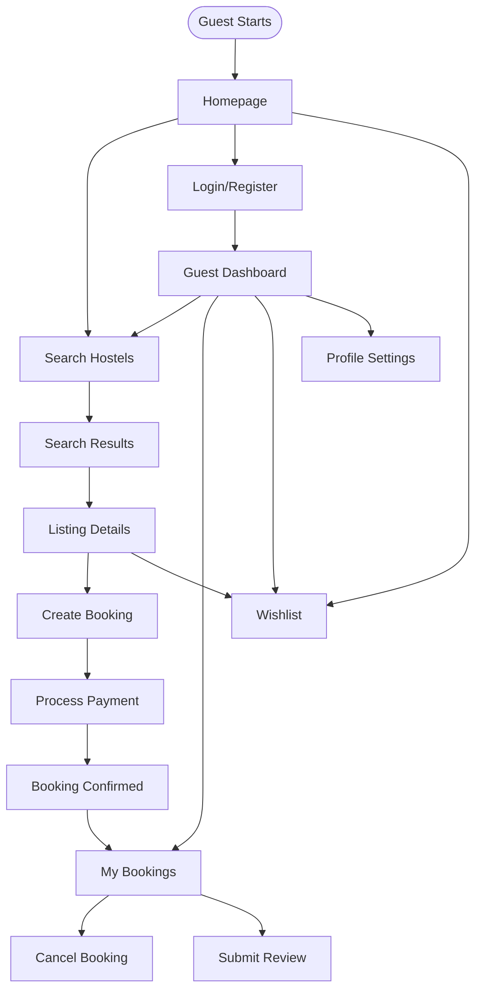
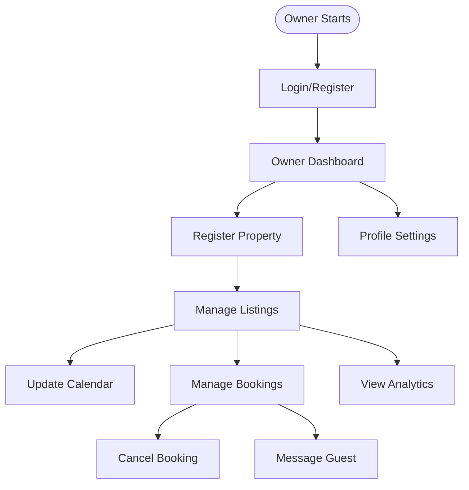
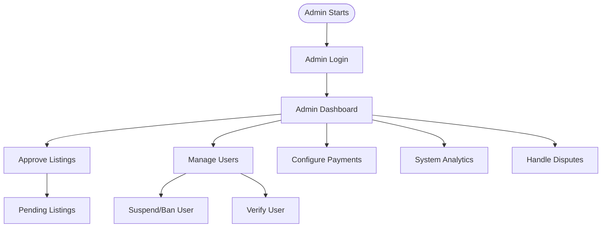

# 3. Functional Requirements

**Project:** Hostel Management System
**Version:** 1.0
**Last Updated:** 2026-01-25

---

## 3.1 System Functional Overview

### 3.1.1 Screen Flows by Actor

#### Guest Screen Flow

#### Owner Screen Flow

#### Admin Screen Flow

---

### 3.1.2 Screen Descriptions

| Screen ID | Screen Name | Purpose | Accessible By |
|-----------|-------------|---------|--------------|
| **SCR-001** | Homepage | Landing page with search functionality | All (Guest, Owner, Admin) |
| **SCR-002** | Search Results | Display filtered hostel listings | Guest |
| **SCR-003** | Listing Details | Detailed view of single hostel | Guest |
| **SCR-004** | Checkout/Booking | Booking form and payment initiation | Guest (authenticated) |
| **SCR-005** | Payment Gateway | External payment processing page | Guest |
| **SCR-006** | My Bookings (Guest) | Guest's booking history and management | Guest (authenticated) |
| **SCR-007** | Submit Review | Review form for completed stays | Guest (authenticated) |
| **SCR-008** | Wishlist | Saved listings for later | Guest (authenticated) |
| **SCR-009** | Guest Dashboard | Guest overview and navigation | Guest (authenticated) |
| **SCR-010** | Guest Profile | Account settings management | Guest (authenticated) |
| **SCR-011** | Owner Dashboard | Owner overview and navigation | Owner (authenticated) |
| **SCR-012** | Register Property | Property registration form | Owner (authenticated) |
| **SCR-013** | Manage Listings | Listing CRUD operations | Owner (authenticated) |
| **SCR-014** | Calendar Management | Availability and pricing calendar | Owner (authenticated) |
| **SCR-015** | Manage Bookings (Owner) | Incoming booking management | Owner (authenticated) |
| **SCR-016** | Owner Analytics | Performance metrics dashboard | Owner (authenticated) |
| **SCR-017** | Owner Profile | Owner account settings | Owner (authenticated) |
| **SCR-018** | Admin Dashboard | Admin overview and navigation | Admin (authenticated) |
| **SCR-019** | Approve Listings | Pending property/listing queue | Admin (authenticated) |
| **SCR-020** | Manage Users | User account management | Admin (authenticated) |
| **SCR-021** | Payment Configuration | Gateway settings management | Admin (authenticated) |
| **SCR-022** | System Analytics | Platform-wide metrics | Admin (authenticated) |
| **SCR-023** | Dispute Resolution | Dispute management interface | Admin (authenticated) |
| **SCR-024** | Login/Register | Authentication screen | Unauthenticated users |
| **SCR-025** | Email Notification | Transactional emails (no UI) | System generated |

---

### 3.1.3 Screen Authorization Matrix

| Screen | Guest | Owner | Admin | Notes |
|--------|-------|-------|-------|-------|
| **SCR-001** Homepage | ✅ | ✅ | ✅ | Public access |
| **SCR-002** Search Results | ✅ | ❌ | ❌ | Guest only |
| **SCR-003** Listing Details | ✅ | ❌ | ❌ | Guest only |
| **SCR-004** Checkout | ✅ | ❌ | ❌ | Authenticated guest |
| **SCR-005** Payment Gateway | ✅ | ❌ | ❌ | Guest only |
| **SCR-006** My Bookings | ✅ | ❌ | ❌ | Own bookings only |
| **SCR-007** Submit Review | ✅ | ❌ | ❌ | After completed stay |
| **SCR-008** Wishlist | ✅ | ❌ | ❌ | Authenticated guest |
| **SCR-009** Guest Dashboard | ✅ | ❌ | ❌ | Authenticated guest |
| **SCR-010** Guest Profile | ✅ | ❌ | ❌ | Own profile only |
| **SCR-011** Owner Dashboard | ❌ | ✅ | ❌ | Authenticated owner |
| **SCR-012** Register Property | ❌ | ✅ | ❌ | Authenticated owner |
| **SCR-013** Manage Listings | ❌ | ✅ | ❌ | Own listings only |
| **SCR-014** Calendar | ❌ | ✅ | ❌ | Own listings only |
| **SCR-015** Bookings (Owner) | ❌ | ✅ | ❌ | Own property bookings |
| **SCR-016** Owner Analytics | ❌ | ✅ | ❌ | Own data only |
| **SCR-017** Owner Profile | ❌ | ✅ | ❌ | Own profile only |
| **SCR-018** Admin Dashboard | ❌ | ❌ | ✅ | Admin only |
| **SCR-019** Approve Listings | ❌ | ❌ | ✅ | Admin only |
| **SCR-020** Manage Users | ❌ | ❌ | ✅ | Admin only |
| **SCR-021** Payment Config | ❌ | ❌ | ✅ | Admin only |
| **SCR-022** System Analytics | ❌ | ❌ | ✅ | Admin only |
| **SCR-023** Dispute Resolution | ❌ | ❌ | ✅ | Admin only |
| **SCR-024** Login/Register | ✅ | ✅ | ✅ | Public access |
| **SCR-025** Email Notifications | N/A | N/A | N/A | System generated |

**Legend:** ✅ = Authorized, ❌ = Not Authorized

---

### 3.1.4 Non-Screen Functions

| Function ID | Function Name | Description | Triggered By |
|-------------|---------------|-------------|--------------|
| **NS-001** | Search Indexing | Index listings for search functionality | Listing created/updated |
| **NS-002** | Email Notifications | Send transactional emails | Booking confirmed, payment received, etc. |
| **NS-003** | Availability Reservation | Reserve dates during booking process | Guest initiates booking |
| **NS-004** | Analytics Aggregation | Calculate metrics for dashboards | Scheduled job (daily) |
| **NS-005** | Review Moderation | Auto-moderate reviews for profanity | Review submitted |
| **NS-006** | Report Generation | Generate PDF/CSV reports | Admin/Owner requests export |
| **NS-007** | Cache Invalidation | Clear cached data | Listing/calendar updated |
| **NS-008** | Real-time Updates | Broadcast updates via WebSocket | Calendar updated, booking received |
| **NS-009** | Payment Webhook | Process payment gateway callbacks | Payment completed |
| **NS-010** | Session Cleanup | Remove expired sessions | Scheduled job (hourly) |

---

## 3.2 Common Features

### 3.2.1 Feature: User Authentication

**Use Case Reference:** UC-G01, UC-O01, UC-A01 (all authenticated flows)

| Feature ID | Feature | Description |
|------------|---------|-------------|
| **F-001** | User Registration | Email/password registration with verification |
| **F-002** | User Login | Authentication with session management |
| **F-003** | Password Reset | Email-based password recovery |
| **F-004** | Role-Based Access | Guest, Owner, Admin roles |
| **F-005** | Session Management | JWT-based session handling |

**Wireframe UI Specification:** To be added in design phase

---

### 3.2.2 Feature: Search and Discovery

**Use Case Reference:** UC-G01

| Feature ID | Feature | Description |
|------------|---------|-------------|
| **F-011** | Location Search | Search by city, province, region |
| **F-012** | Date Filter | Check-in/check-out date range |
| **F-013** | Guest Count Filter | Number of guests filter |
| **F-014** | Price Range Filter | Min/max price slider |
| **F-015** | Amenity Filter | Filter by amenities (WiFi, AC, etc.) |
| **F-016** | Room Type Filter | Dormitory, Private Room, Entire Place |
| **F-017** | Search Results Pagination | 20 results per page |
| **F-018** | Search Results Sorting | Price, rating, relevance |

---

### 3.2.3 Feature: Booking Management

**Use Case Reference:** UC-G03, UC-G04, UC-G05

| Feature ID | Feature | Description |
|------------|---------|-------------|
| **F-021** | Booking Initiation | Reserve availability, create pending booking |
| **F-022** | Payment Processing | Integration with SePay gateway |
| **F-023** | Booking Confirmation | Email/SMS confirmation after payment |
| **F-024** | Booking Cancellation | Guest cancellation with refund calculation |
| **F-025** | Booking Modification | Date changes (if allowed by owner) |
| **F-026** | Booking History | View all past and upcoming bookings |
| **F-027** | Availability Locking | Prevent double-bookings during checkout |

---

### 3.2.4 Feature: Property Management

**Use Case Reference:** UC-O01, UC-O02, UC-O03

| Feature ID | Feature | Description |
|------------|---------|-------------|
| **F-031** | Property Registration | Register new hostel property |
| **F-032** | Listing Creation | Create room-type listings under property |
| **F-033** | Image Upload | Upload property and listing photos |
| **F-034** | Calendar Management | Set availability and pricing by date |
| **F-035** | Bulk Calendar Update | Update multiple dates at once |
| **F-036** | Season Pricing | Different pricing for peak/off-peak |
| **F-037** | Listing Activation | Activate/deactivate listings |

---

### 3.2.5 Feature: Review and Rating

**Use Case Reference:** UC-G06

| Feature ID | Feature | Description |
|------------|---------|-------------|
| **F-041** | Review Submission | Submit rating (1-5) and text review |
| **F-042** | Photo Upload | Attach photos to review |
| **F-043** | Review Moderation | Profanity filter and manual approval |
| **F-044** | Owner Response | Owner can reply to reviews |
| **F-045** | Rating Aggregation | Calculate average listing rating |
| **F-046** | Review Display | Show reviews on listing page |

---

### 3.2.6 Feature: Analytics and Reporting

**Use Case Reference:** UC-O05, UC-A04

| Feature ID | Feature | Description |
|------------|---------|-------------|
| **F-051** | Occupancy Rate | Percentage of occupied nights |
| **F-052** | Revenue Tracking | Total and monthly revenue |
| **F-053** | Booking Trends | Charts showing booking patterns |
| **F-054** | Guest Demographics | Guest origin and statistics |
| **F-055** | Listing Performance | Top-performing listings |
| **F-056** | System Metrics | Platform-wide KPIs |
| **F-057** | Report Export | PDF/CSV report generation |

---

### 3.2.7 Feature: Platform Administration

**Use Case Reference:** UC-A01, UC-A02, UC-A03, UC-A05

| Feature ID | Feature | Description |
|------------|---------|-------------|
| **F-061** | Listing Approval | Review and approve/reject properties |
| **F-062** | User Management | View, suspend, ban, verify users |
| **F-063** | Payment Configuration | Configure gateway settings |
| **F-064** | Dispute Resolution | Handle guest-owner disputes |
| **F-065** | System Monitoring | Track system health and errors |
| **F-066** | Audit Logging | Log all admin actions |

---

## 3.3 Functional Requirements Summary

**Total Screens:** 25
**Total Features:** 66 (grouped into 7 feature areas)
**Total Non-Screen Functions:** 10

**Use Case Coverage:** All 17 use cases mapped to features and screens.

**Cross-Cutting Concerns:**
- Multi-language support (Vietnamese/English)
- Mobile responsiveness (all screens)
- Accessibility (WCAG 2.1 AA compliance)
- Security (authentication, authorization, data encryption)
