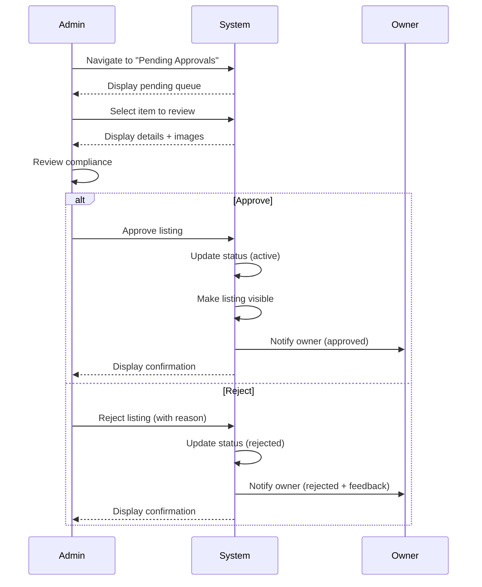

# UC-A01: Approve Listings

| Field | Description |
|-------|-------------|
| **Use Case Name** | Approve Listings |
| **Created By** | Product Team |
| **Created Date** | 2026-01-25 |
| **Last Updated By** | Product Team |
| **Last Updated Date** | 2026-01-25 |
| **Summary** | Admin reviews pending property/listing submissions for compliance, accuracy, and quality. Admin approves or rejects, and system updates status and notifies owner. |
| **Dependency** | UC-O01 (Register Property) - triggers this use case |
| **Actors** | Primary: Admin<br>Secondary: Owner (receives decision) |
| **Preconditions** | Admin is authenticated. Admin has permission to approve listings. Pending items exist in queue. |
| **Trigger** | Admin navigates to "Pending Approvals" and selects an item |
| **Main Sequence** | 1. Admin navigates to "Pending Approvals"<br>2. System displays queue of pending items<br>3. Admin selects an item to review<br>4. System displays property/listing details, images, owner information<br>5. Admin reviews for compliance (business license, accurate info, quality images)<br>6. Admin makes decision (approve or reject)<br>7. System updates property/listing status<br>8. System notifies owner of decision<br>9. If approved, system makes listing visible to guests |
| **Alternative Sequences** | Step 2: If queue empty, System displays "All caught up!" message<br>Step 5: If approve with conditions needed, System approves but flags for follow-up review<br>Step 6: If rejected, Admin must provide rejection reason<br>Step 7: If status update fails, System retries and logs error<br>Step 9: If search index update fails, System queues for retry |
| **Postconditions** | Status updated. Owner notified. Listing visible (if approved). Audit log created. |
| **Nonfunctional Requirements** | SLA: Review within 48 hours. Bulk action support. Decision audit trail. Rejection reason templates. |
| **Business Requirements** | BR-009: Properties must meet quality standards before approval<br>BR-010: Rejected properties must receive feedback for improvement |
| **Frequency of Use** | Medium |
| **Priority** | High |
| **Outstanding Questions** | Should we require business license? What photo quality standards? |

---

## Sequence Diagram



---

## Black Box Compliance

✅ **COMPLIANT** - All steps describe external interactions only:
- Admin actions (navigate, select, review, decide)
- System responses (display, update, notify, make visible)
- Owner receives notification

No internal components mentioned (databases, search indices, audit logs).

---

## Boundary Objects

| Boundary Object | Description | Data Elements |
|----------------|-------------|---------------|
| **ApprovalQueue** | List of pending items | items[], totalCount, priority, submittedDate |
| **ApprovalItem** | Single approval item | propertyId/listingId, ownerInfo, images[], status, submittedAt |
| **ApprovalDecision** | Admin decision result | decision (approve/reject), reason, conditions[], effectiveDate |
| **OwnerNotification** | Notification to owner | notificationType, decision, reason, nextSteps |

---

## Internal Software Objects

| Internal Object | Responsibility |
|-----------------|---------------|
| **ApprovalService** | Manages approval workflow |
| **ListingService** | Updates listing status |
| **PropertyService** | Updates property status |
| **SearchIndexService** | Syncs approved items to Elasticsearch |
| **NotificationService** | Notifies owners of decisions |
| **ApprovalRepository** | Queries approval queue |
| **AuditLogService** | Logs approval decisions |
| **ConditionCheckerService** | Handles "approve with conditions" |
| **QualityService** | Runs automated quality checks |
| **SpamDetectionService** | Flags suspicious submissions |

---

## Message Communication Sequence

### View Approval Queue Flow

```
Admin → System: ViewApprovalQueue (HTTP GET /api/admin/approvals)
    ↓
System → ApprovalRepository: Query pending items
    ← items[]
System → QualityService: Run quality checks
    ← qualityScores[]
System → ApprovalRepository: Enrich with owner data
    ← enrichedItems[]
System → Admin: ApprovalQueue (HTTP 200)
```

### Approve Listing Flow

```
Admin → System: ApproveListing (HTTP POST /api/admin/approvals/:id/approve)
    ↓
System → ApprovalService: Process approval
    ↓
System → ListingService: Update status (active)
    ← Updated
System → SearchIndexService: Sync to Elasticsearch
    ← Indexed
System → NotificationService: Notify owner
    ← Queued
System → AuditLogService: Log approval
    ← Logged
System → Admin: ApprovalDecision (HTTP 200)
```

### Reject Listing Flow

```
Admin → System: RejectListing (HTTP POST /api/admin/approvals/:id/reject)
    ↓
System → ApprovalService: Process rejection
    ↓
System → ListingService: Update status (rejected)
    ← Updated
System → NotificationService: Notify owner with reason
    ← Queued
System → AuditLogService: Log rejection with reason
    ← Logged
System → Admin: ApprovalDecision (HTTP 200)
```

### RabbitMQ: Approval Events

```
System → RabbitMQ: Publish listing.approved
    ↓
Notification Worker → NotificationService: Send email to owner
Analytics Worker → AnalyticsService: Update metrics
Search Worker → SearchIndexService: Update search index
```

---

## Expanded Alternative Sequences

### Step 2: Queue Empty
| Condition | System Response | Recovery |
|-----------|-----------------|----------|
| No pending items | "All caught up!" celebration | Show stats (approved today) |
| Queue paused (maintenance) | "Queue temporarily paused" | Estimated resume time |
| Queue filtered (showing priority only) | Show toggle for all items | Filter controls available |

### Step 5: Approve with Conditions
| Condition | System Response | Recovery |
|-----------|-----------------|----------|
| Minor issues found | "Approve with conditions" option | Flag for follow-up review |
| Missing info | Request additional info | Hold until response |
| Quality concerns | Conditional approval | Re-review scheduled |
| Verification needed | Pending verification block | Auto-approve when verified |

### Step 6: Rejection Reasons
| Condition | System Response | Recovery |
|-----------|-----------------|----------|
| Incomplete information | Required fields specified | Owner can resubmit |
| Quality issues | Detailed feedback | Improvement guidance |
| Policy violation | Specific policy cited | Appeal process link |
| Suspicious activity | Flag for security review | Temporary suspension |

### Step 7: Status Update Failures
| Condition | System Response | Recovery |
|-----------|-----------------|----------|
| Database constraint violation | Retry with fresh data | Log concurrent modification |
| Search index timeout | Queue for retry | "Pending search" badge |
| Listing modified during review | Refresh and confirm | Show what changed |
| Owner account suspended | Block approval | Require account resolution |