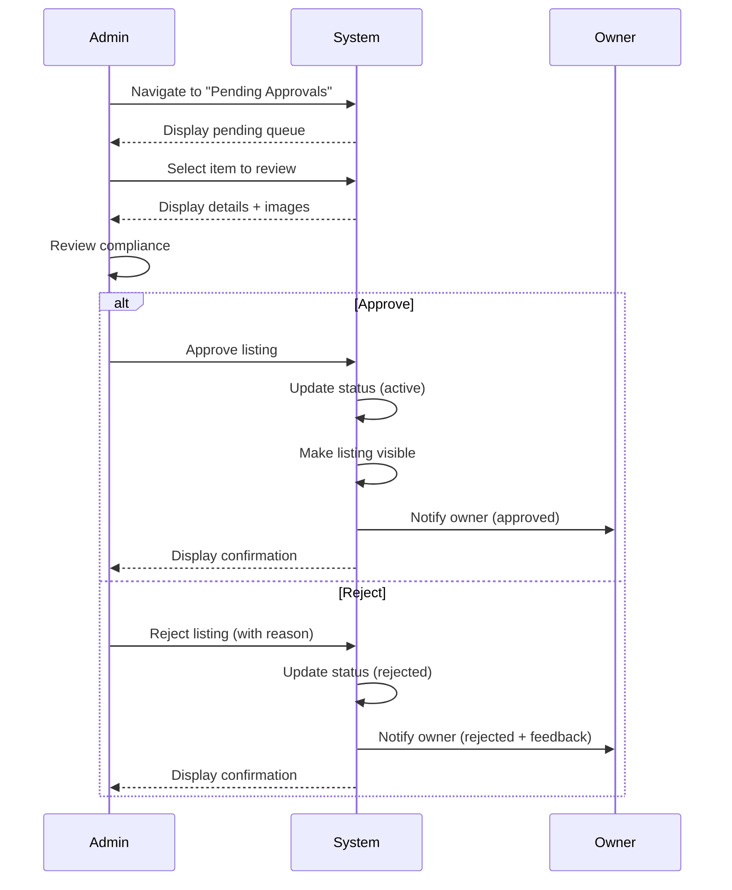

# UC-A01: Approve Listings

| Field | Description |
|-------|-------------|
| **Use Case Name** | Approve Listings |
| **Created By** | Product Team |
| **Created Date** | 2026-01-25 |
| **Last Updated By** | Product Team |
| **Last Updated Date** | 2026-01-25 |
| **Summary** | Admin reviews pending property/listing submissions for compliance, accuracy, and quality. Admin approves or rejects, and system updates status and notifies owner. |
| **Dependency** | UC-O01 (Register Property) - triggers this use case |
| **Actors** | Primary: Admin Secondary: Owner (receives decision) |
| **Preconditions** | Admin is authenticated. Admin has permission to approve listings. Pending items exist in queue. |
| **Trigger** | Admin navigates to "Pending Approvals" and selects an item |
| **Main Sequence** | 1. Admin navigates to "Pending Approvals" 2. System displays queue of pending items 3. Admin selects an item to review 4. System displays property/listing details, images, owner information 5. Admin reviews for compliance (business license, accurate info, quality images) 6. Admin makes decision (approve or reject) 7. System updates property/listing status 8. System notifies owner of decision 9. If approved, system makes listing visible to guests |
| **Alternative Sequences** | Step 2: If queue empty, System displays "All caught up!" message Step 5: If approve with conditions needed, System approves but flags for follow-up review Step 6: If rejected, Admin must provide rejection reason Step 7: If status update fails, System retries and logs error Step 9: If search index update fails, System queues for retry |
| **Postconditions** | Status updated. Owner notified. Listing visible (if approved). Audit log created. |
| **Nonfunctional Requirements** | SLA: Review within 48 hours. Bulk action support. Decision audit trail. Rejection reason templates. |
| **Business Requirements** | BR-009: Properties must meet quality standards before approval BR-010: Rejected properties must receive feedback for improvement |
| **Frequency of Use** | Medium |
| **Priority** | High |
| **Outstanding Questions** | Should we require business license? What photo quality standards? |

---

## Sequence Diagram

---

## Black Box Compliance

✅ **COMPLIANT** - All steps describe external interactions only:
- Admin actions (navigate, select, review, decide)
- System responses (display, update, notify, make visible)
- Owner receives notification

No internal components mentioned (databases, search indices, audit logs).