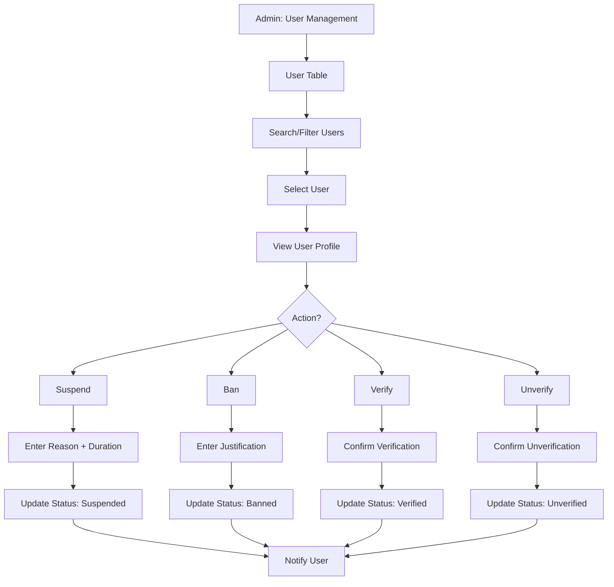

# UC-A02: Manage Users

| Field | Description |
|-------|-------------|
| **Use Case Name** | Manage Users |
| **Created By** | Product Team |
| **Created Date** | 2026-01-25 |
| **Last Updated By** | Product Team |
| **Last Updated Date** | 2026-01-25 |
| **Summary** | Admin views, searches, and manages user accounts. Can suspend/ban users, verify accounts, and view user activity. |
| **Dependency** | None (independent admin function) |
| **Actors** | Primary: Admin Secondary: Users (affected by actions) |
| **Preconditions** | Admin authenticated. Has user management permissions. |
| **Trigger** | Admin navigates to "User Management" |
| **Main Sequence** | 1. Admin navigates to "User Management" 2. System displays user table with search and filters 3. Admin searches by email, name, phone 4. Admin filters by role, status, verification level 5. Admin selects a user to view details 6. System displays user profile, bookings, reviews, activity log 7. Admin may suspend, ban, verify, or unverify user |
| **Alternative Sequences** | Step 3: If user not found, System displays "No users found" message Step 5: If user has bookings, System shows booking summary with links Step 7: If suspend user, Admin must enter reason and duration Step 7: If ban user, Admin must provide justification, System disables all bookings |
| **Postconditions** | User status updated. User notified via email. Audit log created. |
| **Nonfunctional Requirements** | Paginated user list (50 per page). Quick search < 1s. Action confirmation dialogs. Email notifications to users. |
| **Business Requirements** | BR-027: Suspended users cannot create new bookings BR-028: Banned users lose access to platform |
| **Frequency of Use** | Medium |
| **Priority** | High |
| **Outstanding Questions** | Appeal process for banned users? Data retention for banned users? |

---

## Sequence Diagram

---

## Black Box Compliance

✅ **COMPLIANT** - All steps describe external interactions only.