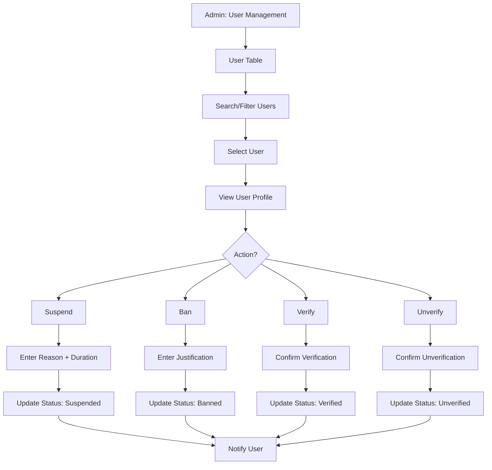

# UC-A02: Manage Users

| Field | Description |
|-------|-------------|
| **Use Case Name** | Manage Users |
| **Created By** | Product Team |
| **Created Date** | 2026-01-25 |
| **Last Updated By** | Product Team |
| **Last Updated Date** | 2026-01-25 |
| **Summary** | Admin views, searches, and manages user accounts. Can suspend/ban users, verify accounts, and view user activity. |
| **Dependency** | None (independent admin function) |
| **Actors** | Primary: Admin<br>Secondary: Users (affected by actions) |
| **Preconditions** | Admin authenticated. Has user management permissions. |
| **Trigger** | Admin navigates to "User Management" |
| **Main Sequence** | 1. Admin navigates to "User Management"<br>2. System displays user table with search and filters<br>3. Admin searches by email, name, phone<br>4. Admin filters by role, status, verification level<br>5. Admin selects a user to view details<br>6. System displays user profile, bookings, reviews, activity log<br>7. Admin may suspend, ban, verify, or unverify user |
| **Alternative Sequences** | Step 3: If user not found, System displays "No users found" message<br>Step 5: If user has bookings, System shows booking summary with links<br>Step 7: If suspend user, Admin must enter reason and duration<br>Step 7: If ban user, Admin must provide justification, System disables all bookings |
| **Postconditions** | User status updated. User notified via email. Audit log created. |
| **Nonfunctional Requirements** | Paginated user list (50 per page). Quick search < 1s. Action confirmation dialogs. Email notifications to users. |
| **Business Requirements** | BR-027: Suspended users cannot create new bookings<br>BR-028: Banned users lose access to platform |
| **Frequency of Use** | Medium |
| **Priority** | High |
| **Outstanding Questions** | Appeal process for banned users? Data retention for banned users? |

---

## Sequence Diagram



---

## Black Box Compliance

✅ **COMPLIANT** - All steps describe external interactions only.

---

## Boundary Objects

| Boundary Object | Description | Data Elements |
|----------------|-------------|---------------|
| **UserList** | Paginated user list | users[], totalCount, page, filters |
| **UserDetails** | Complete user profile | userId, email, name, role, status, verificationLevel, bookings[], reviews[], activityLog[] |
| **UserAction** | Admin action on user | actionType (suspend/ban/verify/unverify), reason, duration, notes |
| **UserSearchRequest** | Search criteria | searchTerm, filters (role, status, verificationLevel) |
| **ActionConfirmation** | Action result | userId, newStatus, effectiveAt, expiresAt |

---

## Internal Software Objects

| Internal Object | Responsibility |
|-----------------|---------------|
| **UserService** | Manages user CRUD operations |
| **UserSearchService** | Handles user search and filtering |
| **UserActionService** | Processes suspend/ban/verify actions |
| **BookingService** | Fetches user booking history |
| **ReviewService** | Fetches user review history |
| **ActivityLogService** | Retrieves user activity |
| **NotificationService** | Sends action notifications to users |
| **UserRepository** | Queries user data |
| **AuditLogService** | Logs all admin actions |
| **AuthService** | Handles auth token invalidation |

---

## Message Communication Sequence

### View Users Flow

```
Admin → System: ViewUsers (HTTP GET /api/admin/users)
    ↓
System → UserRepository: Query users with pagination
    ← users[]
System → UserSearchService: Apply search/filters
    ← filteredUsers
System → Admin: UserList (HTTP 200)
```

### Search Users Flow

```
Admin → System: SearchUsers (HTTP POST /api/admin/users/search)
    ↓
System → UserSearchService: Search by email/name/phone
    ← matchingUsers
System → Admin: UserList (HTTP 200)
```

### Suspend User Flow

```
Admin → System: SuspendUser (HTTP POST /api/admin/users/:id/suspend)
    ↓
System → UserActionService: Process suspension
    ↓
System → UserRepository: Update status (suspended)
    ← Updated
System → BookingService: Cancel upcoming bookings
    ← Cancelled
System → AuthService: Invalidate all tokens
    ← Invalidated
System → NotificationService: Notify user
    ← Queued
System → AuditLogService: Log suspension with reason
    ← Logged
System → Admin: ActionConfirmation (HTTP 200)
```

### Ban User Flow

```
Admin → System: BanUser (HTTP POST /api/admin/users/:id/ban)
    ↓
System → UserActionService: Process ban
    ↓
System → UserRepository: Update status (banned)
    ← Updated
System → BookingService: Cancel all bookings
    ← Cancelled
System → AuthService: Invalidate all tokens
    ← Invalidated
System → NotificationService: Notify user
    ← Queued
System → AuditLogService: Log ban with justification
    ← Logged
System → Admin: ActionConfirmation (HTTP 200)
```

### Verify User Flow

```
Admin → System: VerifyUser (HTTP POST /api/admin/users/:id/verify)
    ↓
System → UserRepository: Update verification level
    ← Verified
System → NotificationService: Notify user
    ← Queued
System → Admin: ActionConfirmation (HTTP 200)
```

---

## Expanded Alternative Sequences

### Step 3: User Search Results
| Condition | System Response | Recovery |
|-----------|-----------------|----------|
| No users found | "No users found" message | Suggest broader search |
| Multiple matches | Show all matches | Refine filters |
| Exact email match | Direct to user profile | Single result |
| Suspended user found | Show "Suspended" badge | Action history available |

### Step 5: Action Confirmations
| Condition | System Response | Recovery |
|-----------|-----------------|----------|
| Suspend - no duration | Require duration input | Minimum/max duration hints |
| Ban - insufficient justification | Require detailed reason | Policy link provided |
| Verify - pending flags | Show unresolved flags | Resolve before verifying |
| Bulk action | Show affected user count | Confirm batch operation |

### Step 7: Action Failures
| Condition | System Response | Recovery |
|-----------|-----------------|----------|
| Database constraint violation | Retry with fresh data | Concurrent modification handling |
| Token invalidation failed | Log for manual cleanup | Cron job retry |
| Booking cancellation failed | Partial success report | Manual follow-up required |
| User already in target state | No-op with notice | "Already suspended" message |

### User State Conflicts
| Condition | System Response | Recovery |
|-----------|-----------------|----------|
| Active bookings during ban | Warning: "Will cancel X bookings" | Force confirmation |
| Pending reviews during ban | Reviews preserved | Reviews stay visible |
| Refund due to ban | Queue refund processing | Payment gateway retry |
| Appeal submitted | Show appeal status | Override option for admins |