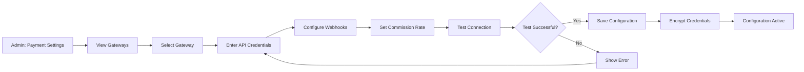

# UC-A03: Configure Payments

| Field | Description |
|-------|-------------|
| **Use Case Name** | Configure Payments |
| **Created By** | Product Team |
| **Created Date** | 2026-01-25 |
| **Last Updated By** | Product Team |
| **Last Updated Date** | 2026-01-25 |
| **Summary** | Admin configures payment gateway settings (SePay, Polar) including API credentials, webhooks, and commission rates. |
| **Dependency** | None (independent admin function) |
| **Actors** | Primary: Admin<br>Secondary: Polar Payment Gateway |
| **Preconditions** | Admin authenticated. Has payment configuration permissions. Payment gateway accounts obtained. |
| **Trigger** | Admin navigates to "Payment Settings" |
| **Main Sequence** | 1. Admin navigates to "Payment Settings"<br>2. System displays configured payment gateways<br>3. Admin selects a gateway to configure<br>4. Admin enters API credentials<br>5. Admin configures webhook URLs<br>6. Admin sets platform commission rate (%)<br>7. Admin tests connection<br>8. System validates and saves configuration |
| **Alternative Sequences** | Step 4: If invalid credentials, System shows error and doesn't save<br>Step 7: If connection test fails, System displays error details and allows retest<br>Step 8: If save fails, System shows error and keeps values for retry |
| **Postconditions** | Payment gateway configured. Credentials encrypted. Test transaction recorded. |
| **Nonfunctional Requirements** | Encrypted credential storage. Credential rotation support. Test mode support. Configuration audit log. |
| **Business Requirements** | BR-029: Payment credentials must be encrypted<br>BR-030: Configuration changes require audit log |
| **Frequency of Use** | Low |
| **Priority** | High |
| **Outstanding Questions** | Multiple gateways active simultaneously? Fallback priority? |

---

## Sequence Diagram



---

## Black Box Compliance

✅ **COMPLIANT** - All steps describe external interactions only.

---

## Boundary Objects

| Boundary Object | Description | Data Elements |
|----------------|-------------|---------------|
| **GatewayConfig** | Payment gateway settings | gatewayType, apiCredentials, webhookUrls, commissionRate |
| **ConnectionTest** | Test connection request | gatewayType, testMode, testAmount |
| **TestTransaction** | Test payment result | success, transactionId, response, duration |
| **CredentialInput** | API credentials for storage | publicKey, secretKey (encrypted), merchantId |
| **CommissionSetting** | Platform commission | percentage, fixedFee, currency |

---

## Internal Software Objects

| Internal Object | Responsibility |
|-----------------|---------------|
| **PaymentConfigService** | Manages payment gateway configurations |
| **SePayConfigValidator** | Validates SePay settings |
| **PolarConfigValidator** | Validates Polar settings |
| **EncryptionService** | Encrypts sensitive credentials |
| **ConnectionTestService** | Tests gateway connectivity |
| **TestTransactionService** | Executes test payments |
| **PaymentConfigRepository** | Persists configurations |
| **AuditLogService** | Logs configuration changes |
| **WebhookRegistrationService** | Registers webhook URLs |
| **CredentialRotationService** | Manages credential rotation |

---

## Message Communication Sequence

### View Payment Settings Flow

```
Admin → System: ViewPaymentSettings (HTTP GET /api/admin/payments)
    ↓
System → PaymentConfigRepository: Query configurations
    ← configs[]
System → EncryptionService: Decrypt for display (masking secrets)
    ← decrypted
System → Admin: GatewayConfig (HTTP 200)
```

### Configure Gateway Flow

```
Admin → System: ConfigureGateway (HTTP PUT /api/admin/payments/:gateway)
    ↓
System → PaymentConfigValidator: Validate input
    ← Valid
System → EncryptionService: Encrypt credentials
    ← encryptedCredentials
System → ConnectionTestService: Test connection
    ← Success
System → PaymentConfigRepository: Save configuration
    ← Saved
System → WebhookRegistrationService: Register webhooks
    ← Registered
System → TestTransactionService: Execute test transaction
    ← Test result
System → AuditLogService: Log configuration change
    ← Logged
System → Admin: GatewayConfig (HTTP 200)
```

### Connection Test Flow

```
Admin → System: TestConnection (HTTP POST /api/admin/payments/test)
    ↓
System → ConnectionTestService: Test gateway
    ↓
System → SePayGatewayAdapter: Ping API
    ← Response time
System → Admin: TestTransaction (HTTP 200)
```

### Test Transaction Flow

```
System → PaymentGateway: Execute test payment
    ↓
PaymentGateway → System: Webhook (test transaction)
    ↓
System → WebhookHandler: Process test webhook
    ← Verified
System → Admin: TestTransaction result
```

---

## Expanded Alternative Sequences

### Step 4: Invalid Credentials
| Condition | System Response | Recovery |
|-----------|-----------------|----------|
| API key format invalid | Error: "Invalid API key format" | Show expected format |
| Secret key mismatch | Error: "Authentication failed" | Re-enter credentials |
| Test mode not enabled | Error: "Enable test mode first" | Toggle test mode |
| Expired credentials | Error: "Credentials expired" | Generate new keys |

### Step 7: Connection Test Results
| Condition | System Response | Recovery |
|-----------|-----------------|----------|
| Connection timeout | Error: "Gateway not responding" | Retry button |
| Invalid response | Error: "Unexpected response" | Check gateway status |
| Rate limit exceeded | Warning: "Rate limited" | Wait and retry |
| Certificate error | Error: "SSL certificate invalid" | Check system time |

### Step 8: Save Failures
| Condition | System Response | Recovery |
|-----------|-----------------|----------|
| Database constraint | Error: "Duplicate configuration" | Update existing instead |
| Encryption failure | Error: "Unable to encrypt" | Log security event |
| Webhook registration failed | Warning: "Webhook not registered" | Manual setup required |
| Test transaction failed | Warning: "Test failed, config saved" | Retry test later |

### Multiple Gateway States
| Condition | System Response | Recovery |
|-----------|-----------------|----------|
| Both gateways active | Load balancing enabled | Show active status |
| One gateway down | Failover to backup | Alert on failover |
| Test mode on one | "Mixed mode" warning | Clarify which is live |
| Gateway maintenance | "Temporarily unavailable" | Show ETA for restoration |