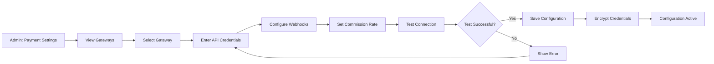

# UC-A03: Configure Payments

| Field | Description |
|-------|-------------|
| **Use Case Name** | Configure Payments |
| **Created By** | Product Team |
| **Created Date** | 2026-01-25 |
| **Last Updated By** | Product Team |
| **Last Updated Date** | 2026-01-25 |
| **Summary** | Admin configures payment gateway settings (SePay, Polar) including API credentials, webhooks, and commission rates. |
| **Dependency** | None (independent admin function) |
| **Actors** | Primary: Admin Secondary: Polar Payment Gateway |
| **Preconditions** | Admin authenticated. Has payment configuration permissions. Payment gateway accounts obtained. |
| **Trigger** | Admin navigates to "Payment Settings" |
| **Main Sequence** | 1. Admin navigates to "Payment Settings" 2. System displays configured payment gateways 3. Admin selects a gateway to configure 4. Admin enters API credentials 5. Admin configures webhook URLs 6. Admin sets platform commission rate (%) 7. Admin tests connection 8. System validates and saves configuration |
| **Alternative Sequences** | Step 4: If invalid credentials, System shows error and doesn't save Step 7: If connection test fails, System displays error details and allows retest Step 8: If save fails, System shows error and keeps values for retry |
| **Postconditions** | Payment gateway configured. Credentials encrypted. Test transaction recorded. |
| **Nonfunctional Requirements** | Encrypted credential storage. Credential rotation support. Test mode support. Configuration audit log. |
| **Business Requirements** | BR-029: Payment credentials must be encrypted BR-030: Configuration changes require audit log |
| **Frequency of Use** | Low |
| **Priority** | High |
| **Outstanding Questions** | Multiple gateways active simultaneously? Fallback priority? |

---

## Sequence Diagram

---

## Black Box Compliance

✅ **COMPLIANT** - All steps describe external interactions only.