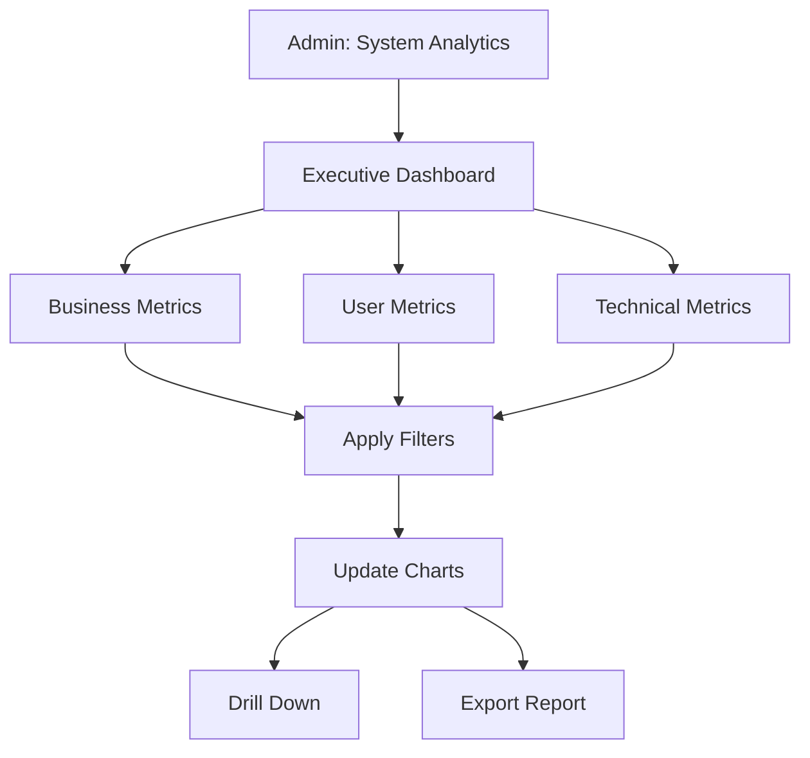

# UC-A04: View System Analytics

| Field | Description |
|-------|-------------|
| **Use Case Name** | View System Analytics |
| **Created By** | Product Team |
| **Created Date** | 2026-01-25 |
| **Last Updated By** | Product Team |
| **Last Updated Date** | 2026-01-25 |
| **Summary** | Admin accesses platform-wide analytics including total bookings, revenue, user growth, search trends, and system performance metrics. |
| **Dependency** | None (independent admin function) |
| **Actors** | Primary: Admin |
| **Preconditions** | Admin authenticated. Has analytics permissions. |
| **Trigger** | Admin navigates to "System Analytics" |
| **Main Sequence** | 1. Admin navigates to "System Analytics" 2. System displays executive dashboard with KPIs 3. Admin views sections: Business metrics, User metrics, Technical metrics 4. Admin filters by date range, region 5. Admin drills down into specific metrics 6. System updates with filtered data |
| **Alternative Sequences** | Step 5: If export requested, System generates comprehensive report (PDF/Excel) Step 5: If real-time mode selected, System switches to live metrics view |
| **Postconditions** | Analytics viewed. Export generated (if requested). |
| **Nonfunctional Requirements** | Aggregation efficiency. Chart rendering < 2s. Large dataset handling. Scheduled reports (email). |
| **Business Requirements** | BR-031: System analytics updated hourly BR-032: Export limited to platform data only |
| **Frequency of Use** | Medium |
| **Priority** | Medium |
| **Outstanding Questions** | Real-time vs hourly aggregation? Custom dashboard creation? |

---

## Sequence Diagram

---

## Black Box Compliance

✅ **COMPLIANT** - All steps describe external interactions only.