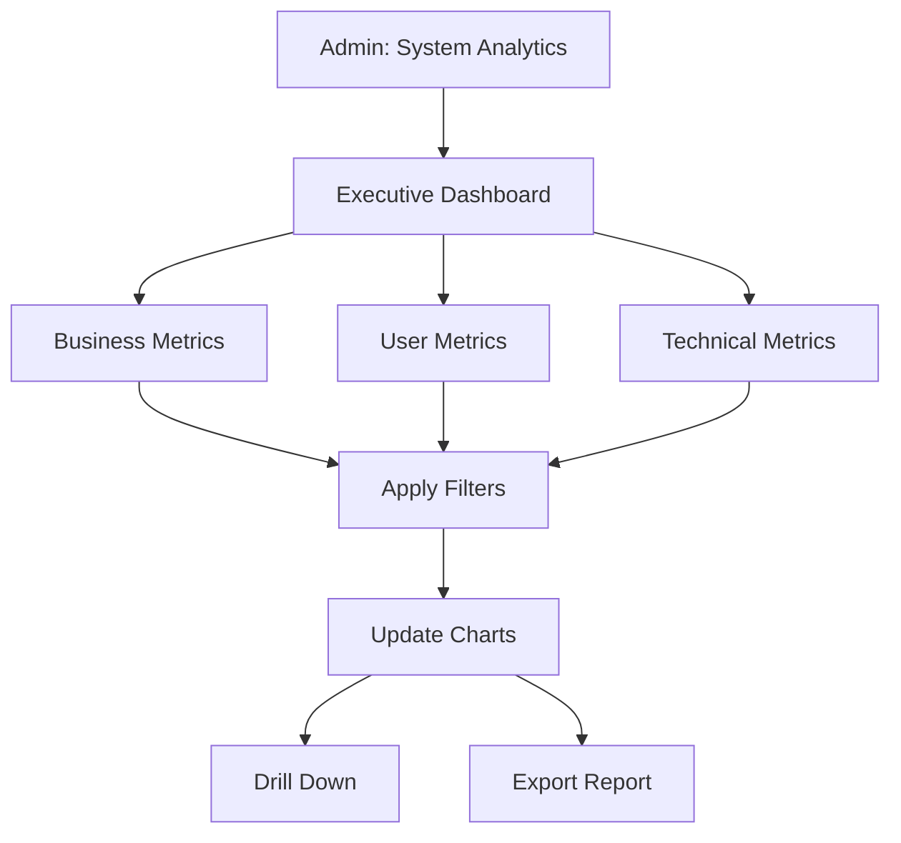

# UC-A04: View System Analytics

| Field | Description |
|-------|-------------|
| **Use Case Name** | View System Analytics |
| **Created By** | Product Team |
| **Created Date** | 2026-01-25 |
| **Last Updated By** | Product Team |
| **Last Updated Date** | 2026-01-25 |
| **Summary** | Admin accesses platform-wide analytics including total bookings, revenue, user growth, search trends, and system performance metrics. |
| **Dependency** | None (independent admin function) |
| **Actors** | Primary: Admin |
| **Preconditions** | Admin authenticated. Has analytics permissions. |
| **Trigger** | Admin navigates to "System Analytics" |
| **Main Sequence** | 1. Admin navigates to "System Analytics"<br>2. System displays executive dashboard with KPIs<br>3. Admin views sections: Business metrics, User metrics, Technical metrics<br>4. Admin filters by date range, region<br>5. Admin drills down into specific metrics<br>6. System updates with filtered data |
| **Alternative Sequences** | Step 5: If export requested, System generates comprehensive report (PDF/Excel)<br>Step 5: If real-time mode selected, System switches to live metrics view |
| **Postconditions** | Analytics viewed. Export generated (if requested). |
| **Nonfunctional Requirements** | Aggregation efficiency. Chart rendering < 2s. Large dataset handling. Scheduled reports (email). |
| **Business Requirements** | BR-031: System analytics updated hourly<br>BR-032: Export limited to platform data only |
| **Frequency of Use** | Medium |
| **Priority** | Medium |
| **Outstanding Questions** | Real-time vs hourly aggregation? Custom dashboard creation? |

---

## Sequence Diagram



---

## Black Box Compliance

✅ **COMPLIANT** - All steps describe external interactions only.

---

## Boundary Objects

| Boundary Object | Description | Data Elements |
|----------------|-------------|---------------|
| **SystemAnalytics** | Platform-wide analytics | businessMetrics, userMetrics, technicalMetrics, dateRange |
| **BusinessMetrics** | Business KPIs | totalBookings, totalRevenue, averageOrderValue, growthRate |
| **UserMetrics** | User statistics | totalUsers, activeUsers, newSignups, retentionRate, churnRate |
| **TechnicalMetrics** | System health | responseTime, errorRate, uptime, serverLoad, queueDepth |
| **AnalyticsFilter** | Filter options | dateRange, region, listingCategory, userSegment |
| **ExportReport** | Export request | format (PDF/Excel), dateRange, includedSections |

---

## Internal Software Objects

| Internal Object | Responsibility |
|-----------------|---------------|
| **SystemAnalyticsService** | Aggregates platform-wide analytics |
| **BusinessAnalyticsService** | Calculates business KPIs |
| **UserAnalyticsService** | Calculates user statistics |
| **TechnicalAnalyticsService** | Aggregates system health metrics |
| **PrometheusQueryService** | Queries Prometheus for metrics |
| **ElasticsearchAnalyticsService** | Queries ES for analytics |
| **AggregationScheduler** | Runs scheduled aggregations (hourly) |
| **ExportService** | Generates system reports |
| **AnalyticsCacheService** | Caches aggregated data (1-hour TTL) |
| **AuditLogService** | Logs analytics exports |

---

## Message Communication Sequence

### View System Analytics Flow

```
Admin → System: ViewSystemAnalytics (HTTP GET /api/admin/analytics)
    ↓
System → AnalyticsCacheService: Check cache
    ← CacheMiss
System → BusinessAnalyticsService: Calculate KPIs
    ← businessMetrics
System → UserAnalyticsService: Calculate user stats
    ← userMetrics
System → TechnicalAnalyticsService: Query Prometheus
    ← technicalMetrics
System → SystemAnalyticsService: Assemble dashboard
    ← dashboard
System → AnalyticsCacheService: Cache response
    ← Cached
System → Admin: SystemAnalytics (HTTP 200)
```

### Apply Filters Flow

```
Admin → System: ApplyFilters (HTTP POST /api/admin/analytics/filter)
    ↓
System → AnalyticsCacheService: Invalidate old cache
System → ElasticsearchAnalyticsService: Query with filters
    ← filteredData
System → SystemAnalyticsService: Recalculate metrics
    ← dashboard
System → Admin: SystemAnalytics (HTTP 200)
```

### Export Report Flow

```
Admin → System: ExportReport (HTTP POST /api/admin/analytics/export)
    ↓
System → ExportService: Generate PDF/Excel
    ← fileUrl
System → AuditLogService: Log export
    ← Logged
System → Admin: ExportReport (HTTP 200)
```

### Scheduled Aggregation Flow

```
System (cron) → AggregationScheduler: Trigger hourly aggregation
    ↓
System → BusinessAnalyticsService: Aggregate bookings/payments
    ← aggregatedData
System → UserAnalyticsService: Aggregate user activity
    ← aggregatedData
System → AnalyticsCacheService: Invalidate cache
    ← Invalidated
```

---

## Expanded Alternative Sequences

### Step 2: No Data Available
| Condition | System Response | Recovery |
|-----------|-----------------|----------|
| New platform, no history | Empty state with onboarding | "First booking pending" message |
| Date range before launch | "No data for selected period" | Suggest available range |
| Aggregation lagging | Show "Updating..." indicator | Background refresh |
| Cache timeout during load | Show loading | Auto-retry |

### Step 5: Drill Down Options
| Condition | System Response | Recovery |
|-----------|-----------------|----------|
| Click on bookings | Navigate to bookings admin | Filtered by date range |
| Click on revenue | Show revenue breakdown | By gateway, by region |
| Click on errors | Show error log | Link to Kibana |
| Click on user segment | Navigate to users admin | Filtered segment |

### Export Failures
| Condition | System Response | Recovery |
|-----------|-----------------|----------|
| PDF generation timeout | Retry with smaller date range | "Try shorter period" suggestion |
| File size too large | Compress or split | Multiple files option |
| Aggregation incomplete | Warning: "Partial data" | "Refresh when complete" notice |
| Storage quota exceeded | Error: "Export quota reached" | Cleanup old exports |

### Data Accuracy States
| Condition | System Response | Recovery |
|-----------|-----------------|----------|
| Real-time mode selected | Query live metrics | "Updated just now" badge |
| Hourly aggregated data | "Last updated: X min ago" | Refresh available |
| Pending aggregation | Show "Updating..." | Background refresh |
| Prometheus connection lost | Fallback to cached data | "Connection lost" warning |