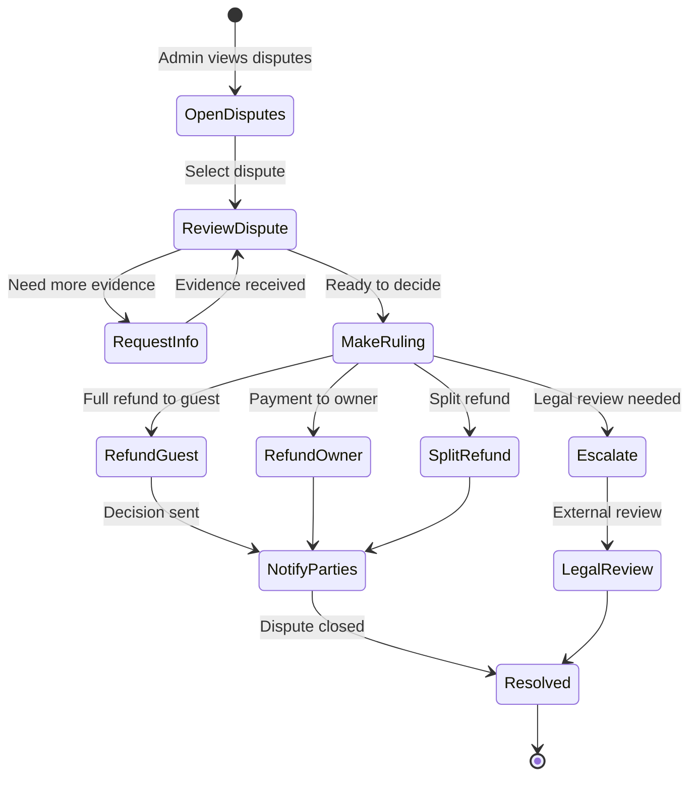

# UC-A05: Handle Disputes

| Field | Description |
|-------|-------------|
| **Use Case Name** | Handle Disputes |
| **Created By** | Product Team |
| **Created Date** | 2026-01-25 |
| **Last Updated By** | Product Team |
| **Last Updated Date** | 2026-01-25 |
| **Summary** | Admin manages disputes between guests and owners, reviews evidence, makes rulings, and processes refunds if necessary. |
| **Dependency** | Dispute submitted by guest or owner |
| **Actors** | Primary: Admin Secondary: Guest, Owner |
| **Preconditions** | Admin authenticated. Has dispute resolution permissions. Dispute submitted. |
| **Trigger** | Admin navigates to "Disputes" and selects a dispute |
| **Main Sequence** | 1. Admin navigates to "Disputes" 2. System displays list of open disputes with priority markers 3. Admin selects a dispute 4. System displays dispute details, messages, evidence 5. Admin reviews booking details, messages, evidence 6. Admin may request additional information 7. Admin makes ruling: refund guest, refund owner, or split 8. System processes refund according to ruling 9. System notifies both parties of decision |
| **Alternative Sequences** | Step 2: If no open disputes, System displays "No open disputes" Step 5: If evidence insufficient, System requests more info from parties Step 6: If escalation needed, System flags for legal team review Step 7: If split refund, System calculates partial amounts Step 8: If refund fails, System logs for manual processing |
| **Postconditions** | Dispute resolved. Refund processed. Parties notified. Analytics updated. |
| **Nonfunctional Requirements** | Dispute SLA: respond within 24h, resolve within 72h. Evidence file upload support. Secure messaging. Decision audit trail. |
| **Business Requirements** | BR-033: Dispute response within 24 hours BR-034: Resolution within 72 hours BR-035: All decisions must be auditable |
| **Frequency of Use** | Low |
| **Priority** | High |
| **Outstanding Questions** | Appeal process? Partial refund calculations? Dispute categories? |

---

## Sequence Diagram

---

## Black Box Compliance

✅ **COMPLIANT** - All steps describe external interactions only.