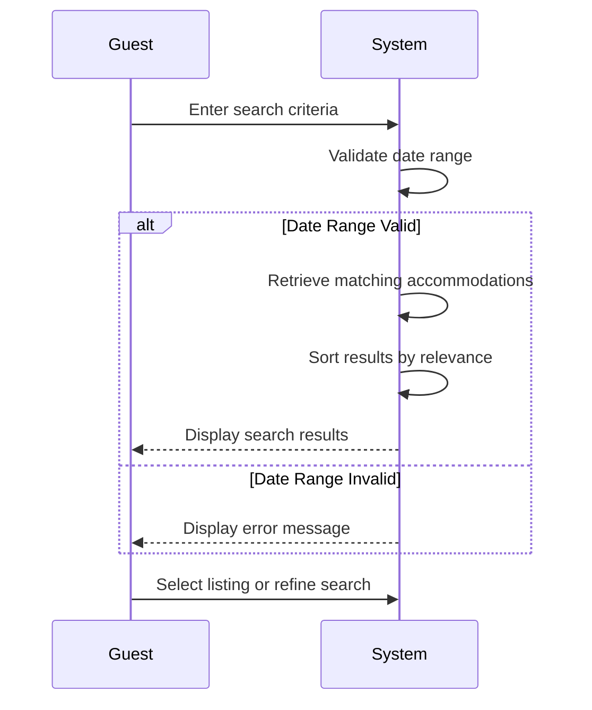

# UC-G01: Search Hostels

| Field | Description |
|-------|-------------|
| **Use Case Name** | Search Hostels |
| **Created By** | Product Team |
| **Created Date** | 2026-01-25 |
| **Last Updated By** | Product Team |
| **Last Updated Date** | 2026-01-25 |
| **Summary** | Guest searches for available hostels using filters like location, dates, price range, amenities, and room type. System retrieves and displays matching results. |
| **Dependency** | UC-G02 (View Listing Details) |
| **Actors** | Primary: Guest |
| **Preconditions** | Guest is on homepage or search page |
| **Trigger** | Guest enters search criteria and clicks search |
| **Main Sequence** | 1. Guest enters search criteria (location, check-in/out dates, number of guests) 2. System validates date range (check-out must be after check-in) 3. System retrieves accommodations matching search criteria 4. System sorts results by relevance and availability 5. System displays search results with pagination 6. Guest may refine filters or select a listing |
| **Alternative Sequences** | Step 2: If date range invalid, System displays error "Check-out date must be after check-in" Step 3: If no results found, System displays "No hostels found" message with suggested nearby locations or date adjustments Step 5: If search service unavailable, System displays error and offers alternative search options |
| **Postconditions** | Search results displayed to guest. Search criteria stored for navigation. Search analytics logged. |
| **Nonfunctional Requirements** | System shall display search results within 500ms (p95). Support 1000 concurrent searches. Vietnamese/English localization. Mobile-responsive. WCAG 2.1 AA compliance. |
| **Business Requirements** | BR-001: Location must be in Vietnam BR-002: Check-out date must be after check-in date |
| **Frequency of Use** | High |
| **Priority** | High |
| **Outstanding Questions** | Should we save search history for logged-in guests? How to handle location typo corrections? |

---

## Sequence Diagram

---

## Black Box Compliance

✅ **COMPLIANT** - All steps describe external interactions only:
- Guest inputs (search criteria)
- System responses (validation, retrieval, display)

No internal components mentioned (databases, services, algorithms).