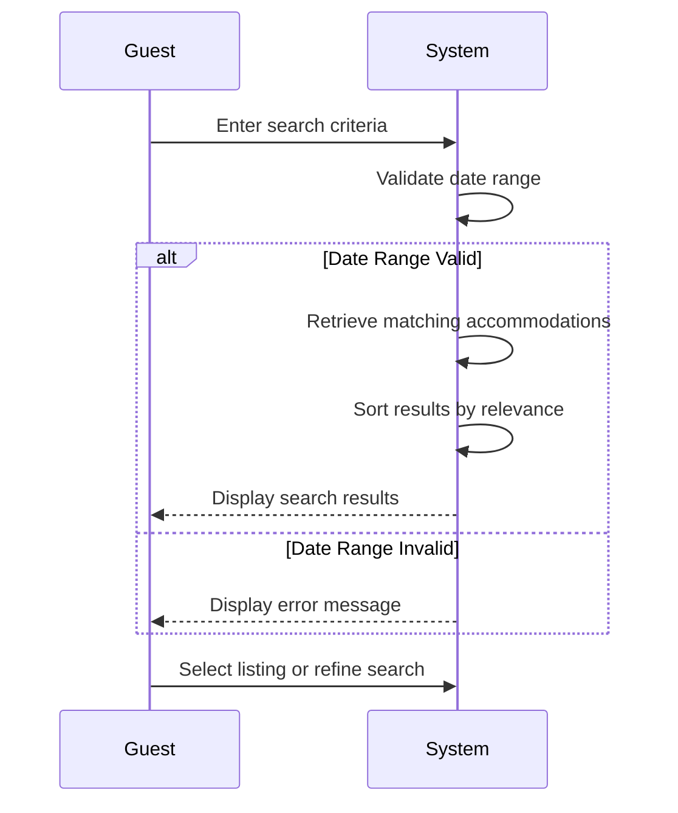

# UC-G01: Search Hostels

| Field | Description |
|-------|-------------|
| **Use Case Name** | Search Hostels |
| **Created By** | Product Team |
| **Created Date** | 2026-01-25 |
| **Last Updated By** | Product Team |
| **Last Updated Date** | 2026-01-25 |
| **Summary** | Guest searches for available hostels using filters like location, dates, price range, amenities, and room type. System retrieves and displays matching results. |
| **Dependency** | UC-G02 (View Listing Details) |
| **Actors** | Primary: Guest |
| **Preconditions** | Guest is on homepage or search page |
| **Trigger** | Guest enters search criteria and clicks search |
| **Main Sequence** | 1. Guest enters search criteria (location, check-in/out dates, number of guests)<br>2. System validates date range (check-out must be after check-in)<br>3. System retrieves accommodations matching search criteria<br>4. System sorts results by relevance and availability<br>5. System displays search results with pagination<br>6. Guest may refine filters or select a listing |
| **Alternative Sequences** | Step 2: If date range invalid, System displays error "Check-out date must be after check-in"<br>Step 3: If no results found, System displays "No hostels found" message with suggested nearby locations or date adjustments<br>Step 5: If search service unavailable, System displays error and offers alternative search options |
| **Postconditions** | Search results displayed to guest. Search criteria stored for navigation. Search analytics logged. |
| **Nonfunctional Requirements** | System shall display search results within 500ms (p95). Support 1000 concurrent searches. Vietnamese/English localization. Mobile-responsive. WCAG 2.1 AA compliance. |
| **Business Requirements** | BR-001: Location must be in Vietnam<br>BR-002: Check-out date must be after check-in date |
| **Frequency of Use** | High |
| **Priority** | High |
| **Outstanding Questions** | Should we save search history for logged-in guests? How to handle location typo corrections? |

---

## Sequence Diagram



---

## Black Box Compliance

✅ **COMPLIANT** - All steps describe external interactions only:
- Guest inputs (search criteria)
- System responses (validation, retrieval, display)

No internal components mentioned (databases, services, algorithms).

---

## Boundary Objects

| Boundary Object | Description | Data Elements |
|----------------|-------------|---------------|
| **SearchRequest** | Guest's search criteria submitted to system | location, checkInDate, checkOutDate, guestCount, priceRange (min/max), amenities[], roomType[], rating (min) |
| **SearchResults** | System response containing matching accommodations | totalCount, results[], page, pageSize, sortBy, filters |
| **ListingSummary** | Brief listing info for search results display | listingId, title, thumbnailUrl, location (city, country), basePrice, currency, rating, reviewCount, amenities[], availableStatus |
| **FilterOptions** | Available filter values for refinement | priceRange (min/max), locations[], amenityOptions[], roomTypeOptions[], ratingRange |
| **SuggestionItem** | Alternative suggestions when no results found | suggestedLocation, suggestedDates, nearbyListings[] |

---

## Internal Software Objects

| Internal Object | Responsibility |
|-----------------|---------------|
| **SearchService** | Validates search criteria, coordinates search orchestration |
| **SearchQueryValidator** | Validates date range logic, filter constraints, guest count limits |
| **ListingSearchEngine** | Queries Elasticsearch for matching listings |
| **AvailabilityService** | Checks real-time availability for search dates |
| **PricingService** | Calculates total prices for search date range |
| **GeoLocationService** | Handles location-based queries and nearby searches |
| **SearchCacheService** | Manages cached search results (5-minute TTL) |
| **SearchAnalyticsLogger** | Logs search queries for analytics and optimization |
| **PaginationService** | Handles result pagination and cursor-based navigation |
| **RelevanceScorer** | Calculates relevance scores for result sorting |

---

## Message Communication Sequence

### Search Flow

```
Guest → System: SearchRequest (HTTP POST /api/search)
    ↓
System → SearchQueryValidator: Validate criteria
    ← ValidationResult
System → SearchCacheService: Check cache
    ← CacheMiss
System → ListingSearchEngine: Search listings (Elasticsearch)
    ← RawResults[]
System → AvailabilityService: Batch check availability
    ← AvailabilityMap
System → PricingService: Calculate prices
    ← PriceMap
System → RelevanceScorer: Score and sort
    ← SortedResults[]
System → SearchAnalyticsLogger: Log search
System ← SearchAnalyticsLogger: Logged
System → Guest: SearchResults (HTTP 200)
```

### Filter Update Flow

```
Guest → System: UpdateFilters (HTTP POST /api/search/filters)
    ↓
System → ListingSearchEngine: Refine search
    ← FilteredResults[]
System → Guest: SearchResults
```

### Suggestion Flow (No Results)

```
System → GeoLocationService: Find nearby locations
    ← NearbyLocations[]
System → AvailabilityService: Check nearby availability
    ← NearbyAvailability[]
System → Guest: SuggestionItem
```

---

## Expanded Alternative Sequences

### Step 2: Date Range Validation
| Condition | System Response | Recovery |
|-----------|-----------------|----------|
| Check-out before check-in | Error: "Check-out must be after check-in" | Auto-swap dates option |
| Check-out equals check-in | Error: "Minimum stay is 1 night" | Suggest next day |
| Check-out beyond 365 days | Error: "Booking limited to 1 year ahead" | Suggest max date |
| Check-in before today | Error: "Check-in cannot be in the past" | Set to today |
| Date range exceeds 90 days | Error: "Maximum stay is 90 nights" | Suggest 90-day limit |
| Guest count exceeds capacity | Error: "Enter valid guest count" | Show max guest hint |

### Step 3: No Results Found
| Condition | System Response | Recovery |
|-----------|-----------------|----------|
| Exact location no results | Show nearby listings (within 50km) | "Show results nearby" button |
| Date range no availability | Suggest alternative dates | Flexible date picker |
| Filter too restrictive | Relax filters gradually | "Remove some filters" suggestion |
| Price range no matches | Suggest price adjustment | Show available price range |
| Complete no results | Popular destinations list | Browse all listings |

### Step 5: Search Service Unavailable
| Condition | System Response | Recovery |
|-----------|-----------------|----------|
| Elasticsearch timeout | Fallback to MySQL search | "Showing partial results" warning |
| Complete service failure | Cached results only | "Last updated X min ago" notice |
| Network latency | Loading indicator + retry | Auto-retry after 3s |
| Partial results returned | Return available results | "Some results unavailable" message |

### Step 6: Real-time Updates
| Condition | System Response | Recovery |
|-----------|-----------------|----------|
| Listing sold during search | Mark as unavailable | Show alternative listings |
| Price changed during search | Update displayed price | "Price may vary" disclaimer |
| New listing matches criteria | Optional refresh prompt | "New listings available" toast |