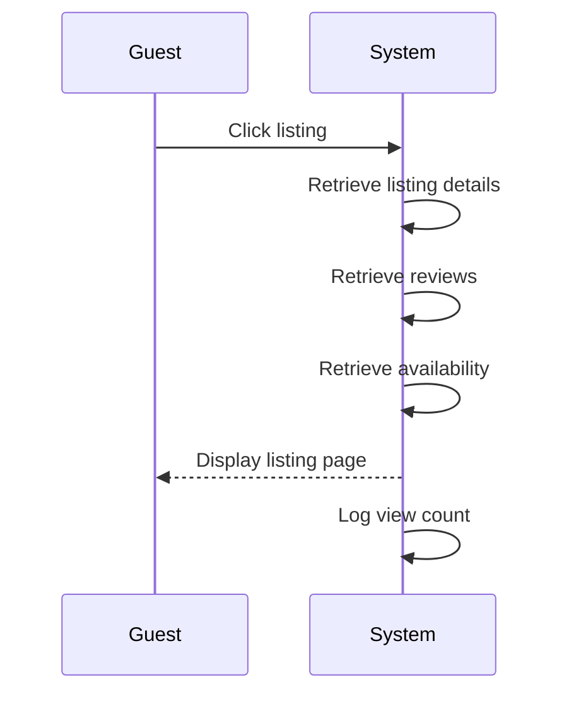

# UC-G02: View Listing Details

| Field | Description |
|-------|-------------|
| **Use Case Name** | View Listing Details |
| **Created By** | Product Team |
| **Created Date** | 2026-01-25 |
| **Last Updated By** | Product Team |
| **Last Updated Date** | 2026-01-25 |
| **Summary** | Guest views comprehensive details of a specific hostel including photos, amenities, pricing, reviews, and availability calendar. |
| **Dependency** | UC-G01 (Search Hostels) |
| **Actors** | Primary: Guest |
| **Preconditions** | Guest has selected a listing from search results or direct link. Listing status is 'approved'. |
| **Trigger** | Guest clicks on a listing from search results |
| **Main Sequence** | 1. Guest clicks on a listing from search results 2. System retrieves listing details 3. System retrieves current reviews and ratings 4. System retrieves available dates 5. System displays listing page with all sections 6. System increments view count |
| **Alternative Sequences** | Step 2: If listing not found, System displays 404 error with similar listing suggestions Step 2: If listing not approved, System displays "This listing is under review" message Step 4: If no availability for selected dates, System shows "Fully Booked" badge with nearest available dates Step 5: If image delivery fails, System displays placeholder images |
| **Postconditions** | Listing viewed event logged. View count incremented. Listing added to "Recently Viewed" (if logged in). |
| **Nonfunctional Requirements** | Page load < 2s. Images optimized (WebP, lazy loading). CDN delivery for images. Mobile-responsive. Vietnamese diacritics support. |
| **Business Requirements** | BR-011: Only approved listings are visible to guests BR-012: View count must be tracked for analytics |
| **Frequency of Use** | High |
| **Priority** | High |
| **Outstanding Questions** | Should we show "X people viewing this now" for urgency? How many images per listing max? |

---

## Sequence Diagram

---

## Black Box Compliance

✅ **COMPLIANT** - All steps describe external interactions only.