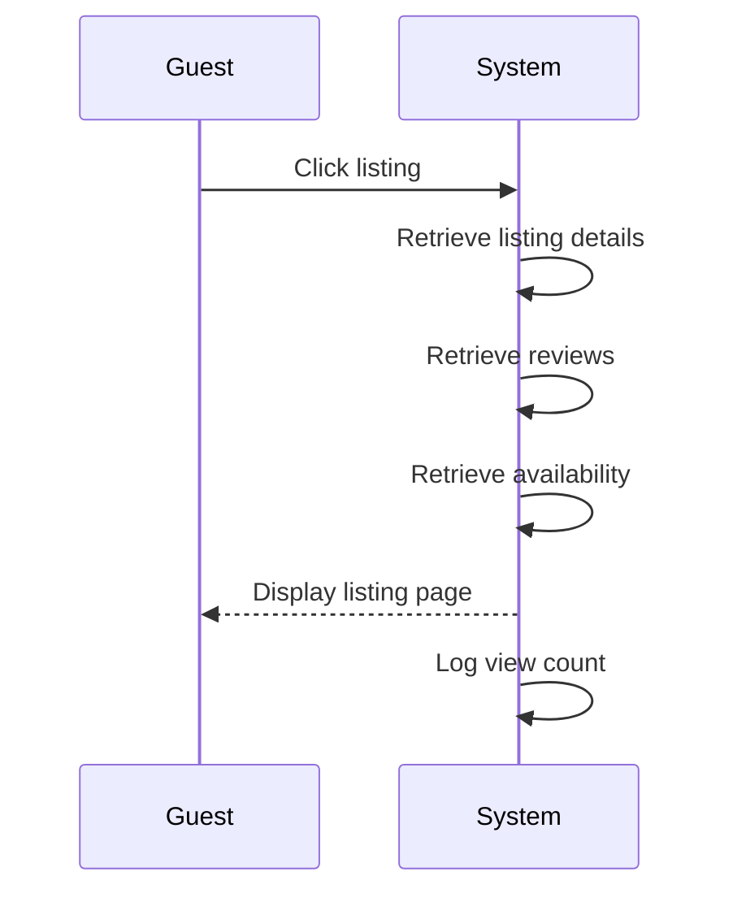

# UC-G02: View Listing Details

| Field | Description |
|-------|-------------|
| **Use Case Name** | View Listing Details |
| **Created By** | Product Team |
| **Created Date** | 2026-01-25 |
| **Last Updated By** | Product Team |
| **Last Updated Date** | 2026-01-25 |
| **Summary** | Guest views comprehensive details of a specific hostel including photos, amenities, pricing, reviews, and availability calendar. |
| **Dependency** | UC-G01 (Search Hostels) |
| **Actors** | Primary: Guest |
| **Preconditions** | Guest has selected a listing from search results or direct link. Listing status is 'approved'. |
| **Trigger** | Guest clicks on a listing from search results |
| **Main Sequence** | 1. Guest clicks on a listing from search results<br>2. System retrieves listing details<br>3. System retrieves current reviews and ratings<br>4. System retrieves available dates<br>5. System displays listing page with all sections<br>6. System increments view count |
| **Alternative Sequences** | Step 2: If listing not found, System displays 404 error with similar listing suggestions<br>Step 2: If listing not approved, System displays "This listing is under review" message<br>Step 4: If no availability for selected dates, System shows "Fully Booked" badge with nearest available dates<br>Step 5: If image delivery fails, System displays placeholder images |
| **Postconditions** | Listing viewed event logged. View count incremented. Listing added to "Recently Viewed" (if logged in). |
| **Nonfunctional Requirements** | Page load < 2s. Images optimized (WebP, lazy loading). CDN delivery for images. Mobile-responsive. Vietnamese diacritics support. |
| **Business Requirements** | BR-011: Only approved listings are visible to guests<br>BR-012: View count must be tracked for analytics |
| **Frequency of Use** | High |
| **Priority** | High |
| **Outstanding Questions** | Should we show "X people viewing this now" for urgency? How many images per listing max? |

---

## Sequence Diagram



---

## Black Box Compliance

✅ **COMPLIANT** - All steps describe external interactions only.

---

## Boundary Objects

| Boundary Object | Description | Data Elements |
|----------------|-------------|---------------|
| **ListingDetailView** | Complete listing data for display | listingId, title, description, location, images[], amenities[], policies, hostInfo, rating, reviewCount |
| **ReviewSummary** | Aggregated review data | averageRating, ratingDistribution, recentReviews[], totalReviews |
| **AvailabilityCalendar** | Calendar data for selected month | dates[], availableDates[], bookedDates[], priceByDate{} |
| **PriceBreakdown** | Pricing details for search dates | basePrice, cleaningFee, serviceFee, taxes, totalPrice, currency |
| **MediaItem** | Individual image/video data | mediaId, type (image/video), url, thumbnailUrl, caption, order |
| **LocationInfo** | Location and map data | address, city, country, coordinates (lat, lng), nearbyPlaces[], distanceFromCenter |

---

## Internal Software Objects

| Internal Object | Responsibility |
|-----------------|---------------|
| **ListingService** | Retrieves listing details by ID |
| **ReviewService** | Fetches reviews and aggregates ratings |
| **AvailabilityService** | Loads availability calendar data |
| **PricingService** | Calculates pricing for date ranges |
| **MediaService** | Handles image URLs, CDN delivery, thumbnails |
| **LocationService** | Provides map data and nearby places |
| **ViewCountService** | Increments and tracks listing views |
| **RecentlyViewedService** | Manages "Recently Viewed" for logged-in users |
| **ListingCacheService** | Caches listing details (15-minute TTL) |
| **ImageOptimizationService** | Generates WebP variants and responsive images |

---

## Message Communication Sequence

### Listing View Flow

```
Guest → System: ViewListing (HTTP GET /api/listings/:id)
    ↓
System → ListingCacheService: Check cache
    ← CacheMiss
System → ListingService: Get listing
    ← ListingData
System → ReviewService: Get reviews
    ← ReviewSummary
System → AvailabilityService: Get calendar
    ← AvailabilityCalendar
System → PricingService: Calculate base pricing
    ← PriceInfo
System → MediaService: Get optimized image URLs
    ← MediaItem[]
System → ViewCountService: Increment view (async, non-blocking)
System → RecentlyViewedService: Add to history (if logged in)
System → ListingCacheService: Cache response
System → Guest: ListingDetailView (HTTP 200)
```

### Image Load Flow

```
Guest → System: RequestImage (HTTP GET /cdn/images/:id)
    ↓
System → MediaService: Validate access
System → CDN: Serve image (WebP, resized)
System → Guest: ImageResponse
```

### WebSocket: Real-time Availability Update

```
Owner → System: CalendarUpdate (WebSocket)
    ↓
System → AvailabilityService: Update calendar
System → WebSocket: Broadcast to connected guests viewing listing
Guest ← System: AvailabilityUpdate (WebSocket event)
```

---

## Expanded Alternative Sequences

### Step 2: Listing Not Found
| Condition | System Response | Recovery |
|-----------|-----------------|----------|
| Invalid listing ID | 404 error page | Similar listings suggestions |
| Listing deleted | 410 Gone error | Alternative properties in same area |
| Listing not approved | "Under review" message | Estimated approval date |
| Listing suspended | "Temporarily unavailable" | Contact support option |
| Listing inactive | "Not currently bookable" | Owner's other listings |

### Step 4: No Availability
| Condition | System Response | Recovery |
|-----------|-----------------|----------|
| Fully booked for dates | "Fully Booked" badge | Nearest available dates |
| Partial availability | Show available dates only | Split booking option |
| Calendar not published | "Contact owner for availability" | Message owner button |
| Blackout dates | "Not available these dates" | Alternative date suggestions |

### Step 5: Image Delivery Failures
| Condition | System Response | Recovery |
|-----------|-----------------|----------|
| CDN timeout | Fallback to origin | Loading retry |
| Image not found | Placeholder image | "Image unavailable" badge |
| Slow image load | Progressive loading | Low-res placeholder first |
| Video playback error | Show thumbnail | "Video unavailable" message |

### Step 6: Authentication Edge Cases
| Condition | System Response | Recovery |
|-----------|-----------------|----------|
| Not logged in | Skip "Recently Viewed" | "Sign in to save" prompt |
| Session expired | Silently fail history save | Continue viewing normally |
| Rate limit exceeded | Cache view count locally | Batch update later |